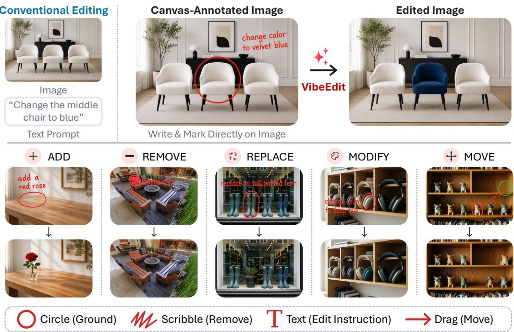
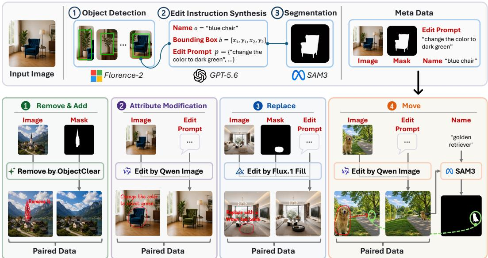
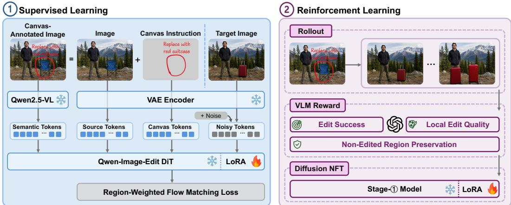
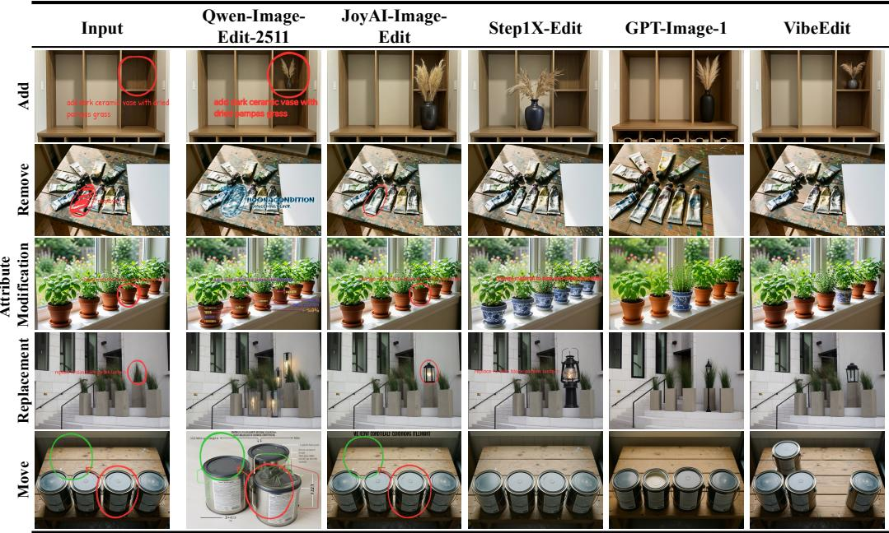
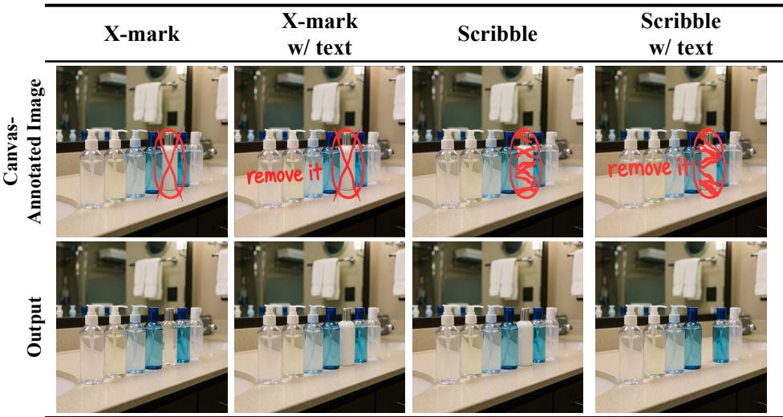
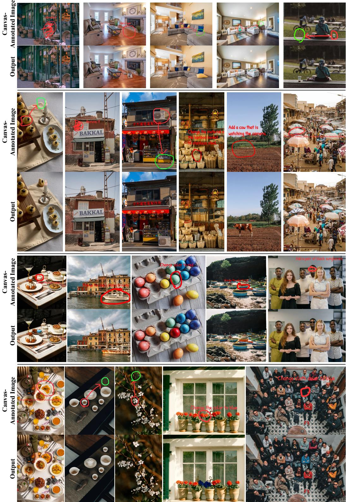

# VIBEEDIT: IMAGE EDITING WITH CANVAS INSTRUC-TIONS

Jinjing Zhao1∗ Fangyun Wei2∗ Yitong Wang3 Xiuyu Wu4 Yunuo Chen5 Yang Yue6 Sirui Zhang7 Wenbo Wang1 Hongyang Zhang8 Dong Chen2 Yan Lu2 Chang Xu1†

1University of Sydney 2Microsoft Research 3Fudan University

4Nankai University 5Shanghai Jiao Tong University 6Tsinghua University

7University of Science and Technology of China 8University of Waterloo

{jzha0100,wwan0412,c.xu}@sydney.edu.au {fawe,doch,yanlu}@microsoft.com wangyitong23@m.fudan.edu.cn xiuyuwu@mail.nankai.edu.cn cyril-chenyn@sjtu.edu.cn yueyang22@mails.tsinghua.edu.cn zsr200901@mail.ustc.edu.cn hongyang.zhang@uwaterloo.ca

Project page: https://zhaojingjing713.github.io/VibeEdit/

  
Figure 1: VibeEdit enables image editing without requiring a separate text prompt. Users express editing intent directly on the image through canvas instructions, including spatial marks such as circles, scribbles, and drag gestures, optionally accompanied by short text notes. Given the resulting canvas-annotated image, VibeEdit supports diverse editing operations, including object addition, removal, replacement, attribute modification, and movement. More visualizations are provided in Figure 6 in the Appendix.

## ABSTRACT

In text-guided image editing, describing the desired change is often straightforward, but identifying the intended object or region can be cumbersome, especially when several objects look alike. We introduce a new image editing interface that lets users place spatial marks and optional short notes directly on the image. Together, these annotations form a canvas instruction that specifies where to edit and what to change. Our editor, VibeEdit, follows these instructions to perform object addition, removal, replacement, attribute modification, and movement with-

out a separate text prompt. We construct 1.55 million source–target edit pairs with object masks and structured edit descriptions, from which we render canvas instructions during training. We adapt Qwen-Image-Edit with layer-decoupled conditioning that separately encodes source images and canvas instructions for image editing. We train the model with region-weighted supervised fine-tuning, followed by rubric-guided reinforcement learning to improve edit completion, local edit quality, and preservation of unedited regions. We evaluate VibeEdit on an independently constructed, human-curated benchmark of 419 cases emphasizing target selection among similar objects. VibeEdit achieves a VLM rubric score of 79.9 and an outside-region PSNR of 32.8 dB, compared with 67.4 and 24.0 dB for FireRed, the highest-scoring text-instructed baseline in our evaluation.

## 1 INTRODUCTION

Instruction-based image editors translate natural-language requests into image changes (Brooks et al., 2023; Wu et al., 2025; Team et al., 2025; Black Forest Labs, 2026; Team et al., 2026; Song et al., 2026; Liu et al., 2025b; OpenAI, 2025). For a localized edit, users must specify both what to change and where to apply it. Describing the desired change is often straightforward, but identifying the intended object can require detailed descriptions of its position and surroundings, especially when several objects look alike. Points and brush strokes provide direct spatial control (Pan et al., 2023; Liu et al., 2025c), while language expresses the desired change. Combining these complementary cues directly on the image offers a natural way to link an edit to its target.

We introduce a new image editing interface that lets users place spatial marks and optional short notes directly on the image (Figure 1). Together, these annotations form a canvas instruction that specifies where to edit and what to change. Circles identify objects or regions, scribbles indicate removal, and arrows specify movement. Short notes placed near the marks describe the desired content or attributes. For example, a user can circle a chair and write a new color beside it, or mark an empty region and name an object to add. These marks need not follow precise object boundaries. To support this interface, we develop VibeEdit, an image editor that follows canvas instructions to perform object addition, removal, replacement, attribute modification, and movement without a separate text prompt.

Training VibeEdit requires paired examples that connect canvas instructions to the intended edits. We construct a corpus of 1.55 million source–target edit pairs by selecting editable objects and generating edited targets with existing models. Each pair includes object masks and structured edit descriptions. During training, we use these records to render spatial marks and short notes, sampling either editing direction where applicable. We vary stroke shapes, widths, and typefaces, including handwriting and print styles, to expose the model to different annotations for the same edit.

Following canvas instructions requires the editor to interpret annotations in context without reproducing them in the output. We adapt Qwen-Image-Edit (Wu et al., 2025) with layer-decoupled conditioning: the vision–language encoder interprets the annotated image, while the generative pathway separately encodes the source image and canvas annotations. This design provides spatial guidance while retaining a clean source reference. Because most pixels remain unchanged in a localized edit, we use region-weighted supervised fine-tuning to emphasize the edit region and annotation removal while retaining supervision over the full image. A visually plausible result can still target the wrong object or alter unrelated content. We therefore refine the editor with rubric-guided reinforcement learning (Feng et al., 2025; Zheng et al., 2026), using rewards for edit completion, local edit quality, and preservation of unedited regions.

We evaluate VibeEdit on an independently constructed, human-curated benchmark of 419 cases. The benchmark emphasizes scenes with similar objects to test whether the editor applies the requested change to the intended instance. We jointly assess edit success, local edit quality, and preservation of unedited regions, since preserving the source alone does not establish that an edit was completed. VibeEdit achieves an overall VLM rubric score of 79.9 and an outside-region PSNR of 32.8 dB, outperforming all evaluated baselines on both metrics, even when baselines receive detailed external text instructions specifying the edit target and desired change.

Our contributions are threefold:

• We introduce a new image editing interface in which spatial marks and optional short notes form canvas instructions, specifying edit targets and desired changes directly on the image across five editing operations. This interface is complementary to conventional text prompting, providing direct spatial grounding when language alone is cumbersome or ambiguous.

• We construct 1.55 million source–target edit pairs for canvas instruction training and develop VibeEdit by adapting Qwen-Image-Edit with layer-decoupled conditioning, regionweighted supervised fine-tuning, and rubric-guided reinforcement learning.

• We construct an independent, human-curated benchmark of 419 cases emphasizing target selection among similar objects. VibeEdit outperforms the evaluated baselines in both overall VLM rubric score and outside-region PSNR.

## 2 RELATED WORK

Instruction-based image editing. Large-scale text-to-image pretraining supplies the generative prior for modern editors. Recent systems span publicly released HunyuanImage 3.0, Z-Image, and Lens, alongside proprietary Qwen-Image-2.0 and Seedream 4.0, exploring autoregressive modeling, multimodal diffusion, and unified generation and editing (Cao et al., 2025; Cai et al., 2025; Chen et al., 2026; Zhao et al., 2026a; Seedream et al., 2025). Diffusion editors translate language instructions into image transformations. InstructPix2Pix learns this mapping from synthetic instruction pairs (Brooks et al., 2023), while MagicBrush (Zhang et al., 2023) and UltraEdit (Zhao et al., 2024) broaden instruction-editing datasets. Recent foundation editors further improve instruction following and source-image fidelity (Wu et al., 2025; Team et al., 2025; Black Forest Labs, 2026; Team et al., 2026; Song et al., 2026; Liu et al., 2025b; OpenAI, 2025; Google, 2025). Text-only prompts must describe both the desired change and its referent. VibeEdit instead lets users place short text notes directly beside the intended edit targets.

Spatial control and visual instructions. Spatial interfaces generally follow three patterns. First, operation-specific methods encode geometric correspondence through handle and target points. DragGAN (Pan et al., 2023) and DragDiffusion (Shi et al., 2024) focus on object movement and deformation. Second, region-guided visual-instruction methods combine image-space cues with separate text. Inter-Edit (Liu et al., 2026a), FineEdit (Xu et al., 2026a), and scribble-guided editing (Xu et al., 2026b) use masks, boxes, or scribbles for localization, while VIBE (Zhang et al., 2026a) evaluates broader visual cues with textual task instructions. Third, visual-interaction systems structure edit intent through graphical controls. The MagicQuill series (Liu et al., 2025c; 2026b) explores richer interactions: the original system combines brush modes with an inferred editing prompt, while its successor couples language with layered content, spatial, and color controls. By contrast, VibeEdit combines circles, scribbles, and movement arrows with open-vocabulary handwritten instructions. Rather than using image-space cues only for localization, it also places semantic guidance directly on the canvas across five edit types.

Reinforcement learning for diffusion models. Reward-based post-training aligns diffusion and flow models with visual objectives difficult to express through likelihood training. DDPO (Black et al., 2024) formulates denoising as a sequential decision process. Flow-GRPO and DanceGRPO adapt group-relative policy optimization to diffusion and flow-based generation (Liu et al., 2025a; Xue et al., 2025). OP-GRPO (Zhang et al., 2026b) improves sample reuse through off-policy trajectory replay. DiffusionNFT (Zheng et al., 2026) instead optimizes a forward-process objective using positive and implicit negative predictions, without storing full denoising trajectories. For reward design, RubricRL (Feng et al., 2025) decomposes prompt requirements into criteria evaluated independently by a multimodal judge. We adapt forward-process updates and decomposed rewards to localized editing, where edit completion must be balanced with source preservation.

## 3 DATA AND BENCHMARK CONSTRUCTION

We construct three datasets for VibeEdit across five edit types: a supervised learning corpus for training the editor to follow canvas instructions, an RL set selected by reward variation, and a humancurated benchmark to evaluate instruction following and target selection among similar objects.

  
Figure 2: Supervised learning edit-pair construction. A shared pipeline performs object selection, edit prompt synthesis, and segmentation. Operation-specific pipelines then generate source–target pairs for addition, removal, attribute modification, replacement, and movement. Canvas annotations are shown for illustration and are rendered online during training.

## 3.1 SUPERVISED LEARNING DATA

We synthesize edit pairs offline and render canvas instructions online during training. Figure 2 shows the overall data construction pipeline. Each stored record contains a source image I, an edited target I , object masks, and structured edit descriptions. This representation separates the underlying edit from its annotation style, allowing the same pair to support varied canvas instructions. Where applicable, we also retain the information needed to render instructions in both editing directions.

Object selection and prompt synthesis. In Figure 2, Florence-2 (Xiao et al., 2024) generates openvocabulary object proposals. We discard excessively small or large proposals, assign identifiers to the remaining candidates, and provide the indexed image and optional candidate crops to GPT-5.6- sol (OpenAI, 2026b). The model selects an object that is recognizable, sufficiently visible, mostly within the frame, and spatially separable from its surroundings. It records the object’s name o and, when needed for edit synthesis, generates an edit prompt p. SAM 3 (Carion et al., 2026) produces an object mask M from the selected box. Detailed selection rules are provided in Appendix E.1.

Addition and removal. We select objects with clean boundaries and backgrounds suitable for reconstruction, avoiding tightly entangled instances and prominent attached shadows or reflections. ObjectClear (Zhao et al., 2026b) inpaints the masked region of I to produce an image without the selected object. The original-to-inpainted direction provides removal supervision; reversing the pair provides addition supervision. Each pair thus supports both operations, with the added object and its context drawn from the same original image. We retain the object’s name and visual description.

Attribute modification. GPT-5.6-sol selects one visible attribute from color, material, texture, pattern, state, or object-local style, and specifies a distinct, verifiable target value. The edit prompt identifies the object and the requested change while instructing the editor to preserve its identity, geometry, pose, and position. Qwen-Image-Edit (Wu et al., 2025) applies the prompt p to I without using M as a generation constraint. We retain M for localization and store both the original and target attribute values.

Object replacement. GPT-5.6-sol selects a contextually plausible replacement from a different category and at a scale appropriate for the scene. FLUX.1 Fill (Black Forest Labs, 2024) generates the replacement described by the edit prompt within an expanded version of M, preserving the surrounding scene. We retain descriptions of both the original and replacement objects.

Object movement. GPT-5.6-sol selects an object that can move as a rigid unit and a clearly separated destination on a suitable, unoccupied support surface. Qwen-Image-Edit (Wu et al., 2025) follows the edit prompt to relocate the object and produce $I _ { \mathrm { e d i t } }$ . The original object mask serves as the source mask $M _ { \mathrm { s r c } } .$ To locate the object after editing, GPT-5.6-sol provides a description of its stable appearance attributes and intended destination. We use this description to prompt SAM 3 (Carion et al., 2026) on $I _ { \mathrm { e d i t } }$ , obtaining the destination mask $M _ { \mathrm { t g t } }$ . The two masks specify the endpoints of the movement annotation; reversing the edit swaps their roles.

Quality control. We use GPT-5.6-sol to assess the synthesized edit pairs and filter out low-quality examples. Since filtering may not eliminate all errors, we complement this data-level screening with rubric-guided RL after supervised training. By favoring outputs with successful edits, high local quality, and preserved surrounding content, RL steers the model toward the desired editing behavior and helps mitigate the influence of residual training noise.

Canvas instruction rendering. During training, we sample a valid edit direction and use the corresponding masks and edit descriptions to render a canvas instruction C. Circles and short notes specify addition, attribute modification, and replacement. A circled scribble accompanied by a short deletion note indicates removal. Two circles connected by a directed arrow specify movement. We vary stroke shapes, widths, and typefaces during rendering.

We form the canvas-annotated image $A = I \oplus C$ , where ⊕ denotes rendering the spatial marks and text notes in C onto the source image I. These annotations specify the edit without a separate text prompt. We retain I and C separately for the layer-decoupled conditioning in Section 4.1. The final corpus contains 1,554,062 stored image pairs. Appendix C details the instruction grammar, rendering procedure, and corpus statistics.

## 3.2 REINFORCEMENT LEARNING DATA AND BENCHMARK

RL data selection by reward variation. We select RL conditions based on reward variation across edits sampled from our base model trained with supervised learning. For each candidate image– canvas instruction pair $c = ( I , C )$ , we generate K offline rollouts, score them with the structured reward defined in Section 4.3, and compute $\sigma ( c ) = \mathrm { S t d } _ { k = 1 } ^ { K } [ R ( \hat { I } _ { k } ; c ) ]$ ]. Within each edit type, we retain the candidates with the highest $\sigma ( c )$ . Selection thus favors reward differences among rollouts of the same condition, which provide the relative training signal for DiffusionNFT, rather than low mean rewards. The resulting RL set contains 3,520 conditions, with 704 for each edit type.

Human-curated VibeEdit benchmark. We construct a 419-case benchmark independently of the training corpus, using images manually collected and selected from online sources. The benchmark emphasizes scenes containing multiple objects from the same category or with similar appearances. For each case, human annotators specify the edit region with a mask and describe the intended change. We use these annotations to render spatial marks and short notes as needed, forming the canvas instruction. For comparison with text-instructed baselines, we additionally prepare a detailed external text instruction for each case, specifying the target object’s location within the scene and the requested edit. These baselines receive the source image and external text instruction, while VibeEdit receives the source image and canvas instruction without a separate text prompt. The benchmark tests whether an editor interprets the requested change and applies it to the intended object or region. Per-task counts and external text-instruction lengths are reported in Appendix C.2.

## 4 METHOD

Given a source image I and a canvas instruction C, VibeEdit produces an edited image $\hat { I } = f _ { \theta } ( I , C )$ without a separate text prompt. We denote the canvas-annotated image by ${ \cal A } = I \oplus { \bf \bar { \cal { C } } } . \mathrm { ~ A s ~ }$ shown in Figure 3, layer-decoupled conditioning uses the vision–language encoder to interpret the annotated image and the VAE to encode the source image and canvas instruction separately for generation. We then train the model in two stages: region-weighted supervised learning emphasizes the requested local changes, and rubric-guided RL further refines the model using rewards for edit success, local edit quality, and preservation of unedited regions.

## 4.1 LAYER-DECOUPLED CONDITIONING

Canvas annotations must guide the edit without appearing in the output. Encoding only the canvasannotated image A in the generative pathway mixes source content with instruction marks. We therefore use the canvas-annotated image for semantic interpretation and separate the image from the annotations for generative conditioning.

  
Figure 3: VibeEdit training pipeline. Left: the vision–language encoder processes annotated image $A ,$ while the VAE separately encodes source image I and rasterized instruction $\bar { C } .$ The target image supervises region-weighted training. Right: the base model is refined with DiffusionNFT using rewards for edit success, outside preservation, and local edit quality.

The frozen Qwen2.5-VL (Bai et al., 2025) encoder processes A to produce semantic tokens $h =$ $E _ { \mathrm { V L } } ( A )$ . For the generative pathway, we rasterize C on a neutral gray background to obtain ${ \bar { C } } ,$ then encode the two layers separately as $z _ { I } = E _ { \mathrm { V A E } } ( I )$ and $z _ { C } = \overrightharpoon { E } _ { \mathrm { V A E } } ( \bar { C } )$ . This provides a clean source reference and an explicit representation of the annotation layout, while the semantic tokens convey the instruction in the context of the scene.

Following the conditioning scheme of Qwen-Image-Edit (Wu et al., 2025), the DiT receives noisy target tokens, source tokens $z _ { I } ,$ , canvas tokens $z _ { C }$ , and semantic tokens h. The noisy target tokens use timestep t, while source and canvas tokens use timestep zero. We freeze the VAE, the vision– language encoder, and the DiT weights, and train rank-128 LoRA (Hu et al., 2021) adapters on the DiT attention projections and modulation layers.

## 4.2 REGION-WEIGHTED SUPERVISED FINE-TUNING

For a localized edit, most target pixels remain unchanged from the source. A spatially uniform loss can therefore underemphasize the requested change. We assign greater weight to the edited object and rendered annotations to emphasize edit completion and annotation removal, while retaining supervision over the full image.

Let $z _ { 0 } = E _ { \mathrm { V A E } } ( I _ { \mathrm { e d i t } } )$ be the target latent. For a sampled timestep t with noise level $\sigma _ { t }$ and Gaussian noise $\epsilon ,$ we define the noisy latent and target velocity as

$$
z _ { t } = ( 1 - \sigma _ { t } ) z _ { 0 } + \sigma _ { t } \epsilon , \qquad v ^ { * } = \epsilon - z _ { 0 } .\tag{1}
$$

We form a binary supervision mask $M _ { \mathrm { s u p } } = M _ { \mathrm { o b j } } \lor M _ { \mathrm { a n n } }$ , where $M _ { \mathrm { o b j } }$ covers the edited object and $M _ { \mathrm { a n n } }$ covers all rendered strokes and text. For movement, $M _ { \mathrm { o b j } }$ is the union of the source and destination object masks. We dilate $M _ { \mathrm { s u p } }$ and map it to latent resolution to obtain $\widetilde { M }$ . Dilation extends the upweighted region around object boundaries and annotations to accommodate approximate marks, nearby edit effects, and VAE downsampling. The supervised learning objective is

$$
\mathcal { L } _ { \mathrm { S F T } } = \mathbb { E } _ { t , \epsilon } \left[ \left. \sqrt { \mathbf { 1 } + \lambda \widetilde { M } } \odot \left( v _ { \theta } ( z _ { t } ; h , z _ { I } , z _ { C } , t ) - v ^ { * } \right) \right. _ { 2 } ^ { 2 } \right] ,\tag{2}
$$

where $\widetilde { M }$ is broadcast over latent channels. The loss retains unit weight outside the mask and increases the weight within it. We set $\lambda = 1 . 5$ and dilate the mask by 50 pixels before downsampling. The supervision mask only weights the training loss and is not provided to the model at inference.

## 4.3 RUBRIC-GUIDED DIFFUSION REINFORCEMENT LEARNING

Supervised learning teaches the model to follow canvas instructions. We then refine its editing behavior through rubric-guided RL. For each condition in the RL set from Section 3.2, the sampling policy $\pi _ { \mathrm { o l d } }$ generates multiple edits, and a VLM judge assigns rubric rewards. The rollout latents are then re-noised for DiffusionNFT optimization (Zheng et al., 2026).

Structured rubric reward. For each image–canvas instruction pair $( I , C )$ of edit type τ , πold generates K rollouts $\{ \hat { I } _ { k } \} _ { k = 1 } ^ { K }$ . To evaluate each rollout, the VLM judge receives the source and edited images, aligned before/after crops of the edit region, the edit type, and the structured target description. Movement examples include crops of both the source and destination regions. The structured description is used only for reward computation and is not provided to the editing policy.

Following the rubric rewards design (Feng et al., 2025), we assess each output with binary questions in three groups:

• Edit success checks whether the requested operation is completed at the intended location, using operation-specific criteria such as object presence, absence, or identity preservation.

• Outside preservation checks whether unrelated objects and scene content remain unchanged, with no unintended edits or duplicates.

• Local edit quality checks whether the edited region is visually well-formed, naturally integrated, and aesthetically consistent with the scene.

The judge prompt and rubric questions are provided in Appendices E.2 and E.3. Let $\mathcal { Q }$ denote the questions applicable to the current example and $q _ { k , j } \in \{ 0 , 1 \}$ the judge’s decision for question $j$ on rollout k. We average these decisions and apply a penalty for insufficient preservation outside the edit region:

$$
R _ { k } ^ { \mathrm { r u b } } = \frac { 1 } { | \mathcal { Q } | } \sum _ { j \in \mathcal { Q } } q _ { k , j } , \qquad R _ { k } = R _ { k } ^ { \mathrm { r u b } } - \gamma _ { \mathrm { p } } { \bf 1 } [ \mathrm { P S N R } _ { \mathrm { o u t } } < \tau _ { \mathrm { p } } ] .\tag{3}
$$

Here, $\mathrm { P S N R _ { o u t } }$ compares the source image with rollout k outside a padded edit region. For movement, the excluded region covers both the source and destination. This penalty accounts for lowlevel image changes that binary VLM judgments may miss. We set $\gamma _ { \mathrm { { p } } } = 0 . 3$ and $\tau _ { \mathrm { p } } = 2 5 \ : \mathrm { d B }$

Reward normalization. We center rewards within each condition and normalize them by the reward standard deviation of the corresponding edit type:

$$
a _ { k } = \frac { R _ { k } - \frac { 1 } { K } \sum _ { i = 1 } ^ { K } R _ { i } } { s _ { \tau } + \delta } , \qquad \rho _ { k } = \frac { 1 } { 2 } + \frac { 1 } { 2 } \mathrm { c l i p } \Bigg ( \frac { a _ { k } } { a _ { \mathrm { m a x } } } , - 1 , 1 \Bigg ) ,\tag{4}
$$

where $s _ { \tau }$ is computed over the current rollouts of edit type τ across workers, $a _ { \mathrm { m a x } }$ is the advantage clipping threshold, and δ ensures numerical stability. Centering compares each rollout with others generated for the same condition, while type-wise normalization adjusts for differences in reward scale across edit types. Unlike the per-condition statistic $\sigma ( c )$ used for offline data selection, $s _ { \tau }$ is computed online across rollouts of the same edit type.

The resulting $\rho _ { k } \in [ 0 , 1 ]$ controls the relative weights of the positive and negative branches in the DiffusionNFT objective: higher-reward rollouts receive greater weight in the positive branch. The policy-update objective and implementation details are provided in Appendix B.

## 5 EXPERIMENTS

## 5.1 EXPERIMENTAL SETUP

Training. We initialize VibeEdit from Qwen-Image-Edit (Wu et al., 2025) and train rank-128 LoRA (Hu et al., 2021) adapters on the DiT attention projections and modulation layers. Supervised learning uses aspect-ratio buckets of approximately $\mathrm { \bar { 1 0 2 4 ^ { 2 } } }$ pixels, a global batch size of 128, and a constant learning rate of $5 \times 1 0 ^ { - 5 }$ after 500 warmup steps. RL starts from the 12,000-step supervised fine-tuned checkpoint and trains a new rank-128 LoRA adapter at $5 1 2 ^ { 2 }$ resolution with the same learning rate. Each condition uses 12 rollouts with eight denoising steps and classifier-free

Table 1: Main comparison on the VibeEdit benchmark. We tailor the input format to different model types. Visual-only baselines receive the canvas-annotated image A; text-instructed baselines receive the source image I and a text instruction. VibeEdit uses (I, C) without a separate text prompt. Entries report V (VLM rubric score (%)) / P (outside-region PSNR (dB)). Bold and underlined values indicate the best and second-best results.
<table><tr><td>Method</td><td>Add V/P</td><td>Remove V/P</td><td>Attribute V/P</td><td>Replace V/P</td><td>Move V/P</td><td>Overall V/P</td></tr><tr><td colspan="5">Visual-only baselines</td><td></td><td>19.8 / 16.3</td></tr><tr><td>Qwen-Image-Edit-2511 LongCat-Image-Edit FLUX.2-klein-9B</td><td>17.7 / 17.0 8.8 / 15.0 30.0 / 24.1</td><td>22.1 / 14.3 39.0 / 18.9 34.3 / 27.6 35.4 / 17.1</td><td>28.1 / 17.4 29.5 / 14.8 56.9 / 26.8 28.6 / 13.4</td><td>21.1 / 16.5 27.8 / 16.2 43.3 / 25.7</td><td>10.0 / 16.1 10.5 / 13.5 23.8 / 27.9</td><td>23.1 / 15.6 37.6 / 26.4</td></tr><tr><td>FireRed-Image-Edit-1.0 JoyAI-Image-Edit Step1X-Edit-v1p2 GPT-Image-1</td><td>26.9 / 17.9 69.1 / 23.9 31.3 / 19.7 50.0 / 14.4</td><td>38.1 / 27.8 43.6 / 24.6 52.8 / 12.9</td><td>49.9 / 24.1 40.1 / 19.1 43.7 / 13.1</td><td>19.0 / 16.6 63.0 / 26.0 53.3 / 18.5 50.6 / 13.2</td><td>4.2 / 14.6 12.0 / 20.9 21.1 /21.7 16.3 / 13.1</td><td>22.8 / 16.0 46.4 / 24.5 37.9 / 20.7 42.7 / 13.4</td></tr><tr><td>Text-instructed baselines</td><td></td><td></td><td></td><td></td><td></td><td></td></tr><tr><td>Qwen-Image-Edit-2511</td><td>63.7 / 18.9</td><td>71.8 / 19.7</td><td>54.7 / 19.9</td><td>67.8 / 20.0</td><td>54.4 / 18.9</td><td>62.5 / 19.4</td></tr><tr><td></td><td></td><td>66.9 / 19.5</td><td></td><td></td><td></td><td></td></tr><tr><td>LongCat-Image-Edit</td><td>54.6 / 17.7</td><td></td><td>53.4 / 20.2</td><td>62.7 / 19.7</td><td>34.7 / 16.1</td><td>54.5 / 18.6</td></tr><tr><td>FLUX.2-klein-9B</td><td>57.3 / 25.0</td><td>70.8 / 23.5</td><td>57.4 / 24.1</td><td>59.8 / 24.4</td><td></td><td></td></tr><tr><td></td><td></td><td></td><td></td><td></td><td>32.4 / 26.0</td><td>55.5 / 24.6</td></tr><tr><td>FireRed-Image-Edit-1.0</td><td>69.9 / 23.4</td><td>69.8 / 22.8</td><td>65.4 / 26.4</td><td>78.9 / 25.8</td><td>53.0 / 21.8</td><td>67.4 / 24.0</td></tr><tr><td>JoyAI-Image-Edit</td><td>66.0 / 21.9</td><td>72.3 / 23.3</td><td>61.5 / 26.2</td><td>72.9 / 24.7</td><td>54.6 / 20.8</td><td>65.4 / 23.3</td></tr><tr><td>Step1X-Edit-v1p2</td><td>43.3 / 18.8</td><td>60.8 / 19.5</td><td>50.6 / 19.8</td><td>62.5 / 19.6</td><td>31.9 / 17.8</td><td></td></tr><tr><td></td><td></td><td></td><td></td><td></td><td></td><td>49.8 / 19.1</td></tr><tr><td>Ours</td><td></td><td></td><td></td><td></td><td></td><td></td></tr><tr><td>VibeEdit-base</td><td>67.6 / 32.7</td><td>73.3 / 27.5</td><td>66.0 / 22.1</td><td>72.9 /31.5</td><td>59.1 / 20.7</td><td>67.8 / 27.0</td></tr><tr><td>VibeEdit</td><td>80.3 / 34.7</td><td>85.4 / 35.8</td><td>77.4 / 31.2</td><td>79.9 / 34.9</td><td></td><td></td></tr><tr><td></td><td></td><td></td><td></td><td></td><td>76.4 / 27.1</td><td>79.9 / 32.8</td></tr></table>

Table 2: Effect of VAE inputs on editing performance, with the VLM input fixed to A.
<table><tr><td>VAE input</td><td>VLM↑</td><td>PSNR ↑</td></tr><tr><td>I</td><td>24.7</td><td>21.3</td></tr><tr><td>A</td><td>58.6</td><td>24.2</td></tr><tr><td>I,č</td><td>67.8</td><td>27.0</td></tr></table>

Table 3: Effect of region weighting and mask dilation on the base model.
<table><tr><td>Weighting</td><td>Dilation</td><td>VLM↑</td></tr><tr><td>一</td><td>一</td><td>66.2</td></tr><tr><td>√</td><td>一</td><td>64.2</td></tr><tr><td>√</td><td>√</td><td>67.8</td></tr></table>

guidance (CFG) scale 1, scored by the fixed GPT-5.4-mini (OpenAI, 2026a) judge. We evaluate RL at 220 steps. Both stages use 32 NVIDIA A100 GPUs.  
Inference. All evaluations use $H \times W \approx 1 0 2 4 ^ { 2 }$ pixels and one output per case. Base models use 30 denoising steps and CFG scale 4; RL models use 16 steps and CFG scale 1. Public baselines otherwise use their released pipelines and recommended settings.

Metrics. On the 419-case benchmark, GPT-5.6-sol (OpenAI, 2026b) serves as a fixed judge. It answers binary rubric questions on edit success, outside preservation, and local edit quality using source and edited images with aligned crops. The overall VLM rubric score (%) averages per-case pass rates within each edit type, then equally across the five types. Appendices E.2 and E.3 detail the protocol and rubric. We also report source–output PSNR outside a padded edit region.

## 5.2 MAIN RESULTS

We compare VibeEdit with Qwen-Image-Edit-2511 (Wu et al., 2025), LongCat-Image-Edit (Team et al., 2025), FLUX.2-klein-9B (Black Forest Labs, 2026), FireRed-Image-Edit-1.0 (Team et al., 2026), JoyAI-Image-Edit (Song et al., 2026), Step1X-Edit-v1p2 (Liu et al., 2025b), and proprietary GPT-Image-1 (OpenAI, 2025). Baselines evaluated without an external text prompt receive the canvas-annotated image A, including any rasterized notes. We also evaluate public baselines in a text-instructed setting, providing the source image I and the full human-written benchmark instruction as an external text prompt (21.3 words on average). VibeEdit receives source image and canvas instruction (I, C) without a separate text prompt.

Main results. Table 1 shows that all six public baselines achieve higher overall rubric scores with external text instructions than with the canvas-annotated image alone. Without an external text prompt, our base model achieves a VLM rubric score comparable to that of FireRed, the highestscoring text-instructed baseline (67.8 versus 67.4), while achieving higher outside-region PSNR. The final VibeEdit configuration achieves the highest rubric score on all five edit types and the highest overall PSNR, reaching 79.9 and 32.8 dB, respectively.

  
Figure 4: Qualitative comparison across all five edit types without separate text prompts. Baseline methods exhibit typical errors such as instruction-mark retention, target-instance confusion, unintended changes to unrelated regions, and inaccurate object relocation. Additional qualitative results are provided in Figure 6 in the Appendix.

Qualitative comparison. Figure 4 compares editing results across all five edit types. The baselines exhibit varying errors in instruction following and source preservation, while VibeEdit follows the canvas instructions more consistently.

## 5.3 ABLATION STUDIES

Layer-decoupled conditioning. Table 2 compares VAE inputs while keeping the annotated image A fixed at the vision–language encoder. Encoding only the source image I leaves the canvas instruction represented solely by semantic tokens and yields a rubric score of 24.7. Encoding A raises the score to 58.6. Separately encoding I and C¯ further improves the rubric score to 67.8 and PSNR from 24.2 to 27.0 dB. These results support separately encoding the annotation layout and the clean image.

Region-weighted supervision. As shown in Table 3, region weighting without dilation lowers the rubric score from 66.2 to 64.2, while combining weighting with dilation raises it to 67.8. Dilation extends the upweighted region around object boundaries and annotations to accommodate approximate marks and nearby edit effects.

RL condition selection. Table 4 compares selection strategies based on rollout-reward variation. High-variance selection achieves a slightly higher rubric score than random sampling, at 79.9 versus 79.3, while low-variance selection performs worse at 76.6.

Reward composition. Table 5 shows that local edit quality and outside preservation play complementary roles. Starting from edit-success rewards alone, adding local-quality criteria improves the rubric score but reduces outside-region PSNR, whereas adding preservation criteria improves both metrics. Combining all three rubric groups achieves the best results, with a rubric score of 79.9 and PSNR of 32.8 dB.

Table 4: Effect of RL condition selection based on variation in rollout rewards.
<table><tr><td>Selection Strategy</td><td>VLM↑</td></tr><tr><td>High-variance</td><td>79.9</td></tr><tr><td>Random</td><td>79.3</td></tr><tr><td>Low-variance</td><td>76.6</td></tr></table>

Table 5: Effect of RL reward components on edit quality and source preservation.
<table><tr><td>Edit Success</td><td>Outside Preservation</td><td>Local Edit Quality</td><td>VLM↑</td><td>PSNR ↑</td></tr><tr><td>√</td><td></td><td>一</td><td>69.2</td><td>28.6</td></tr><tr><td>√</td><td>√</td><td>一</td><td>74.9</td><td>29.4</td></tr><tr><td>√</td><td></td><td>√</td><td>72.4</td><td>28.0</td></tr><tr><td>√</td><td>√</td><td>√</td><td>79.9</td><td>32.8</td></tr><tr><td></td><td></td><td></td><td></td><td></td></tr></table>

## 6 CONCLUSION

We introduced a new image editing interface in which spatial marks and optional short notes form canvas instructions, specifying where to edit and what to change. We developed VibeEdit to support five editing operations through this interface without a separate text prompt. Using 1.55 million source–target edit pairs, we trained VibeEdit with layer-decoupled conditioning, region-weighted supervised learning, and rubric-guided RL. On an independent, human-curated 419-case benchmark emphasizing target selection among similar objects, VibeEdit outperforms the evaluated baselines in overall VLM rubric score and outside-region PSNR.

## AI USE STATEMENT

The authors developed the research ideas and methodology without generative AI assistance. We used GPT models for object selection and edit-description generation, and generative image models to synthesize training pairs, as described in Section 3. GPT models also provided rubric-based rewards during reinforcement learning and evaluated editing outputs. We also used language models to improve the clarity and readability of the manuscript. The authors take responsibility for al content, claims, and artifacts in this work, including those produced with AI assistance.

## ETHICS STATEMENT

Our data include images from publicly available datasets and AI-generated images.

## REPRODUCIBILITY STATEMENT

To ensure reproducibility, Sections 3, 4, and 5.1 describe data construction, the model and training objectives, and the training, inference, and evaluation settings. The appendix provides additional data details, the RL policy update, data-selection rules, and evaluation prompts and rubrics.

## REFERENCES

Shuai Bai, Keqin Chen, Xuejing Liu, Jialin Wang, Wenbin Ge, Sibo Song, Kai Dang, Peng Wang, Shijie Wang, Jun Tang, Humen Zhong, Yuanzhi Zhu, Mingkun Yang, Zhaohai Li, Jianqiang Wan, Pengfei Wang, Wei Ding, Zheren Fu, Yiheng Xu, Jiabo Ye, Xi Zhang, Tianbao Xie, Zesen Cheng, Hang Zhang, Zhibo Yang, Haiyang Xu, and Junyang Lin. Qwen2.5-vl technical report, 2025. URL https://arxiv.org/abs/2502.13923.

Kevin Black, Michael Janner, Yilun Du, Ilya Kostrikov, and Sergey Levine. Training diffusion models with reinforcement learning. In International Conference on Learning Representations, volume 2024, pp. 4965–4987, 2024.

Black Forest Labs. Introducing FLUX.1 tools. https://bfl.ai/blog/24-11-21-tools, 2024.

Black Forest Labs. FLUX.2 [klein]. https://bfl.ai/models/flux-2-klein, 2026.

Tim Brooks, Aleksander Holynski, and Alexei A Efros. Instructpix2pix: Learning to follow image editing instructions. In 2023 IEEE/CVF Conference on Computer Vision and Pattern Recognition (CVPR), pp. 18392–18402. IEEE, 2023.

Huanqia Cai, Sihan Cao, Ruoyi Du, Peng Gao, Aiming Hao, Steven Hoi, Zhaohui Hou, Shijie Huang, Dengyang Jiang, Yuming Jiang, et al. Z-image: An efficient image generation foundation model with single-stream diffusion transformer. arXiv preprint arXiv:2511.22699, 2025.

Siyu Cao, Hangting Chen, Peng Chen, Yiji Cheng, Yutao Cui, Xinchi Deng, Ying Dong, Kipper Gong, Tianpeng Gu, Xiusen Gu, et al. Hunyuanimage 3.0 technical report. arXiv preprint arXiv:2509.23951, 2025.

Nicolas Carion, Laura Gustafson, Yuan-Ting Hu, Shoubhik Debnath, Ronghang Hu, Didac Suris Coll-Vinent, Chaitanya Ryali, Kalyan Vasudev Alwala, Haitham Khedr, Andrew Huang, et al. Sam 3: Segment anything with concepts. In International conference on learning representations, volume 2026, pp. 138846–138923, 2026.

Dong Chen, Fangyun Wei, Ziyu Wan, Dongdong Chen, Jiawei Zhang, Jinjing Zhao, Sirui Zhang, Yang Yue, Zhiyang Liang, Baining Guo, et al. Lens: Rethinking training efficiency for foundational text-to-image models. arXiv preprint arXiv:2605.21573, 2026.

Xuelu Feng, Yunsheng Li, Ziyu Wan, Zixuan Gao, Junsong Yuan, Dongdong Chen, and Chunming Qiao. Rubricrl: Simple generalizable rewards for text-to-image generation. arXiv preprint arXiv:2511.20651, 2025.

Google. Gemini 2.5 Flash Image (Nano Banana), 2025. URL https://ai.google.dev/ gemini-api/docs/models/gemini-2.5-flash-image.

Edward J Hu, Yelong Shen, Phillip Wallis, Zeyuan Allen-Zhu, Yuanzhi Li, Shean Wang, Lu Wang, and Weizhu Chen. Lora: Low-rank adaptation of large language models. arXiv preprint arXiv:2106.09685, 2021.

Delong Liu, Haotian Hou, Zhaohui Hou, Zhiyuan Huang, Shihao Han, Mingjie Zhan, Zhicheng Zhao, and Fei Su. Inter-edit: First benchmark for interactive instruction-based image editing. In Proceedings of the IEEE/CVF Conference on Computer Vision and Pattern Recognition, pp. 37290–37300, 2026a.

Jie Liu, Gongye Liu, Jiajun Liang, Yangguang Li, Jiaheng Liu, Xintao Wang, Pengfei Wan, Di Zhang, and Wanli Ouyang. Flow-grpo: Training flow matching models via online rl. In Advances in Neural Information Processing Systems, volume 38, 2025a. doi: 10.52202 085713-1362.

Shiyu Liu, Yucheng Han, Peng Xing, Fukun Yin, Rui Wang, Wei Cheng, Jiaqi Liao, Yingming Wang, Honghao Fu, Chunrui Han, et al. Step1x-edit: A practical framework for general image editing. arXiv preprint arXiv:2504.17761, 2025b.

Zichen Liu, Yue Yu, Hao Ouyang, Qiuyu Wang, Ka Leong Cheng, Wen Wang, Zhiheng Liu, Qifeng Chen, and Yujun Shen. Magicquill: An intelligent interactive image editing system. In 2025 IEEE/CVF Conference on Computer Vision and Pattern Recognition (CVPR), pp. 13072–13082. IEEE, 2025c.

Zichen Liu, Yue Yu, Hao Ouyang, Qiuyu Wang, Shuailei Ma, Ka Leong Cheng, Wen Wang, Qingyan Bai, Yuxuan Zhang, Yanhong Zeng, et al. Magicquill v2: Precise and interactive image editing with layered visual cues. In Proceedings of the IEEE/CVF Conference on Computer Vision and Pattern Recognition, pp. 22467–22477, 2026b.

OpenAI. GPT-Image-1. https://developers.openai.com/api/docs/models/ gpt-image-1, 2025. OpenAI API model documentation.

OpenAI. Introducing GPT-5.4. https://openai.com/index/ introducing-gpt-5-4/, 2026a.

OpenAI. Gpt-5.6: Frontier intelligence that scales with your ambition. https://openai.com/ index/gpt-5-6/, 2026b.

Xingang Pan, Ayush Tewari, Thomas Leimkuhler, Lingjie Liu, Abhimitra Meka, and Christian ¨ Theobalt. Drag your gan: Interactive point-based manipulation on the generative image mani fold. In ACM SIGGRAPH 2023 conference proceedings, pp. 1–11, 2023.

Team Seedream, Yunpeng Chen, Yu Gao, Lixue Gong, Meng Guo, Qiushan Guo, Zhiyao Guo, Xiaoxia Hou, Weilin Huang, Yixuan Huang, et al. Seedream 4.0: Toward next-generation multimodal image generation. arXiv preprint arXiv:2509.20427, 2025.

Yujun Shi, Chuhui Xue, Jun Hao Liew, Jiachun Pan, Hanshu Yan, Wenqing Zhang, Vincent YF Tan, and Song Bai. Dragdiffusion: Harnessing diffusion models for interactive point-based image editing. In 2024 IEEE/CVF Conference on Computer Vision and Pattern Recognition (CVPR), pp. 8839–8849. IEEE, 2024.

Lin Song, Wenbo Li, Guoqing Ma, Wei Tang, Bo Wang, Yuan Zhang, Yijun Yang, Yicheng Xiao, Jianhui Liu, Yanbing Zhang, et al. Joyai-image: Awaking spatial intelligence in unified multimodal understanding and generation. arXiv preprint arXiv:2605.04128, 2026.

Meituan LongCat Team, Hanghang Ma, Haoxian Tan, Jiale Huang, Junqiang Wu, Jun-Yan He, Lishuai Gao, Songlin Xiao, Xiaoming Wei, Xiaoqi Ma, et al. Longcat-image technical report. arXiv preprint arXiv:2512.07584, 2025.

Super Intelligence Team, Changhao Qiao, Chao Hui, Chen Li, Cunzheng Wang, Dejia Song, Jiale Zhang, Jing Li, Qiang Xiang, Runqi Wang, et al. Firered-image-edit-1.0 technical report. arXiv preprint arXiv:2602.13344, 2026.

Chenfei Wu, Jiahao Li, Jingren Zhou, Junyang Lin, Kaiyuan Gao, Kun Yan, Sheng-ming Yin, Shuai Bai, Xiao Xu, Yilei Chen, et al. Qwen-image technical report. arXiv preprint arXiv:2508.02324, 2025.

Bin Xiao, Haiping Wu, Weijian Xu, Xiyang Dai, Houdong Hu, Yumao Lu, Michael Zeng, Ce Liu, and Lu Yuan. Florence-2: Advancing a unified representation for a variety of vision tasks. In 2024 IEEE/CVF Conference on Computer Vision and Pattern Recognition (CVPR), pp. 4818– 4829. IEEE, 2024.

Haohang Xu, Lin Liu, Zhibo Zhang, Rong Cong, Xiaopeng Zhang, and Qi Tian. Fineedit: Finegrained image edit with bounding box guidance. arXiv preprint arXiv:2604.10954, 2026a.

Mingyi Xu, Jinpeng Lin, Min Zhou, Tiezheng Ge, and Ming Zeng. Rethinking scribbleguided image editing: Generalization, instruction adherence, and multi-tasking. arXiv preprint arXiv:2605.25568, 2026b.

Zeyue Xue, Jie Wu, Yu Gao, Fangyuan Kong, Lingting Zhu, Mengzhao Chen, Zhiheng Liu, Wei Liu, Qiushan Guo, Weilin Huang, et al. Dancegrpo: Unleashing grpo on visual generation. arXiv preprint arXiv:2505.07818, 2025.

Huanyu Zhang, Xuehai Bai, Chengzu Li, Chen Liang, Haochen Tian, Haodong Li, Ruichuan An, Yifan Zhang, Anna Korhonen, Zhang Zhang, et al. How well do models follow visual instructions? vibe: A systematic benchmark for visual instruction-driven image editing. arXiv preprint arXiv:2602.01851, 2026a.

Kai Zhang, Lingbo Mo, Wenhu Chen, Huan Sun, and Yu Su. Magicbrush: A manually annotated dataset for instruction-guided image editing. Advances in neural information processing systems, 36:31428–31449, 2023.

Liyu Zhang, Kehan Li, Tingrui Han, Tao Zhao, Yuxuan Sheng, Shibo He, and Chao Li. Op-grpo: Efficient off-policy grpo for flow-matching models. arXiv preprint arXiv:2604.04142, 2026b.

Bing Zhao, Chenfei Wu, Deqing Li, Hao Meng, Jiahao Li, Jie Zhang, Jingren Zhou, Junyang Lin, Kaiyuan Gao, Kuan Cao, et al. Qwen-image-2.0 technical report. arXiv preprint arXiv:2605.10730, 2026a.

Haozhe Zhao, Xiaojian Ma, Liang Chen, Shuzheng Si, Rujie Wu, Kaikai An, Peiyu Yu, Minjia Zhang, Qing Li, and Baobao Chang. Ultraedit: Instruction-based fine-grained image editing at scale. Advances in Neural Information Processing Systems, 37:3058–3093, 2024.

Jixin Zhao, Zhouxia Wang, Peiqing Yang, and Shangchen Zhou. Precise object and effect removal with adaptive target-aware attention. In Proceedings of the IEEE/CVF Conference on Computer Vision and Pattern Recognition, pp. 19370–19379, 2026b.

Kaiwen Zheng, Huayu Chen, Haotian Ye, Haoxiang Wang, Qinsheng Zhang, Kai Jiang, Hang Su, Stefano Ermon, Jun Zhu, and Ming-Yu Liu. Diffusionnft: Online diffusion reinforcement with forward process. In International Conference on Learning Representations, volume 2026, pp. 134129–134150, 2026.

## A SUPPLEMENTARY EXPERIMENTS

We further examine task composition, annotation color, font diversity, removal instructions, and LoRA configuration. We also validate the automatic evaluation judge against human annotations. VLM rubric scores and outside-region PSNR follow the definitions in Section 5.1; evaluation subsets and human-evaluation settings are specified below.

Joint and single-task training. Table 6 compares single-task base models with a model trained jointly on all five editing tasks. Joint training improves the VLM rubric score over the corresponding single-task models on addition, attribute modification, and movement, suggesting positive transfer across editing operations. Although removal-only and replacement-only models perform better on their respective tasks, the results support learning multiple editing operations within a shared model.

Table 6: Effect of task composition in supervised learning. All models are evaluated on the full benchmark. Entries report VLM rubric scores (%); higher is better. Bold and underlined values indicate the best and second-best results in each column.
<table><tr><td>Training Data</td><td>Add</td><td>Remove</td><td>Attribute</td><td>Replace</td><td>Move</td><td>Overall</td></tr><tr><td>Add only</td><td>42.7</td><td>45.0</td><td>62.7</td><td>46.6</td><td>28.8</td><td>45.2</td></tr><tr><td>Remove only</td><td>28.7</td><td>81.4</td><td>40.7</td><td>50.7</td><td>37.6</td><td>47.8</td></tr><tr><td>Attribute only</td><td>60.1</td><td>35.0</td><td>59.8</td><td>55.4</td><td>19.1</td><td>45.9</td></tr><tr><td>Replace only</td><td>61.2</td><td>53.4</td><td>60.1</td><td>77.6</td><td>27.9</td><td>56.1</td></tr><tr><td>Move only</td><td>23.8</td><td>31.3</td><td>44.7</td><td>34.3</td><td>55.9</td><td>38.0</td></tr><tr><td>All five tasks</td><td>67.6</td><td>73.3</td><td>66.0</td><td>72.9</td><td>59.1</td><td>67.8</td></tr></table>

Annotation-color generalization. Table 7 evaluates changes to the primary stroke color, which is red during training. At evaluation, we use blue, yellow, or a color sampled independently for each case from red, blue, and yellow. Movement destination circles remain green in all settings. Relative to red strokes, the rubric score changes by at most 0.6 points and PSNR by at most 0.2 dB, indicating stable performance under these color variations.

Font diversity. Table 8 compares models trained with a single font or multiple fonts during supervised learning. Participants create canvas instructions in their own handwriting and compare the outputs from the two models. Across 200 pairwise human preference comparisons, the model trained with multiple fonts achieves a higher Elo score.

Table 7: Robustness to changes in primary stroke color. Training uses red strokes; movement destination circles remain green at evaluation. “Random” samples red, blue, or yellow for each case.
<table><tr><td>Primary Stroke Color</td><td>VLM↑</td><td>PSNR ↑</td></tr><tr><td>Red</td><td>79.9</td><td>32.8</td></tr><tr><td>Blue</td><td>79.4</td><td>32.6</td></tr><tr><td>Yellow</td><td>79.3</td><td>32.6</td></tr><tr><td>Random</td><td>79.5</td><td>32.6</td></tr></table>

Table 8: Effect of font diversity during supervised learning on human preferences for edits guided by user-written canvas instructions. Elo scores summarize 200 pairwise comparisons.
<table><tr><td>Training Fonts</td><td>Human Elo ↑</td></tr><tr><td>Single font</td><td>1382.9</td></tr><tr><td>Multiple fonts</td><td>1617.1</td></tr></table>

Table 9: Comparison of removal instruction designs. Four models are independently trained on the same removal data under supervised learning and evaluated on the removal subset. All designs circle the target; “w/ text” adds “remove it” to the X mark or scribble.
<table><tr><td>Canvas Instruction</td><td>VLM↑</td><td>PSNR↑</td></tr><tr><td>X mark</td><td>58.4</td><td>27.0</td></tr><tr><td>X mark w/ text</td><td>78.9</td><td>30.8</td></tr><tr><td>Scribble</td><td>55.4</td><td>27.6</td></tr><tr><td>Scribble w/ text</td><td>81.4</td><td>36.1</td></tr></table>

  
Figure 5: Four removal instruction designs and outputs from their corresponding base models. Each design uses a circled X mark or scribble, with or without a short handwritten text cue.

Canvas instructions for removal. Figure 5 illustrates four instruction designs that vary the deletion mark and the presence of a short text cue. Each design circles the target object and uses either an X mark or a scribble. We train four separate models by supervised learning on the same removal data, using a different annotation design for each model, and evaluate them on the removal subset.

Table 9 shows that models trained with a text cue achieve higher rubric scores and outside-region PSNR for both deletion marks. The circled scribble with text performs best, suggesting that an explicit deletion cue helps the model interpret the requested operation. We adopt the circled scribble in our default removal instructions and include “remove it” during supervised learning.

Human validation of the VLM judge. Table 10 compares GPT-5.6-sol with majority-vote human labels on 100 randomly sampled VibeEdit outputs. Human raters and the automatic judge answer the same 947 binary rubric questions. The pooled pass rates are close: 76.6% for humans and 77.0% for GPT-5.6-sol. Question-level agreement reaches 93.0% accuracy, 95.5% F1, and Cohen’s κ = 0.805, indicating close agreement with human judgments on these outputs. These pass rates are pooled across questions.

LoRA module ablation. Table 11 compares the DiT modules adapted with LoRA while keeping the rank, learning rate, training data, and optimization budget fixed. Adapting both attention and modulation improves the rubric score and PSNR over attention-only adaptation. Further adapting the MLP lowers both scores despite increasing the number of trainable parameters.

Table 10: Validation of GPT-5.6-sol against majority-vote human labels on 100 randomly sampled VibeEdit outputs. Pass rates are pooled over 947 matched binary questions. Accuracy, F1, and Cohen’s κ measure question-level agreement.
<table><tr><td colspan="3">Pooled rubric pass rates</td></tr><tr><td>Edit Model</td><td>Human (%)</td><td>GPT-5.6-sol (%)</td></tr><tr><td>VibeEdit</td><td>76.6</td><td>77.0</td></tr><tr><td></td><td>Agreement with majority-vote human labels</td><td></td></tr><tr><td>Judge</td><td>Accuracy / F1 (%) ↑</td><td>Cohen&#x27;s κ ↑</td></tr><tr><td>GPT-5.6-sol</td><td>93.0 / 95.5</td><td>0.805</td></tr></table>

Table 11: Effect of the DiT modules adapted with LoRA. All configurations use the same rank, learning rate, training data, and optimization budget.
<table><tr><td>Attention</td><td>Modulation</td><td>MLP</td><td>Trainable Params.</td><td>VLM↑</td><td>PSNR ↑</td></tr><tr><td> $\checkmark$ </td><td></td><td></td><td>377.5M</td><td>64.1</td><td>26.6</td></tr><tr><td>√</td><td>√</td><td></td><td>707.8M</td><td>67.8</td><td>27.0</td></tr><tr><td>√</td><td>√</td><td>√</td><td>943.7M</td><td>60.3</td><td>22.7</td></tr></table>

## B DIFFUSIONNFT POLICY UPDATE

Our forward-process policy update follows DiffusionNFT, using the structured reward and normalization in Section 4.3. For each condition, the old policy $\pi _ { \mathrm { o l d } }$ generates K rollouts, indexed by $k \in \{ 1 , \ldots , K \}$ . We re-noise each final rollout latent $z _ { 0 } ^ { k }$ to obtain $z _ { t } ^ { k }$ . The current and old policies then predict velocities $v _ { \theta }$ and $v _ { \mathrm { o l d } }$ from the same noisy latent, timestep, and editing condition. The implicit positive and negative predictions are

$$
v _ { \theta } ^ { + } = ( 1 - \beta ) v _ { \mathrm { o l d } } + \beta v _ { \theta } , \qquad v _ { \theta } ^ { - } = ( 1 + \beta ) v _ { \mathrm { o l d } } - \beta v _ { \theta } ,\tag{5}
$$

where $\beta$ controls the deviation of each branch from the old policy prediction. For a velocity prediction v on rollout k, let $\hat { z } _ { 0 } ^ { k } ( v ) = z _ { t } ^ { k } - \sigma _ { t } v$ and define the self-normalized reconstruction loss

$$
\ell ( v ; z _ { 0 } ^ { k } ) = \frac { \mathrm { m e a n } \Big [ \big ( \hat { z } _ { 0 } ^ { k } ( v ) - z _ { 0 } ^ { k } \big ) ^ { 2 } \Big ] } { \mathrm { s g } \big [ \mathrm { m e a n } | \hat { z } _ { 0 } ^ { k } ( v ) - z _ { 0 } ^ { k } | \big ] } ,\tag{6}
$$

where $\mathrm { s g }$ stops gradients. The resulting objective is

$$
\mathcal { L } _ { \mathrm { { R L } } } = \frac { a _ { \mathrm { { m a x } } } } { \beta } \mathbb { E } _ { k , t } \left[ \rho _ { k } \ell ( v _ { \theta } ^ { + } ; z _ { 0 } ^ { k } ) + ( 1 - \rho _ { k } ) \ell ( v _ { \theta } ^ { - } ; z _ { 0 } ^ { k } ) \right] + \eta \| v _ { \theta } - v _ { \mathrm { r e f } } \| _ { 2 } ^ { 2 } ,\tag{7}
$$

where $v _ { \mathrm { r e f } }$ is the velocity prediction of the frozen reference model and η controls the regularization strength. The reward-derived weight $\rho _ { k }$ , defined in Equation 4, balances the two reconstruction losses: within each condition, higher-reward rollouts place more weight on the positive branch, while lower-reward rollouts place more weight on the negative branch. We train a new LoRA adapter for the current policy and softly update $\pi _ { \mathrm { o l d } }$ toward it after each training round, keeping the reference model fixed. We use $K = 1 2$ rollouts per condition, $a _ { \mathrm { m a x } } = 5 , \delta = 1 \bar { 0 } ^ { - 4 } , \beta = 1$ , and $\eta = 1 0 ^ { - 4 }$

## C ADDITIONAL DATA DETAILS

## C.1 CANVAS INSTRUCTION SYNTHESIS

Stored records and direction sampling. Each record stores a source–target image pair, object masks, and structured edit fields. For data sources that support bidirectional sampling, the loader selects either direction with equal probability. Reversing an edit swaps the source and target images and updates the instruction fields accordingly. For addition and removal, this exchanges the objectpresent and object-absent images. For attribute modification, the original attribute value becomes the new target; for replacement, the original object’s description specifies the replacement. Movement reversal swaps the source and destination masks and reverses the arrow. Both directions share one stored pair.

Online rendering. After selecting the edit direction, the loader applies the same crop and resize to both images and their masks. The renderer uses each transformed mask to locate the object and determine its spatial extent, then draws a circle around the masked region with a margin beyond its boundary. The circle indicates the edit region without tracing the exact object shape. We add operation-specific marks and place text notes near the circles as needed, forming the canvas instruction C. The same annotations are rendered on the source image I to form $A = { \bar { I ^ { \cdot } } } \Phi C$ and on an RGB (128, 128, 128) background to form C¯, ensuring consistent appearance and spatial layout across the vision–language and VAE pathways. The target image $I _ { \mathrm { e d i t } }$ remains free of annotations.

Operation-specific instructions. Table 12 summarizes how these circles are combined with operation-specific marks and text notes to express each edit type. For addition, the mask from the object-present image identifies the insertion region in the object-absent source. The primary stroke color is red; movement uses a red source circle and a green destination circle connected by a directed arrow. Removal uses a circled scribble, accompanied by “remove it” in the default supervised learning configuration. Text notes are rendered as part of the canvas annotations and are never supplied as a separate text prompt.

Table 12: Canvas instruction grammar for each operation. Braced placeholders are filled from the structured edit fields. Text templates reproduce the renderer’s wording.
<table><tr><td>Operation</td><td>Spatial Marks</td><td>Rasterized Note</td></tr><tr><td>Addition</td><td>Circle around the insertion region</td><td>add  $\{ \mathrm { o b j e c t } \}$ </td></tr><tr><td>Removal Attribute Modification</td><td>Circle and scribble over the object remove it Circle around the selected object</td><td>change {attribute} to {value}</td></tr><tr><td>Replacement Movement</td><td>Circle around the selected object Source and destination circles None</td><td>replace to {description}</td></tr></table>

Rendering variation. We randomly vary the spacing between each circle and the object mask boundary from 0.25 to 0.45 times the mask’s equivalent radius, and sample stroke opacity in [0.82, 1.0]. We also vary the circle shape, stroke width, and overlap between the stroke’s start and end points. For text notes, we sample handwriting and print typefaces, adjust font size and line wrapping to the available space, and place the text near the selected region while avoiding overlap where possible. These variations produce different canvas instructions for the same edit pair across training iterations. The annotation alpha mask records the locations of rendered strokes and text and is used to construct $M _ { \mathrm { a n n } }$ for the region-weighted loss in Section 4.2.

## C.2 DATASET STATISTICS

Table 13 summarizes the supervised learning corpus, RL set, and VibeEdit benchmark by edit type. Supervised learning counts refer to stored image pairs and exclude online reversals and randomized canvas instruction renderings. Each bidirectional addition/removal record is counted once. The RL set contains 3,520 conditions, with 704 per edit type. The VibeEdit benchmark contains 419 cases across the five edit types. To evaluate models that require text instructions, each case includes a human-written external text prompt, averaging 21.26 words across the benchmark.

Table 13: Composition of the supervised learning corpus, RL set, and VibeEdit benchmark. Average word counts refer to the external text prompts used for text-instructed benchmark baselines.
<table><tr><td>Resource</td><td>Edit Category</td><td>Count</td><td>Avg. Words</td></tr><tr><td rowspan="5">Supervised Learning Corpus</td><td>Addition/Removal</td><td>435,496</td><td></td></tr><tr><td>Attribute Modification</td><td>458,154</td><td></td></tr><tr><td>Object Replacement</td><td>393,440</td><td></td></tr><tr><td>Object Movement</td><td>266,972</td><td></td></tr><tr><td>Total</td><td>1,554,062</td><td></td></tr><tr><td rowspan="2">RL Set</td><td>Each Edit Type</td><td>704</td><td></td></tr><tr><td>Total</td><td>3,520</td><td></td></tr><tr><td rowspan="6">VibeEdit Benchmark</td><td>Addition</td><td>96</td><td>18.97</td></tr><tr><td>Removal</td><td>80</td><td>19.66</td></tr><tr><td>Attribute Modification</td><td>83</td><td>20.57</td></tr><tr><td>Object Replacement</td><td>78</td><td>23.59</td></tr><tr><td>Object Movement</td><td>82</td><td>23.96</td></tr><tr><td>Total</td><td>419</td><td>21.26</td></tr></table>

## D QUALITATIVE RESULTS AND VISUALIZATIONS

Figure 6 presents additional qualitative results across all five edit types. These examples span diverse scenes, object scales, and annotation forms, further illustrating that VibeEdit accurately interprets canvas instructions, performs localized edits, and preserves unrelated image content.

  
Figure 6: Additional VibeEdit results across the five edit types. Each example pairs a canvasannotated image with the generated edit.

## E SYSTEM PROMPTS

This section summarizes the operative instructions used by model-based components in our data and evaluation pipelines. We retain the rules needed to understand and reproduce each stage, while omitting API syntax, exhaustive output schemas, and retry logic.

## E.1 OBJECT SELECTION RULES

For each source image, Florence-2 proposals are assigned visible identifiers. The selector receives the indexed image, optional candidate crops, and the proposal list. It first applies shared hard rules and then the rules for the requested operation. Addition is obtained by reversing a retained removal pair.

## Shared Hard Rules

• Select only from the displayed proposals; never introduce an unboxed object.

• The target must be recognizable, sufficiently visible, mostly inside the frame, and spatially separable from its surroundings.

• The requested edit must be localized and visually verifiable. If no proposal supports the operation, reject the image.

## Addition and Removal

• Prefer an isolated, medium-scale object with a clean boundary and a reconstructable background.

• Avoid entangled duplicates and large attached shadows or reflections.

## Attribute Modification

• Choose an object with a clearly visible surface and edit exactly one family: color, material, texture, pattern, state, or object-local style.

• The source value must be observable and the target value distinct, plausible, and easy to verify.

• Preserve identity, geometry, pose, position, count, and non-target content; for people and animals, edit only externa appearance.

## Object Replacement

• Choose a well-bounded object with enough visible area for localized inpainting; avoid structural surfaces, text, reflections, and ambiguous regions.

• Use one concrete replacement from a different category with compatible context, visual style, and physical scale.

## Object Movement

• Choose a movable, rigid object and a clearly separated empty destination on a physically compatible support.

• Reject ambiguous displacements, occupied destinations, and targets containing an existing similar object.

## E.2 PER-CRITERION RUBRIC JUDGE PROMPT

We use a shared rubric and prompting protocol to assess edit success, outside preservation, and local edit quality. GPT-5.4-mini computes rewards during RL, while GPT-5.6-sol serves as the benchmark evaluation judge. Each rubric criterion is evaluated in a separate request containing the same visual evidence and one binary question. The textual metadata below describes the intended edit to the judge and is not provided to the editing policy.

## System Prompt

You are an image editing evaluator. Judge localized image editing with before/after evidence. Each request asks exactly one binary question about either: (1) whether the intended edit region was edited correctly, (2) whether regions outside the edit region stayed visually unchanged, (3) whether the edited local region is visually well-formed and realistic, or (4) whether the edited local region is aesthetically pleasing and naturally integrated.

The red rectangles and labels are evaluation overlays, not image content. Use the original/source images to understand the pre-edit scene and the edited images to judge the result. Use the full images for global context and the side-by-side crops for precise local comparison. When object info is provided, use it as the explicit summary of the intended object or final object state.

Answer only valid JSON with keys score and reasoning. score must be 1 only if the question-specific success criterion is clearly satisfied. If the requested edit is near the red bbox but mainly outside it, answer 0 for localization questions. For preservation questions, ignore the intended edit bbox or bboxes and judge visible changes elsewhere in the scene. For outside-unchanged questions, the bbox is an approximate edit region, not an exact object mask: minor contiguous boundary spillover of the intended edit is acceptable when the target object’s main body is inside the bbox. When uncertain, answer 0.

User Prompt   
The bracketed fields below are populated at runtime; all other text is sent verbatim.   
edit type: {edit type}   
target instruction: {target instruction}   
full instruction: {full instruction}   
object info (pre-parsed from the edit instruction; use this to identify the target):   
{operation-specific object fields}   
{TARGET bbox line; movement uses SOURCE and TARGET bbox lines}   
The source images show the scene before editing. The edited images show the result after editing. Judge whether the requested   
change was correctly applied in {edit region} and, for preservation questions, whether regions outside {edit region}   
remain unchanged.   
{boundary-tolerance block; outside-preservation criteria only}   
Image order:   
{operation-specific image list}   
Question ({rule name}):   
{one binary rubric question}   
Return exactly one JSON object, for example:   
{"score": 0, "reasoning": "one short sentence"}

The judge receives operation-specific object descriptions: the object to add or remove, the original and target descriptions for replacement or attribute modification, and the object name for movement. Missing information is inferred from the instructions and images. Each bounding box specifies its pixel coordinates, size, fraction of the image area, and approximate location. The edit region is defined by the TARGET box, or the union of the SOURCE and TARGET boxes for movement.

For outside-preservation criteria, we allow minor changes adjacent to the edit boundary, such as background cleanup after removal and natural boundary effects. This tolerance does not extend to misplaced objects, duplicates, or unrelated edits. The visual inputs include annotated source and edited images with aligned before/after crops of the edit region. Movement examples include crops of both the source and destination regions. Images precede the text in each request. The complete rubric questions are listed in Section E.3.

## E.3 COMPLETE RUBRIC QUESTIONS

The following boxes present the complete binary rubric used for RL rewards and benchmark evaluation. Each example is assessed using a common set of questions together with questions specific to its edit type. The rubric covers three dimensions: Edit Success, which checks completion of the requested edit; Outside Preservation, which checks that unrelated content remains unchanged; and Local Edit Quality, which assesses visual quality, scene integration, and aesthetics within the edited region. Placeholders are filled with the corresponding edit information before each judge call.

Shared   
Outside Preservation.   
1. vlm no global style drift. Compare the source full image with the edited full image. Outside the intended edit   
region or regions, does the image preserve the original global style, color palette, camera viewpoint, background layout,   
and overall scene identity? Answer 0 if the edited image has global color/style drift, changed viewpoint, changed   
background, changed scene layout, or looks like a regenerated different image.   
2. vlm instruction no extra edits. Did the edited image avoid unrelated extra edits beyond the requested visual   
instruction? Answer 1 only if the image changes only what is necessary for the requested edit. Answer 0 if unrelated   
objects are added, removed, replaced, moved, recolored, or noticeably altered.   
Local Edit Quality.   
1. vlm local quality. Compare the source TARGET evidence, edited TARGET evidence, and edited full image. Is   
the edited TARGET region locally high-quality and visually well-formed? Answer 1 only if the edited object or filled   
region has coherent geometry, clean boundaries, plausible texture/detail, and no obvious deformation, blur, smear,   
broken structure, duplicated parts, or generation artifacts. Answer 0 if the local edit looks malformed, low-detail, melted,   
pasted, smeared, structurally broken, or technically poor, even if the requested edit is recognizable.

2. vlm scene integration. Compare the source full image, edited full image, and edited TARGET evidence. Does the edited TARGET region fit naturally into the surrounding scene? Answer 1 only if scale, perspective, lighting direction, color temperature, shadows/contact, occlusion, and sharpness are plausible and consistent with nearby content. Answer 0 if the edit looks pasted on, floats, has wrong scale or perspective, mismatched lighting/color/sharpness, missing contact or shadow, or inconsistent occlusion with the scene.

3. vlm local aesthetic. Compare the edited TARGET evidence and edited full image. Is the edited TARGET region locally aesthetically pleasing while preserving realism? Answer 1 only if the edit looks natural, visually harmonious, and not distracting or ugly in the local composition, with appealing shape, material, color, and detail for this scene. Answer 0 if the edit is semantically correct but visually unpleasant, awkward, cheap-looking, cluttered, jarring, or aesthetically worse than a plausible natural edit.

## Object Addition

## Edit Success.

1. vlm add correct in target. Compare the original/source TARGET evidence with the edited TARGET evidence. Was {object desc} added clearly and primarily inside the red TARGET bbox, while fitting the local scene? Answer 1 only if {object desc} is recognizable in the TARGET bbox and not mainly outside it.

## Outside Preservation.

1. vlm add outside unchanged. Compare the original/source full image with the edited full image. Outside the red TARGET bbox, do the scene, objects, colors, lighting, and layout remain visually unchanged? Use the boundary tolerance above for {object desc}. Answer 0 if unrelated regions, background, or global appearance changed, if an extra copy of {object desc} appears outside the TARGET bbox, or if the main body of {object desc} is outside the TARGET bbox and only part of it extends into the bbox.

2. vlm add no duplicate elsewhere. Compare the edited full image with the source full image. Was {object desc} added only once, without an extra duplicate or copy appearing elsewhere outside the TARGET bbox? Answer 0 if another instance of {object desc} appears outside the TARGET bbox due to the edit.

## Local Edit Quality.

1. vlm add contact occlusion. Does the added {object desc} have plausible contact, support, shadow, and occlusion with the surrounding scene? Answer 0 if it floats, cuts through other objects incorrectly, lacks expected contact or shadow, or appears pasted on.

## Object Removal

## Edit Success.

1. vlm remove absent in target. Compare the original/source TARGET evidence with the edited TARGET evidence. Is {object desc}, the original target object, absent from the edited red TARGET bbox? Answer 1 only if {object desc} is no longer visible in the edited TARGET bbox.

2. vlm remove natural fill. After removing {object desc}, does the edited red TARGET bbox look naturally filled, without obvious holes, smears, duplicated texture, or broken structure?

3. vlm remove no remnant. Compare the source TARGET evidence with the edited TARGET evidence. Are there no visible remnants, ghost traces, outlines, partial parts, shadows, or recognizable fragments of {object desc}? Answer 0 if any clear remnant of the removed object remains.

## Outside Preservation.

1. vlm remove outside unchanged. Compare the original/source full image with the edited full image. Outside the red TARGET bbox, do the scene, objects, colors, lighting, and layout remain visually unchanged? Ignore small natural cleanup or fill changes that touch the TARGET bbox boundary and are directly caused by removing {object desc}. Answer 0 if unrelated regions, objects, background, or global appearance changed, if {object desc} appears shifted or copied outside the TARGET bbox, or if the main body of {object desc} remains outside the bbox as an unremoved object

## Local Edit Quality.

1. vlm remove background continuity. Does the filled TARGET region continue the surrounding background, texture, geometry, lighting, and perspective naturally? Answer 0 if the removed area has obvious repeated texture, smear, hole, blur patch, warped lines, or inconsistent background structure

## Object Replacement

## Edit Success.

1. vlm replace correct in target. Compare the original/source TARGET evidence with the edited TARGET evidence. Was {original object desc} replaced by {object desc} clearly and primarily inside the red TARGET bbox? Answer 1 only if {original object desc} is no longer the visible target and {object desc} is recognizable in the TARGET bbox.

2. vlm replace old object absent. Compare the source TARGET evidence with the edited TARGET evidence. Is {original object desc} no longer visible as the main object in the TARGET bbox? Answer 0 if the original object remains, is only partially changed, or is still recognizable as the target.

3. vlm replace new object identity clear. Is the replacement object clearly recognizable as {object desc}, not an ambiguous hybrid or malformed mixture of the old and new objects? Answer 0 if the result is a hybrid, unclear object, or does not clearly match the requested replacement.

## Outside Preservation.

1. vlm replace outside unchanged. Compare the original/source full image with the edited full image. Outside the red TARGET bbox, do the scene, objects, colors, lighting, and layout remain visually unchanged? Use the boundary tolerance above for {object desc}. Answer 0 if unrelated regions changed, if an extra copy of {object desc} appears outside the TARGET bbox, or if the main body of {object desc} is outside the TARGET bbox and only part of it extends into the bbox.

## Object Attribute Modification

## Edit Success.

1. vlm attribute correct in target. Compare the original/source TARGET evidence with the edited TARGET evidence. Does the target object inside the red TARGET bbox clearly match {object desc}, while remaining plausible and recognizable? Answer 1 only if the requested edit is visible on the TARGET object, not only on a nearby or outside object.

2. vlm attribute same object identity. Compare the original/source TARGET evidence with the edited TARGET evidence. Is the edited TARGET still the same object or object instance as {original object desc}, with only the requested attribute modified to match {object desc}? Answer 0 if the target was replaced by a different object, changed category, lost its main shape/structure, or gained unrelated edits beyond the requested attribute.

3. vlm attribute only requested attribute changed. Compare the source TARGET evidence with the edited TARGET evidence. Was only the requested attribute modified, while the object’s category, identity, pose, shape, size, and location remained essentially the same? Answer 0 if the object was replaced, moved, reshaped substantially, changed category, or gained unrelated changes.

## Outside Preservation.

1. vlm attribute outside unchanged. Compare the original/source full image with the edited full image. Outside the red TARGET bbox, do the scene, objects, colors, lighting, and layout remain visually unchanged? Use the boundary tolerance above for the edited target object. Answer 0 if unrelated regions changed, if the requested edit toward {object desc} was applied to another object outside the TARGET bbox, or if the changed object’s main body is outside the TARGET bbox and only part of it extends into the bbox

2. vlm attribute no spillover. Was the requested edit confined to the target object, without changing nearby objects or background regions? Answer 0 if the same edit appears on non-target objects or surrounding background.

## Object Movement

## Edit Success.

1. vlm move source cleared. Is the {object name} no longer visible inside the red SOURCE bbox? Answer 1 only if the SOURCE bbox is cleared of the {object name}.

2. vlm move target contains object. Compare the original/source SOURCE evidence with the edited TARGET evidence. Is the {object name} clearly visible and primarily located inside the red TARGET bbox? Answer 1 only if the TARGET bbox contains the {object name} requested by the instruction.

3. vlm move no duplicate. Compare the original/source and edited full images plus both SOURCE and TARGET crops. Is there no obvious duplicate of the {object name} left elsewhere in the edited image? Answer 1 only if the {object name} appears moved from SOURCE to TARGET without leaving a clear duplicate copy.

4. vlm move object identity preserved. Does the moved object keep the same identity, category, and recognizable appearance as the original source {object name}? Answer 0 if the moved object changes into a different object, loses key identity, or becomes unrecognizable.

## Outside Preservation.

1. vlm move outside unchanged. Compare the original/source full image with the edited full image. Outside the union of the red SOURCE and TARGET bboxes, do the scene, objects, colors, lighting, and layout remain visually unchanged? Use the boundary tolerance above for the moved {object name}. Answer 0 if unrelated regions, background, or global appearance changed, if the main body of the moved {object name} is outside the TARGET bbox and only part of it extends into the bbox, or if an obvious duplicate of the {object name} remains outside the SOURCE/TARGET bbox union

## Local Edit Quality.

1. vlm move source natural fill. After {object name} was moved away, does the SOURCE bbox look naturally filled or restored without obvious holes, smears, ghost traces, or broken background? Answer 0 if the source area contains remnants, shadows, holes, smeared texture, or unnatural fill artifacts.