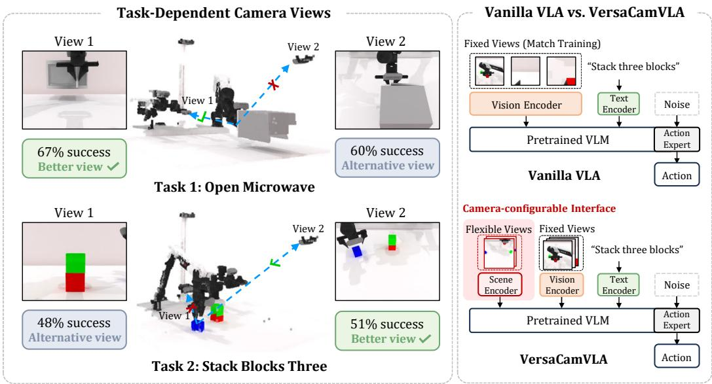
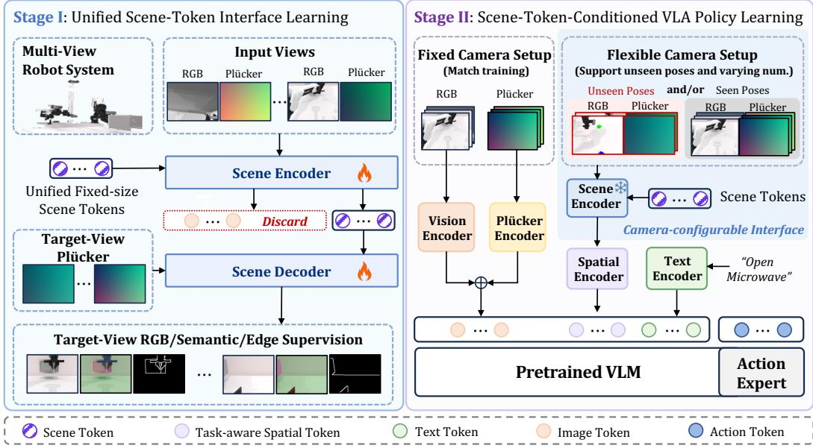
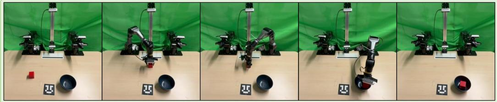
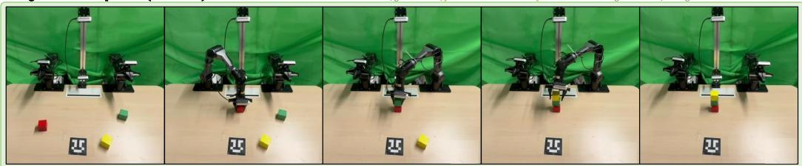
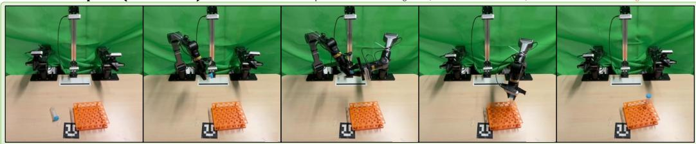
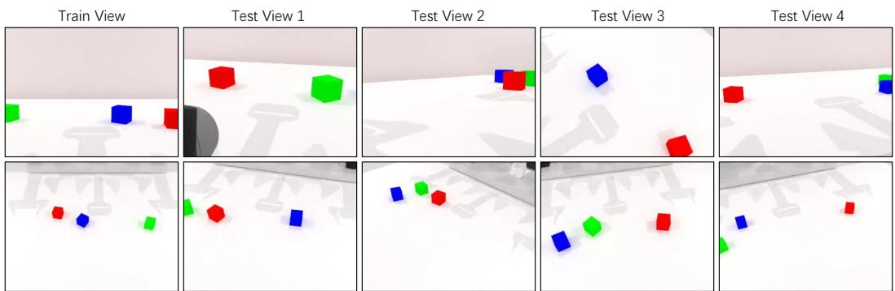
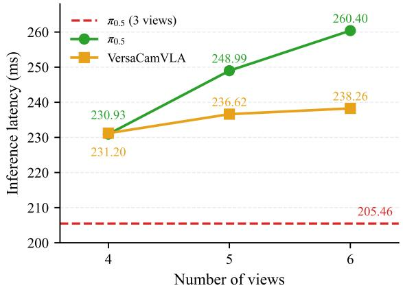
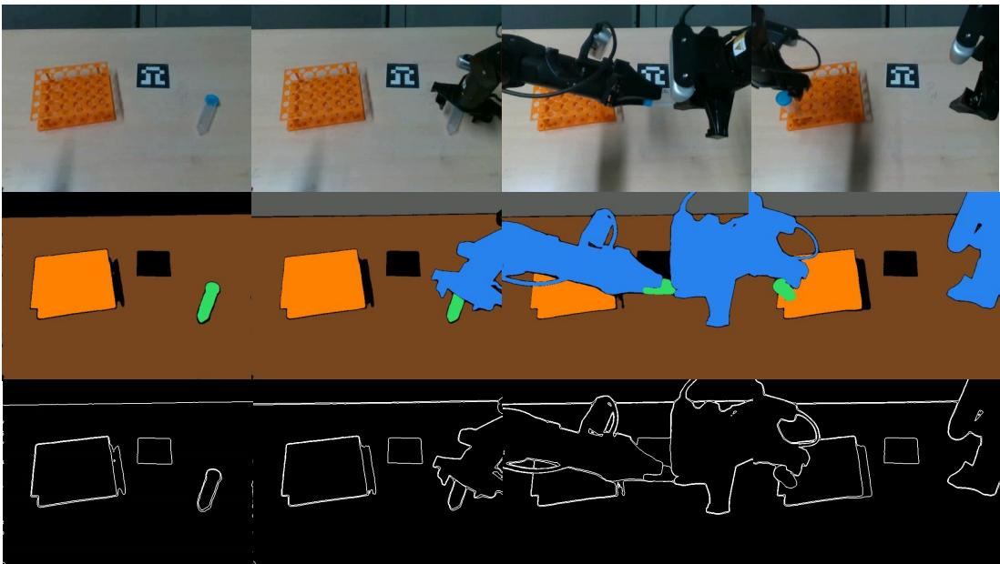

# VersaCamVLA: Camera-Configurable VLA Policies for Robotic Manipulation

Boyao Han1,2∗ Chen Shi1∗ Jingjing Qian1 Zhuotao Tian2,3 Li Jiang1,2†

1The Chinese University of Hong Kong, Shenzhen

2Shenzhen Loop Area Institute 3Harbin Institute of Technology, Shenzhen

Project Page: https://boyaohan.github.io/VersaCamVLA.github.io/

## Abstract

Vision-Language-Action (VLA) models have emerged as powerful foundations for robotic manipulation, but their reliance on fixed camera configurations during training makes them brittle to changes in camera count or pose during deployment. To overcome these limitations, we propose VersaCamVLA, a camera-configurable framework that decouples camera-set representation from action learning. VersaCamVLA learns a unified scene-token interface that maps an arbitrary, variable set of posed RGB views into fixed-size latent scene tokens. This is achieved via multi-signal target-view prediction and Wrist-Augmented Pose Sampling (WAPS), which leverages natural wrist-camera motion for free pose diversity. At deployment, a lightweight spatial encoder injects these compact scene tokens into a pretrained base VLA as a supplementary visual condition, requiring no explicit 3D sensing or novel-view rendering. Experiments on RoboTwin, LIBERO, and a real-robot platform demonstrate that VersaCamVLA consistently outperforms prior VLA methods and direct multi-view baselines, maintaining robust performance across varying camera counts and unseen camera poses.

## 1 Introduction

Vision-Language-Action (VLA) models have become a powerful foundation for robotic manipulation, adapting pretrained Vision-Language Models (VLMs) to map visual observations, language instructions, and proprioception to robot actions [1–8], and their semantic priors and few-shot adaptability make them attractive as general policies across diverse tasks and environments. However, fine-grained tasks such as precise insertion, and bimanual assembly demand reliable spatial perception, which is tightly coupled to the cameras used during training: changing the number of cameras or shifting a camera’s pose alters the visual token distribution and degrades the policy. This poses a obstacle for deployment, where camera placement is often constrained by the robot, workspace, or task, and a useful view on one platform may be unavailable or suboptimal on another, as illustrated in Fig. 1.

Prior work has addressed camera sensitivity through several complementary directions. One line of work improves viewpoint robustness by collecting demonstrations from multiple camera poses [9– 12] or synthesizing novel views for training-time augmentation [13] and training-free test-time adaptation [14]. However, multi-pose collection is costly on real robots, and synthesis-based methods depend on the fidelity of generated views. Another line introduces geometric priors through depth, point clouds, or rendered views [15–18], as well as geometric features extracted from RGB images by pretrained 3D foundation models [19, 20]. Finally, multi-camera policies often append visual tokens from additional cameras to the policy input [21–23]. This direct multi-view formulation improves coverage, but it still binds the policy to the camera count and view layout used during action learning, and its token length grows with the number of input views.

  
Figure 1: Left: Different manipulation tasks prefer different camera views, making a fixed view setup suboptimal. Right: VersaCamVLA augments a vanilla VLA with a camera-configurable scene-token interface that enables flexible view setup at deployment.

We argue that a VLA should instead support a camera-configurable visual pathway that accepts a variable number of posed RGB views, makes no assumption on camera poses, and presents the action policy with a unified fixed-size scene representation. To this end, we present VersaCamVLA, a camera-configurable VLA framework that decouples camera-set representation learning from action learning. Rather than redesigning the VLA backbone or requiring explicit 3D reconstruction, VersaCamVLA learns a unified scene-token interface between raw camera observations and the policy. This interface maps any non-empty set of posed RGB views into fixed-size scene tokens, allowing different camera configurations to be represented through the same policy-facing visual format.

VersaCamVLA is trained in two stages: unified scene-token interface learning and scene-tokenconditioned VLA policy learning. In Stage I, a scene encoder aggregates a source set of posed RGB views into latent scene tokens, and a training-only scene decoder queries these tokens with target-camera rays predict RGB, semantic, and edge signals at target views. This multi-signal targetview objective encourages the scene tokens to preserve view-consistent spatial information while providing object-level and boundary-aware supervision beyond raw pixel reconstruction. To expose the encoder to diverse camera configurations without collecting additional multi-pose demonstrations, we introduce Wrist-Augmented Pose Sampling (WAPS), which turns the natural motion of wrist cameras into a free source of pose diversity. At each training frame, WAPS varies the source camera subset while asking the decoder to reconstruct all available views, producing both self-reconstruction and cross-view prediction signals for the same scene tokens.

In Stage II, VersaCamVLA discards the decoder and prediction heads, freezes the scene encoder, and integrates the learned scene tokens into a pretrained VLA policy. The base VLA keeps its native fixed-view RGB input and action-learning objective, while a lightweight spatial encoder compresses the learned scene tokens into a compact supplementary visual condition. Camera flexibility therefore enters through the auxiliary scene-token pathway: any available posed camera subset can be encoded into the same fixed-size representation, while the action expert receives a stable conditioning interface. At deployment, VersaCamVLA supports versatile camera setups and requires only RGB images with camera intrinsics and extrinsics. No novel-view rendering, depth estimation, point-cloud processing, or explicit 3D reconstruction is needed.

We evaluate VersaCamVLA on RoboTwin [24], LIBERO [25], and a real-robot platform with varying camera counts and poses. Across these scenarios, VersaCamVLA consistently outperforms prior works and direct multi-view baselines. These findings show that learning a unified scene-token interface effectively makes pretrained VLA policies more robust to practical camera-configuration changes. In summary, our main contributions are threefold:

• We formulate camera-configurable VLA policy learning, where a policy must operate with a variable number of posed RGB views without assuming fixed camera poses, while maintaining a fixed-size visual interface for action prediction.

• We propose VersaCamVLA, a two-stage framework that learns a unified scene-token interface through target-view prediction, then injects the resulting scene tokens into a pretrained VLA as supplementary visual conditioning. Wrist-Augmented Pose Sampling is introduced to exploit wrist-camera motion as free pose diversity for scene-token learning.

• We validate VersaCamVLA on simulation and real-robot manipulation benchmarks, showing consistent improvements over prior VLA methods and direct multi-view baselines under changing camera counts and unseen camera poses.

## 2 Related Work

## 2.1 Vision-Language-Action Models

Vision-Language-Action models (VLAs) [1–3, 22, 6, 4, 5, 26] adapt pretrained vision-language models (VLMs) to robot control by training on large-scale teleoperation and egocentric data, generalizing across novel scenes, objects, and instructions. However, recent evaluations show that VLAs are sensitive to camera-configuration shifts, especially viewpoint variations [27–29], mainly because their 2D RGB inputs lack explicit camera-pose awareness. Most VLA policies further fix the number of input cameras during post-training, limiting adaptation to camera additions, removals, or pose changes. Our work targets this underexplored camera-configuration flexibility for pretrained VLAs.

## 2.2 Viewpoint Generalization for Vision-Language-Action Policies

Recent work addresses viewpoint brittleness in visuomotor and Vision-Language-Action policies through data augmentation, test-time view synthesis, and geometry-aware representation learning. Data augmentation broadens viewpoint coverage through multi-pose demonstrations [9, 10, 12] or novel-view synthesis [30, 31], but is limited by collection cost and synthesis fidelity. Geometryaware methods inject priors such as depth [17, 32], point clouds[33, 15, 34], or view-aligned 3D features [15–17, 35–37, 16], as well as geometric features extracted from RGB images by pretrained 3D foundation models [19, 20]. In contrast, our method learns compact scene tokens from posed RGB views, improving unseen-pose robustness without explicit 3D reconstruction at deployment or extra multi-pose demonstrations, while requiring calibrated camera intrinsics and extrinsics.

## 2.3 Multi-Camera Perception for Vision-Language-Action Policies

Multi-camera perception is a common strategy in imitation learning and robot manipulation. Prior policies [21, 22] concatenate image features or tokens from multiple cameras and feed them into a transformer-based action predictor. Recent VLA-style approaches [38, 22, 23, 39–43] adopt a similar design by appending external-view tokens to the policy input. This direct multi-view formulation is simple and effective, and has been widely used to improve scene coverage, reduce occlusion, and enhance policy performance on fine-grained manipulation tasks.

## 3 Methodology

We present VersaCamVLA, a camera-configurable VLA framework that decouples camera-set representation learning from action learning, as illustrated in Fig. 2. In Stage I, VersaCamVLA learns a unified scene-token interface between raw observations and the policy. A scene encoder maps any non-empty set of posed RGB views to fixed-size latent scene tokens, supervised by target-view prediction, which encourages the scene tokens to preserve view-consistent spatial information acros camera poses. In Stage II, the decoder used for scene representation learning is removed, the scene encoder is frozen, and a compact version of the learned scene tokens is injected into a pretrained VLA policy as additional visual conditioning, allowing the policy to use observations from different numbers of cameras and unseen camera poses.

Specifically, we first introduce the camera-configurable VLA setting and base policy in Sec. 3.1. We then describe how VersaCamVLA learns the unified scene-token interface in Sec. 3.2. Sec. 3.3 presents Wrist-Augmented Pose Sampling, which improves camera-configuration coverage during scene representation learning. Finally, Sec. 3.4 describes how the learned scene tokens are integrated into the VLA policy for action learning.

  
Figure 2: Overview of VersaCamVLA. Stage I: A scene encoder aggregates posed RGB views into fixed-size scene tokens, with a training-only decoder predicting RGB, semantic, and edge signals at target views. Stage II: The decoder is discarded, the scene encoder is frozen, and a jointly-trained spatial encoder compresses the tokens into a supplementary visual condition for a pretrained VLA.

## 3.1 Camera-Configurable VLA Setting

Standard VLA formulation. A VLA policy π predicts robot actions at timestep t from a language instruction L, visual observation Vt, and proprioceptive state $\mathcal { P } _ { t }$ , written as

$$
A _ { t } = \pi ( \mathcal { L } , \mathcal { V } _ { t } , \mathcal { P } _ { t } ) = [ a _ { t } , a _ { t + 1 } , \ldots , a _ { t + H _ { a } - 1 } ] ,\tag{1}
$$

where $H _ { a }$ is the action horizon. Each action $a _ { t } = [ \mathbf { q } _ { t } ^ { L } , g _ { t } ^ { L } , \mathbf { q } _ { t } ^ { R } , g _ { t } ^ { R } ] \in \mathbb { R } ^ { 1 4 }$ is represented in joint space: $\mathbf { q } _ { t } ^ { L } , \mathbf { q } _ { t } ^ { R } \in \mathbb { R } ^ { 6 }$ are the left and right arm joint angles, and $g _ { t } ^ { L } , g _ { t } ^ { R } \in \mathbb { R }$ are the gripper states. In conventional single- or multi-view VLAs, Vt is tied to the camera setup used during policy training. For example, a multi-camera VLA typically instantiates $\nu _ { t }$ as an image tuple $\{ \mathbf { I } _ { t } ^ { i } \} _ { i = 1 } ^ { N }$ , where the number of views and the camera poses are fixed components of the policy input.

Camera-configurable observations. The fixed-tuple visual observation in standard VLAs makes the policy interface depend on the demonstrated camera setup. If a camera is added or moved to a new pose, the resulting visual tokens no longer match the structure seen during action learning. To remove this dependency, we keep the standard VLA input-output form but replace the camera component of $\nu _ { t }$ with a flexible camera set. Let $\begin{array} { r } { \mathcal { C } = \{ ( \mathbf { K } ^ { i } , \mathbf { \bar { T } } ^ { i } ) \} _ { i = } ^ { N ^ { 1 } } } \end{array}$ denote a camera configuration, where $\mathbf { K } ^ { i }$ and $\mathbf { T } ^ { i }$ are the intrinsic and extrinsic matrices of camera i. Under this configuration, the visual observation is $\mathcal { V } _ { t } ^ { \mathcal { C } } = \{ ( \mathbf { I } _ { t } ^ { i } , \mathbf { K } ^ { i } , \mathbf { T } ^ { i } ) \} _ { i = 1 } ^ { N }$ . Camera-configurable VLA policy learning asks for a single policy that remains valid as $\mathcal { C }$ varies across deployment setups. The visual observation should therefore allow a variable number of views from non-fixed poses, while the downstream action policy should still receive fixed-size scene tokens. This motivates VersaCamVLA’s scene-token interface, which maps $\mathcal { V } _ { t } ^ { \mathcal { C } }$ to unified scene tokens $\mathbf { Z } _ { t }$ whose size is independent of N.

Backbone instantiation. We instantiate π with $\pi _ { 0 . 5 }$ [1], a pretrained VLA that uses a VLM [44, 45] to encode visual and language context and a robotics-specific action expert to generate continuous action chunks. VersaCamVLA does not redesign the VLA backbone; instead, it augments the backbone’s visual context with scene tokens produced from $\mathcal { V } _ { t } ^ { \mathcal { C } }$ . The action expert follows $\pi _ { 0 . 5 }$ [2] and predicts $A _ { t }$ through a flow-matching denoising objective, detailed in Sec. 3.4.

## 3.2 Unified Scene-Token Interface Learning

To implement a unified scene-token interface, VersaCamVLA uses a scene encoder that turns the camera-configurable observation into fixed-size scene tokens Z. Inspired by LVSM [46], we learn this encoder with target-view prediction: a scene decoder, used only during representation learning, queries Z with target-camera rays and reconstructs RGB, semantic, and edge signals. This objective encourages Z to support prediction at target views beyond the input views, while presenting the downstream VLA with a consistent visual representation regardless of the input camera set.

Scene encoder. Given a source camera set S and the corresponding input observation $\begin{array} { r } { \mathcal { V } ^ { S } = } \end{array}$ $\{ ( \mathbf { I } ^ { i } , \mathbf { K } ^ { i } , \mathbf { T } ^ { i } ) \} _ { i = } ^ { N }$ with N source views, we first compute a Plücker ray embedding map $\mathbf { R } ^ { i }$ for each posed view. We then tokenize each RGB image and ray map via ViT-style patchification with patch size p, yielding $P = H _ { I } W _ { I } / p ^ { 2 }$ patches per view. For the j-th patch of view i, we concatenate the RGB patch $\mathbf { I } ^ { i , \breve { j } } \in \mathbb { R } ^ { p \times p \times 3 }$ with its ray embedding patch $\mathbf { R } ^ { i , j } \in \dot { \mathbb { R } } ^ { p \times p \times 6 }$ , and project the result into a d-dimensional source token:

$$
\mathbf { x } ^ { i , j } = \phi _ { \mathrm { s r c } } \big ( \big [ \mathbf { I } ^ { i , j } , \mathbf { R } ^ { i , j } \big ] \big ) \in \mathbb { R } ^ { d } ,\tag{2}
$$

where $\phi _ { \mathrm { s r c } }$ is a linear patch projection. The tokens from all source views are stacked into a source sequence $\mathbf { X } \in \mathbb { R } ^ { ( N \times \bar { P } ) \times d }$ , whose length varies with the number of input cameras.

We use L learnable scene tokens $\mathbf { E } = \{ \mathbf { e } ^ { k } \} _ { k = 1 } ^ { L }$ with $\mathbf { e } ^ { k } \in \mathbb { R } ^ { d }$ to aggregate the variable-length source-token sequence into a fixed-size representation. The source tokens and scene tokens are concatenated and processed jointly by a Transformer encoder, allowing the scene tokens to attend to spatial information from all input views through self-attention. We discard the updated source tokens and retain the updated scene-token outputs Z as the compact scene representation:

$$
\begin{array} { r } { \mathbf { Z } = \mathrm { E n c } _ { \theta } \big ( [ \mathbf { X } , \mathbf { E } ] \big ) \in \mathbb { R } ^ { L \times d } . } \end{array}\tag{3}
$$

Since L is independent of the number and poses of input cameras, Z provides a fixed-size scene representation for downstream policy learning under flexible camera configurations.

Scene decoder. To encourage Z to encode view-consistent scene information that remains useful beyond the input camera views, we train a scene decoder to predict signals at target view poses conditioned on Z. Given a target camera $c = ( \bf K , T )$ , we denote its tokenized Plücker ray embeddings as $\{ \mathbf { R } ^ { c , j } \} _ { j = 1 } ^ { P }$ and project each target ray patch through a linear projection $\phi _ { \mathrm { t g t } }$

$$
\mathbf { q } ^ { c , j } = \phi _ { \mathrm { t g t } } \bigl ( \mathbf { R } ^ { c , j } \bigr ) \in \mathbb { R } ^ { d } .\tag{4}
$$

The target ray tokens $\mathbf { Q } ^ { c } \in \mathbb { R } ^ { P \times d }$ are concatenated with the scene tokens and passed through a Transformer with self-attention. We keep only the updated target tokens $\mathbf { Y } ^ { c }$ as output:

$$
\begin{array} { r } { \mathbf { Y } ^ { c } = \operatorname { D e c } _ { \boldsymbol { \psi } } ( [ \mathbf { Q } ^ { c } , \mathbf { Z } ] ) \in \mathbb { R } ^ { P \times d } . } \end{array}\tag{5}
$$

$\mathbf { Y } ^ { c }$ are then fed to lightweight prediction heads for RGB, semantic-map, and edge-map reconstruction. Successful prediction requires Z to summarize the source observations in a form that supports prediction beyond the encoder input views.

Multi-signal target-view supervision. Given a target camera set $\tau _ { \ast }$ , the scene decoder produces target-view output tokens $\mathbf { Y } ^ { c }$ for each $c \in { \mathcal { T } }$ . A lightweight prediction head $h _ { \mathrm { r g b } }$ then maps $\mathbf { Y } ^ { c }$ to a predicted RGB image:

$$
\hat { \mathbf { I } } ^ { c } = h _ { \mathrm { r g b } } ( \mathbf { Y } ^ { c } ) ,\tag{6}
$$

and is supervised against the ground-truth RGB image Ic by an MSE term plus a deep perceptual term $\mathcal { L } _ { \mathrm { p e r c } }$ computed in a pretrained feature space:

$$
\mathcal { L } _ { \mathrm { r g b } } = \sum _ { c \in \mathcal { T } } \left[ \mathrm { M S E } ( \hat { \mathbf { I } } ^ { c } , \mathbf { I } ^ { c } ) + \lambda _ { \mathrm { p e r c } } \mathcal { L } _ { \mathrm { p e r c } } ( \hat { \mathbf { I } } ^ { c } , \mathbf { I } ^ { c } ) \right] .\tag{7}
$$

RGB reconstruction alone can be dominated by texture, lighting, and background statistics. To better align the scene tokens with manipulation-relevant structure, we add two complementary supervision signals: semantic maps and edge maps. Two additional heads on the same target-view decoder output produce the semantic and edge predictions:

$$
\hat { \mathbf { S } } ^ { c } = h _ { \mathrm { s e m } } ( \mathbf { Y } ^ { c } ) , \qquad \hat { \mathbf { B } } ^ { c } = h _ { \mathrm { e d g e } } ( \mathbf { Y } ^ { c } ) ,\tag{8}
$$

Fine-Grained Manipulation(Insert Test Tube).

Long-Horizon Manipulation(StackCube). Instruction: Use arms to centralize red block, green block, yellow block and stack yellow block above green block, then green block above red block.  
  
Instruction: Pick up the test tube with the right arm, hand it over to the left arm, and then insert it into the orange test tube rack

  
Figure 3: Real-world Manipulation Processes. Representative rollouts of VersaCamVLA on three real-world tasks: PickCube, StackCube, and Insert Test Tube, showing key execution states from the initial scene to task completion.

each supervised against its target map by an MSE term:

$$
{ \mathcal { L } } _ { \mathrm { s e m } } = \sum _ { c \in { \mathcal { T } } } { \mathrm { M S E } } ( { \hat { \mathbf { S } } } ^ { c } , \mathbf { S } ^ { c } ) , \qquad { \mathcal { L } } _ { \mathrm { e d g e } } = \sum _ { c \in { \mathcal { T } } } { \mathrm { M S E } } ( { \hat { \mathbf { B } } } ^ { c } , \mathbf { B } ^ { c } ) .\tag{9}
$$

Semantic targets ${ \bf S } ^ { c }$ come from the simulator’s segmentation sensor in simulation and from a SAM3 segmenter [47] fine-tuned on our real-robot data for real frames; edge targets $\mathbf { B } ^ { c }$ are extracted with a Canny detector. The scene-token learning objective is the weighted sum:

$$
{ \mathcal { L } } _ { \mathrm { s c e n e } } = { \mathcal { L } } _ { \mathrm { r g b } } + \lambda _ { \mathrm { s e m } } { \mathcal { L } } _ { \mathrm { s e m } } + \lambda _ { \mathrm { e d g e } } { \mathcal { L } } _ { \mathrm { e d g e } } ,\tag{10}
$$

where $\lambda _ { \mathrm { s e m } }$ and $\lambda _ { \mathrm { e d g e } }$ balance the high-level signals against photometric reconstruction.

## 3.3 Wrist-Augmented Pose Sampling

The scene encoder in Sec. 3.2 is designed to accept a variable number of views from non-fixed poses and produce fixed-size unified scene tokens for downstream VLA. Learning this camera-configurable interface, however, requires the training data to cover sufficiently diverse camera placements. In tabletop manipulation data, static cameras provide stable but sparsely distributed viewpoints, while wrist cameras sweep a much richer pose distribution as the robot moves. Wrist-Augmented Pose Sampling (WAPS) turns this natural motion into pose diversity for scene-token learning.

Specifically, for each training frame, let $\mathcal { C } _ { \mathrm { s t a t } }$ and $\mathcal { C } _ { \mathrm { w r i s t } }$ denote the available static-camera and wrist camera views. The source view set $S = S _ { \mathrm { s t a t } } \cup S _ { \mathrm { w r i s t } }$ fed to the scene encoder is drawn from the two camera types independently. From the static cameras, we randomly sample n views as $S _ { \mathrm { s t a t } } ,$ , where n is a random integer between 1 and $| { \mathcal { C } } _ { \mathrm { s t a t } } |$ . For wrist cameras, each view is independently included in $\mathcal { S } _ { \mathrm { w r i s t } }$ with probability 0.5. We use the full camera pool as the target set $\mathcal { T } = \dot { \mathcal { C } } _ { \mathrm { s t a t } } \cup \dot { \mathcal { C } } _ { \mathrm { w r i s t } }$ , so the decoder is always trained to render every available view, regardless of the encoder input.

This design provides two complementary supervision signals on the same scene tokens. Selfreconstruction on source views preserves visual detail through the latent bottleneck, while cross-view prediction on held-out views forces Z to support view poses that were not in the encoder input.

Table 1: Simulation results on RoboTwin 2.0. We report success rates (%) on RoboTwin 2.0. All results are reproduced by us. Bold indicates the best performance in each column.
<table><tr><td rowspan="2">Task</td><td colspan="2">ACT[21]</td><td colspan="2">DP[48]</td><td colspan="2">DP3[15]</td><td colspan="2">OpenVLA-OFT[3]</td><td colspan="2">π0.5 [1]</td><td colspan="2">VersaCamVLA</td></tr><tr><td>Clean</td><td>DR</td><td>Clean</td><td>DR</td><td>Clean</td><td>DR</td><td>Clean</td><td>DR</td><td>Clean</td><td>DR</td><td>Clean</td><td>DR</td></tr><tr><td>Blocks Ranking RGB</td><td>0</td><td>0</td><td>0</td><td>0</td><td>2</td><td>0</td><td>0</td><td>0</td><td>38</td><td>11</td><td>67</td><td>12</td></tr><tr><td>Blocks Ranking Size</td><td>3</td><td>0</td><td>1</td><td>0</td><td>2</td><td>1</td><td>7</td><td>0</td><td>12</td><td>4</td><td>35</td><td>6</td></tr><tr><td>Hanging Mug</td><td>6</td><td>0</td><td>19</td><td>0</td><td>35</td><td>1</td><td>12</td><td>0</td><td>4</td><td>4</td><td>10</td><td>4</td></tr><tr><td>Move Stapler Pad</td><td>0</td><td>0</td><td>0</td><td>0</td><td>7</td><td>0</td><td>0</td><td>0</td><td>5</td><td>7</td><td>8</td><td>5</td></tr><tr><td>Open Laptop</td><td>72</td><td>1</td><td>53</td><td>0</td><td>77</td><td>1</td><td>82</td><td>0</td><td>90</td><td>70</td><td>96</td><td>62</td></tr><tr><td>Open Microwave</td><td>72</td><td>0</td><td>78</td><td>0</td><td>91</td><td>25</td><td>23</td><td>56</td><td>43</td><td>26</td><td>51</td><td>46</td></tr><tr><td>Pick Diverse Bottles</td><td>8</td><td>0</td><td>28</td><td>0</td><td>55</td><td>1</td><td>9</td><td>0</td><td>36</td><td>21</td><td>47</td><td>12</td></tr><tr><td>Place A2B Left</td><td>1</td><td>0</td><td>3</td><td>0</td><td>30</td><td>1</td><td>5</td><td>0</td><td>42</td><td>24</td><td>54</td><td>17</td></tr><tr><td>Place A2B Right</td><td>2</td><td>0</td><td>6</td><td>0</td><td>43</td><td>0</td><td>11</td><td>0</td><td>24</td><td>19</td><td>45</td><td>27</td></tr><tr><td>Place Burger Fries</td><td>67</td><td>0</td><td>80</td><td>0</td><td>75</td><td>2</td><td>30</td><td>0</td><td>48</td><td>31</td><td>81</td><td>49</td></tr><tr><td>Place Dual Shoes</td><td>0</td><td>0</td><td>4</td><td>0</td><td>9</td><td>0</td><td>2</td><td>0</td><td>25</td><td>24</td><td>51</td><td>25</td></tr><tr><td>Place Empty Cup</td><td>38</td><td>0</td><td>27</td><td>0</td><td>75</td><td>1</td><td>20</td><td>0</td><td>77</td><td>1</td><td>81</td><td>27</td></tr><tr><td>Place Object Basket</td><td>1</td><td>0</td><td>21</td><td>0</td><td>49</td><td>3</td><td>5</td><td>0</td><td>53</td><td>26</td><td>76</td><td>35</td></tr><tr><td>Scan Object</td><td>3</td><td>0</td><td>8</td><td>0</td><td>29</td><td>1</td><td>8</td><td>1</td><td>6</td><td>4</td><td>35</td><td>15</td></tr><tr><td>Stack Blocks Three</td><td>5</td><td>0</td><td>0</td><td>0</td><td>3</td><td>0</td><td>0</td><td>0</td><td>18</td><td>50</td><td>43</td><td>3</td></tr><tr><td>Stack Bowls Three</td><td>37</td><td>0</td><td>51</td><td>0</td><td>57</td><td>4</td><td>29</td><td>0</td><td>53</td><td>24</td><td>61</td><td>23</td></tr><tr><td>Average (%)</td><td>19.69</td><td>0.06</td><td>23.69</td><td>0.00</td><td>39.94</td><td>2.56</td><td>15.19</td><td>3.56</td><td>35.88</td><td>21.63</td><td>52.56</td><td>23.00</td></tr></table>

Table 2: Simulation results on LIBERO. We report task success rates (%) on LIBERO. Results marked with ∗ are reproduced by us. Bold indicates the best performance in each column, and underlined indicates the second-best performance.
<table><tr><td>Method</td><td>LIBERO-Spatial</td><td>LIBERO-Goal</td><td>LIBERO-Object</td><td>LIBERO-Long</td><td>Average</td></tr><tr><td>Diffusion Policy[48]</td><td>78.3</td><td>92.5</td><td>68.3</td><td>50.5</td><td>72.4</td></tr><tr><td>OpenVLA-OFT [3]</td><td>95.2</td><td>94.2</td><td>95.2</td><td>93.2</td><td>94.5</td></tr><tr><td>π0.5 [1]</td><td>98.0</td><td>94.6</td><td>99.0</td><td>91.6</td><td>95.8</td></tr><tr><td> $\mathrm { V e r s a C a m V L A }$ </td><td>98.2</td><td>95.0</td><td>97.8</td><td>92.4</td><td>95.9</td></tr></table>

By varying the number and poses of source cameras across training frames, the encoder learns to extract scene representation from arbitrary camera subsets instead of relying on a fixed camera setup. Wrist-camera motion further provides diverse cross-view targets at no extra data-collection cost.

## 3.4 Scene-Token-Conditioned VLA Policy Learning

After learning the scene-token interface, we discard the scene decoder and prediction heads, freeze the scene encoder, and integrate the resulting scene tokens into the base VLA for action learning.

Action policy learning. At time step t, the frozen scene encoder maps the versatile camera configu ration C and the corresponding posed views $\mathcal { V } _ { t } ^ { \mathcal { C } }$ into scene tokens $\mathbf { Z } _ { t }$ following Sec. 3.2. Although $\mathbf { \bar { Z } } _ { t }$ has fixed length, directly feeding all scene tokens into the VLA can still add unnecessary computation and may expose the policy to background details that are irrelevant to action prediction. A convolutional spatial encoder $g _ { \eta }$ compresses scene tokens into a compact, task-oriented representation:

$$
\bar { \mathbf Z } _ { t } = g _ { \eta } ( \mathbf Z _ { t } ) .\tag{11}
$$

The compact $\bar { \mathbf Z } _ { t }$ is fed into VLA as a supplementary scene representation. The policy therefore conditions on the language instruction $\mathcal { L } ,$ , the RGB observations $\nu _ { t } ,$ , the supplementary scene representation $\bar { \mathbf { Z } } _ { t } .$ , and the proprioceptive state $\mathcal { P } _ { t }$ , and predicts the action chunk $A _ { t }$

The scene encoder stays frozen throughout this stage; $g _ { \eta }$ is randomly initialized and, jointly with base VLA’s trainable parameters ω, optimized by the standard flow-matching action regression loss:

$$
\begin{array} { r } { \mathcal { L } _ { \mathrm { a c t i o n } } = \mathbb { E } _ { \tau , \epsilon } \left[ \left\| v _ { \eta , \omega } \big ( A _ { t } ^ { \tau } ; \mathcal { L } , \mathcal { V } _ { t } , \bar { \mathbf { Z } } _ { t } , \mathcal { P } _ { t } , \tau \big ) - \big ( A _ { t } - \epsilon \big ) \right\| _ { 2 } ^ { 2 } \right] , } \end{array}\tag{12}
$$

where $\epsilon \sim \mathcal { N } ( 0 , \mathbf { I } ) , \tau \sim \mathcal { U } [ 0 , 1 ] , A _ { t } ^ { \tau } = \tau A _ { t } + ( 1 - \tau ) \epsilon$ ϵ is the linear interpolation between noise and the demonstration action chunk, and $v _ { \eta , \omega }$ is the velocity field predicted by the base $\mathrm { V L A } \pi _ { 0 . 5 } ^ { } \mathrm { s }$ action expert. Because $g _ { \eta }$ is supervised only through $\mathcal { L } _ { \mathrm { a c t i o n } } ,$ it acts as a task-driven information bottleneck that retains scene-token information useful for action prediction.

Table 3: Robustness to camera-pose variations. Average success rate (%) on RoboTwin 2.0 Clean and real-robot tasks. Bold indicates the best performance in each column.
<table><tr><td></td><td colspan="2">RoboTwin 2.0</td><td colspan="2">Real Robot</td></tr><tr><td>Method</td><td>Seen Pose</td><td>Unseen Pose</td><td>Seen Pose</td><td>Unseen Pose</td></tr><tr><td> $\pi _ { 0 . 5 }$ </td><td>48.88</td><td>32.88</td><td>41.67</td><td>13.33</td></tr><tr><td>VersaCamVLA</td><td>53.44</td><td>52.63</td><td>53.33</td><td>58.33</td></tr></table>

Table 4: Effect of input camera count. Average success rate (%) on RoboTwin 2.0 Clean and real-robot tasks. V denotes views. Bold indicates the best performance in each column.
<table><tr><td></td><td colspan="4">RoboTwin 2.0</td><td colspan="3">Real Robot</td></tr><tr><td>Method</td><td>3V</td><td>4V</td><td>5V</td><td>6V</td><td>3V</td><td>4V</td><td>5V</td></tr><tr><td> $\pi _ { 0 . 5 }$ </td><td>35.88</td><td>48.88</td><td>x</td><td>x</td><td>31.67</td><td>41.67</td><td>x</td></tr><tr><td>VersaCamVLA</td><td>52.56</td><td>53.44</td><td>53.13</td><td>55.63</td><td>x</td><td>53.33</td><td>65.00</td></tr></table>

Inference. At deployment, the scene decoder and the three prediction heads are discarded; only the scene encoder, spatial encoder, and the base VLA backbone $( \pi _ { 0 . 5 } )$ run on the inference path. Any subset of posed camera observations available on the robot system is encoded into the same fixedlength $\bar { \mathbf Z } _ { t } ,$ , so the policy operates under flexible camera configurations through a unified scene-token interface, without novel-view rendering, depth, point clouds, or explicit 3D reconstruction.

## 4 Experiments

## 4.1 Experimental Setup

Simulation Setup. We evaluate on two standard robotic manipulation benchmarks, RoboTwin 2.0 [24] for bimanual manipulation under canonical (Clean) and domain-randomized (DR) settings, and LIBERO [25] for single-arm manipulation across four suites. Embodiments, task selection, demonstration counts, and training protocols are described in Appendix A.

Camera-Configuration Setup. Beyond the official benchmark settings, we design additional evaluations to test robustness to changing camera configurations.

• Camera-Pose Perturbation. On both RoboTwin 2.0 and LIBERO, policies are trained under the nominal camera setup and evaluated with camera poses perturbed in azimuth, distance, and pitch over a workspace-centered spherical region, probing generalization to unseen viewpoints.

• Camera-Count Variation. On RoboTwin 2.0 Clean, we train $\mathrm { 1 w o ~ } \pi _ { 0 . 5 }$ baselines separately at 3 and 4 views and a single VersaCamVLA policy, then evaluate VersaCamVLA under 3, 4, 5, and 6 input views and each $\pi _ { 0 . 5 }$ baseline at its matched view count, isolating the effect of camera count.

Real-World Setup. To evaluate real-robot camera flexibility, we test VersaCamVLA on three Cobot Magic bimanual tasks, covering sequential coordination, long-horizon manipulation, and fine handover-and-insertion, with 20 trajectories per task. Figure 3 provides visualizations of all tasks.

• Basic Manipulation (PickCube). The right arm moves a red cube to the workspace center, and the left arm then picks it up and places it into a bowl, exercising sequential bimanual coordination in a shared workspace.

• Long-Horizon Manipulation (StackCube). The robot stacks three cubes into a red–green–yellow tower from bottom to top with cube positions randomized at evaluation; small placement errors collapse the tower, stressing precise spatial control over an extended horizon.

• Fine-Grained Manipulation(Insert Test Tube): The right arm grasps a test tube, transfers it to the left arm, and inserts it into a tube rack, requiring accurate handover orientation and fine local alignment despite gripper-induced occlusions during the handover.

Baselines. We compare VersaCamVLA with visuomotor and bimanual VLA baselines. Visuomotor policies include ACT [21], DP [48] and DP3 [15] trained separately per task. VLA baselines include OpenVLA-OFT [3], the original $\pi _ { 0 . 5 }$ [1]. For $\pi _ { 0 . 5 } ,$ , each additional RGB view is encoded with SigLIP [49] and appended to the policy input as extra visual tokens in a fixed view order.

Table 5: Token ablation on RoboTwin 2.0 Clean. Average success rate (%). Bold indicates the best performance.  
Table 6: Spatial Encoder ablation on RoboTwin 2.0 Clean. Average success rate (%). Bold indicates the best performance.
<table><tr><td>Token Number</td><td>48</td><td>192</td><td>432</td></tr><tr><td>Average SR (%)</td><td>50.06</td><td>55.63</td><td>47.50</td></tr></table>

<table><tr><td>Spatial Encoder</td><td>Pooling</td><td>Conv</td></tr><tr><td>Average SR (%)</td><td>50.13</td><td>55.63</td></tr></table>

Table 8: LVSM pretraining ablation. Average success rate (%) on RoboTwin 2.0 Clean. Bold indicates the best result.

Table 7: WAPS ablation. Average success rate (%) under the unseen camera pose setting. Bold indicates the best result.
<table><tr><td>Method</td><td>w/o WAPS</td><td>WAPS</td></tr><tr><td>Average SR (%)</td><td>48.79</td><td>52.63</td></tr></table>

<table><tr><td>Initialization</td><td>From scratch</td><td>Pretrained LVSM</td></tr><tr><td>Average SR (%)</td><td>51.25</td><td>55.63</td></tr></table>

Implementation Details. We use a predictive horizon of $H = 5 0$ for all tasks. Details of the camera-pose perturbation sampling protocol are provided in Appendix C.5. We train the policy for 30,000 iterations using AdamW [50] with a learning rate of $5 \times \mathrm { 1 0 ^ { - 5 } }$ on 8 NVIDIA H100 GPUs and a total batch size of 512. The primary evaluation metric is task success rate (%).More implementation details are provided in Appendix C.

## 4.2 Main Results

## Simulation Results.

• RoboTwin 2.0. Table 1 reports per-task success rates on the 16 fine-grained RoboTwin 2.0 tasks under the official Clean and DR settings, with 100 trials per task. Both $\pi _ { 0 . 5 }$ and VersaCamVLA use 3-view inputs. VersaCamVLA achieves the best average in both settings, reaching 52.56% on Clean and 23.00% on DR. VersaCamVLA achieves the best DR average, showing that scene tokens provide robust policy representations under appearance randomization.

• LIBERO. Table 2 reports results on the four LIBERO suites, testing whether the scene-token pathway preserves the general manipulation capability of the pretrained backbone on standard single-arm tasks. VersaCamVLA reaches an average success rate of 95.9%, substantially above Diffusion Policy[48] (72.4%) and OpenVLA-OFT[3] (94.5%) and on par with the strong π0.5 [1] baseline (95.8%), with slight gains on LIBERO-Spatial, LIBERO-Goal, and LIBERO-Long.

## Camera-Configuration Results.

• Camera-Pose Perturbation. Table 3 summarizes camera-pose robustness on both RoboTwin 2.0 and real-robot tasks. The LIBERO counterpart deferred to the Appendix B.2. Both $\pi _ { 0 . 5 }$ and VersaCamVLA are evaluated under matched four-view inputs, and under perturbation $\pi _ { 0 . 5 }$ drops 16.0 pp while VersaCamVLA loses only 0.8 pp. These results show that the scene-token interface is more pose-robust than direct multi-view token concatenation.

• Camera-Count Variation. Table 4 summarizes the effect of camera-count on both RoboTwin 2.0 and real-robot tasks. On RoboTwin 2.0 Clean, we train two $\pi _ { 0 . 5 }$ baselines separately at 3 and 4 views and a single VersaCamVLA policy, then evaluate VersaCamVLA under 3, 4, 5, and 6 input views and each $\pi _ { 0 . 5 }$ baseline at its matched view count, isolating the effect of camera count.

Real-world Results. Tables 3 and 4 report real-robot success rates on three bimanual manipulation tasks; the same VersaCamVLA model is evaluated at the trained pose, at an unseen pose, and with one extra test-time camera, while $\pi _ { 0 . 5 }$ is trained separately at 3 and 4 views and tested at the matched count. Under matched 4-view inputs, VersaCamVLA outperforms $\pi _ { 0 . 5 }$ by 11.7 and 45.0 percentage points on seen and unseen camera poses, respectively.

## 4.3 Ablation Study

We ablate five design choices in VersaCamVLA, covering how the scene-token interface is learned and how it conditions the action policy.

Number of compressed scene tokens. Table 5 varies the number of compressed scene tokens passed to the policy. Using 192 tokens achieves the highest average success of 55.63%, compared with 50.06% for 48 tokens and 47.50% for 432 tokens.

Table 9: Ablation of supervision signals for scene-token learning. Average success rate (%) on RoboTwin 2.0 DR. Bold indicates the best result.
<table><tr><td>RGB</td><td>√</td><td>V</td><td>V</td></tr><tr><td>Edge</td><td>X</td><td>V</td><td>√</td></tr><tr><td>Semantic</td><td>X</td><td></td><td>V</td></tr><tr><td>Average SR</td><td>20.94</td><td>X 24.75</td><td>29.50</td></tr></table>

Spatial encoder architecture. The spatial encoder compresses scene tokens into a supplementary visual condition for the action policy. As shown in Table 6, convolutional compression achieves 55.63% average success, compared with 50.13% for pooling.

Wrist-Augmented Pose Sampling. Learning a camera-configurable interface requires exposure to diverse camera poses. Table 7 shows that WAPS improves average success under unseen camera poses from 48.79% to 52.63%, a gain of 3.84 percentage points.

Scene encoder–decoder initialization. Table 8 examines the contribution of LVSM initialization. Initializing the scene encoder–decoder from a pretrained LVSM checkpoint achieves 55.63% average success, compared with 51.25% when trained from scratch.

Multi-signal supervision. RGB reconstruction provides a basic learning signal, while semantic and edge targets introduce object-level and boundary information. Table 9 shows that adding edge or semantic supervision individually improves average success from 20.94% to 24.75% and 25.69%, respectively. Combining both signals yields the best result of 29.50%, an improvement of 8.56 percentage points over RGB-only supervision.

## 5 Conclusion

We present VersaCamVLA, a camera-configurable VLA framework that augments pretrained policies with a unified scene-token interface decoupling camera-set representation from action learning. VersaCamVLA introduces a scene encoder learned by multi-signal target-view prediction and Wrist Augmented Pose Sampling that exploits wrist-camera motion as free pose diversity, producing compact scene tokens that condition a pretrained VLA without explicit 3D sensing. Experiments on RoboTwin 2.0, LIBERO, and a real-robot platform show consistent improvements over prior VLAs and direct multi-view baselines under camera-pose perturbations and varying camera counts.

Limitations and broader impacts. VersaCamVLA assumes calibrated camera intrinsics and extrinsics and focuses on tabletop bimanual setups with manual camera placement, lacking autonomous viewpoint selection. Extending the scene-token interface to uncalibrated cameras, active perception that optimizes camera configurations online, and mobile workspaces remains key future work. In terms of impact, we hope camera-configurable VLA policies lower the deployment barrier across robot platforms by reducing reliance on a fixed camera setup. However, safety-critical deployment requires further validation against task-specific failures under large camera-configuration shifts.

## References

[1] Physical Intelligence, Kevin Black, Noah Brown, James Darpinian, Karan Dhabalia, Danny Driess, Adnan Esmail, Michael Equi, Chelsea Finn, Niccolo Fusai, et al. π : A vision-language-action model with open-world generalization. arXiv preprint arXiv:2504.16054, 2025.

[2] Kevin Black, Noah Brown, Danny Driess, Adnan Esmail, Michael Equi, Chelsea Finn, Niccolo Fusai, Lachy Groom, Karol Hausman, Brian Ichter, et al. π : A vision-language-action flow model for general robot control. arXiv preprint arXiv:2410.24164, 2024.

[3] Moo Jin Kim, Chelsea Finn, and Percy Liang. Fine-tuning vision-language-action models: Optimizing speed and success, 2025. URL https://arxiv.org/abs/2502.19645.

[4] Anthony Brohan, Noah Brown, Justice Carbajal, Yevgen Chebotar, Joseph Dabis, Chelsea Finn, Keerthana Gopalakrishnan, Karol Hausman, Alex Herzog, Jasmine Hsu, Julian Ibarz, Brian Ichter, Alex Irpan, Tomas Jackson, Sally Jesmonth, Nikhil Joshi, Ryan Julian, Dmitry Kalashnikov, Yuheng Kuang, Isabel Leal, Kuang-Huei Lee, Sergey Levine, Yao Lu, Utsav Malla, Deeksha Manjunath, Igor Mordatch, Ofir Nachum, Carolina Parada, Jodilyn Peralta, Emily Perez, Karl Pertsch, Jornell Quiambao, Kanishka Rao, Michael

Ryoo, Grecia Salazar, Pannag Sanketi, Kevin Sayed, Jaspiar Singh, Sumedh Sontakke, Austin Stone, Clayton Tan, Huong Tran, Vincent Vanhoucke, Steve Vega, Quan Vuong, Fei Xia, Ted Xiao, Peng Xu, Sichun Xu, Tianhe Yu, and Brianna Zitkovich. Rt-1: Robotics transformer for real-world control at scale. In arXiv preprint arXiv:2212.06817, 2022.

[5] Brianna Zitkovich, Tianhe Yu, Sichun Xu, Peng Xu, Ted Xiao, Fei Xia, Jialin Wu, Paul Wohlhart, Stefan Welker, Ayzaan Wahid, et al. Rt-2: Vision-language-action models transfer web knowledge to robotic control. In Conference on Robot Learning, pages 2165–2183. PMLR, 2023.

[6] Octo Model Team, Dibya Ghosh, Homer Walke, Karl Pertsch, Kevin Black, Oier Mees, Sudeep Dasari, Joey Hejna, Charles Xu, Jianlan Luo, Tobias Kreiman, You Liang Tan, Lawrence Yunliang Chen, Pannag Sanketi, Quan Vuong, Ted Xiao, Dorsa Sadigh, Chelsea Finn, and Sergey Levine. Octo: An open-source generalist robot policy. In Proceedings ofRobotics: Science and Systems, Delft, Netherlands, 2024.

[7] NVIDIA, :, Johan Bjorck, Fernando Castañeda, Nikita Cherniadev, Xingye Da, Runyu Ding, Linxi "Jim" Fan, Yu Fang, Dieter Fox, Fengyuan Hu, Spencer Huang, Joel Jang, Zhenyu Jiang, Jan Kautz, Kaushil Kundalia, Lawrence Lao, Zhiqi Li, Zongyu Lin, Kevin Lin, Guilin Liu, Edith Llontop, Loic Magne, Ajay Mandlekar, Avnish Narayan, Soroush Nasiriany, Scott Reed, You Liang Tan, Guanzhi Wang, Zu Wang, Jing Wang, Qi Wang, Jiannan Xiang, Yuqi Xie, Yinzhen Xu, Zhenjia Xu, Seonghyeon Ye, Zhiding Yu, Ao Zhang, Hao Zhang, Yizhou Zhao, Ruijie Zheng, and Yuke Zhu. Gr00t n1: An open foundation model for generalist humanoid robots, 2025. URL https://arxiv.org/abs/2503.14734.

[8] Moo Jin Kim, Karl Pertsch, Siddharth Karamcheti, Ted Xiao, Ashwin Balakrishna, Suraj Nair, Rafael Rafailov, Ethan P Foster, Pannag R Sanketi, Quan Vuong, Thomas Kollar, Benjamin Burchfiel, Russ Tedrake, Dorsa Sadigh, Sergey Levine, Percy Liang, and Chelsea Finn. Openvla: An open-source visionlanguage-action model. In Pulkit Agrawal, Oliver Kroemer, and Wolfram Burgard, editors, Proceedings of The 8th Conference on Robot Learning, volume 270 of Proceedings of Machine Learning Research, pages 2679–2713. PMLR, 06–09 Nov 2025. URL https://proceedings.mlr.press/v270/kim25c.html.

[9] Tianchong Jiang, Jingtian Ji, Xiangshan Tan, Jiading Fang, Anand Bhattad, Vitor Guizilini, and Matthew R Walter. Do you know where your camera is? view-invariant policy learning with camera conditioning. arXiv preprint arXiv:2510.02268, 2025.

[10] Jinyue Bian, Zhaoxing Zhang, Zhengyu Liang, Shiwei Zheng, Shengtao Zhang, Rong Shen, Chen Yang, and Anzhou Hou. Vla-lpaf: Lightweight perspective-adaptive fusion for vision-language-action to enable more unconstrained robotic manipulation. arXiv preprint arXiv:2509.18183, 2025.

[11] Alexander Khazatsky, Karl Pertsch, Suraj Nair, Ashwin Balakrishna, Sudeep Dasari, Siddharth Karamcheti, Soroush Nasiriany, Mohan Kumar Srirama, Lawrence Yunliang Chen, Kirsty Ellis, Peter David Fagan, Joey Hejna, Masha Itkina, Marion Lepert, Yecheng Jason Ma, Patrick Tree Miller, Jimmy Wu, Suneel Belkhale, Shivin Dass, Huy Ha, Arhan Jain, Abraham Lee, Youngwoon Lee, Marius Memmel, Sungjae Park, Ilija Radosavovic, Kaiyuan Wang, Albert Zhan, Kevin Black, Cheng Chi, Kyle Beltran Hatch, Shan Lin, Jingpei Lu, Jean Mercat, Abdul Rehman, Pannag R Sanketi, Archit Sharma, Cody Simpson, Quan Vuong, Homer Rich Walke, Blake Wulfe, Ted Xiao, Jonathan Heewon Yang, Arefeh Yavary, Tony Z. Zhao, Christopher Agia, Rohan Baijal, Mateo Guaman Castro, Daphne Chen, Qiuyu Chen, Trinity Chung, Jaimyn Drake, Ethan Paul Foster, Jensen Gao, Vitor Guizilini, David Antonio Herrera, Minho Heo, Kyle Hsu, Jiaheng Hu, Muhammad Zubair Irshad, Donovon Jackson, Charlotte Le, Yunshuang Li, Kevin Lin, Roy Lin, Zehan Ma, Abhiram Maddukuri, Suvir Mirchandani, Daniel Morton, Tony Nguyen, Abigail O’Neill, Rosario Scalise, Derick Seale, Victor Son, Stephen Tian, Emi Tran, Andrew E. Wang, Yilin Wu, Annie Xie, Jingyun Yang, Patrick Yin, Yunchu Zhang, Osbert Bastani, Glen Berseth, Jeannette Bohg, Ken Goldberg, Abhinav Gupta, Abhishek Gupta, Dinesh Jayaraman, Joseph J Lim, Jitendra Malik, Roberto Martín-Martín, Subramanian Ramamoorthy, Dorsa Sadigh, Shuran Song, Jiajun Wu, Michael C. Yip, Yuke Zhu, Thomas Kollar, Sergey Levine, and Chelsea Finn. Droid: A large-scale in-the-wild robot manipulation dataset, 2025. URL https://arxiv.org/abs/2403.12945.

[12] Yichen Xie, Yixiao Wang, Shuqi Zhao, Cheng-En Wu, Masayoshi Tomizuka, Jianwen Xie, and Hao-Shu Fang. Multi-camera view scaling for data-efficient robot imitation learning, 2026. URL https: //arxiv.org/abs/2604.00557.

[13] Allan Zhou, Moo Jin Kim, Lirui Wang, Pete Florence, and Chelsea Finn. Nerf in the palm of your hand: Corrective augmentation for robotics via novel-view synthesis, 2023. URL https://arxiv.org/abs/ 2301.08556.

[14] Hyeongjun Heo, Seungyeon Woo, Sang Min Kim, Junho Kim, Junho Lee, Yonghyeon Lee, and Young Min Kim. Anycamvla: Zero-shot camera adaptation for viewpoint robust vision-language-action models, 2026. URL https://arxiv.org/abs/2603.05868.

[15] Yanjie Ze, Gu Zhang, Kangning Zhang, Chenyuan Hu, Muhan Wang, and Huazhe Xu. 3d diffusion policy: Generalizable visuomotor policy learning via simple 3d representations, 2024. URL https: //arxiv.org/abs/2403.03954.

[16] Zhenyang Liu, Yongchong Gu, Yikai Wang, Xiangyang Xue, and Yanwei Fu. Activevla: Injecting active perception into vision-language-action models for precise 3d robotic manipulation, 2026. URL https://arxiv.org/abs/2601.08325.

[17] Jingjing Qian, Boyao Han, Chen Shi, Lei Xiao, Long Yang, Shaoshuai Shi, and Li Jiang. Geopredict: Leveraging predictive kinematics and 3d gaussian geometry for precise vla manipulation. arXiv preprint arXiv:2512.16811, 2025.

[18] Albert Wilcox, Mohamed Ghanem, Masoud Moghani, Pierre Barroso, Benjamin Joffe, and Animesh Garg. Adapt3r: Adaptive 3d scene representation for domain transfer in imitation learning, 2025. URL https://arxiv.org/abs/2503.04877.

[19] Ali Abouzeid, Malak Mansour, Qinbo Sun, Zezhou Sun, and Dezhen Song. Geoaware-vla: Implicit geometry aware vision-language-action model, 2026. URL https://arxiv.org/abs/2509.14117.

[20] Fuhao Li, Wenxuan Song, Han Zhao, Jingbo Wang, Pengxiang Ding, Donglin Wang, Long Zeng, and Haoang Li. Spatial forcing: Implicit spatial representation alignment for vision-language-action model, 2025. URL https://arxiv.org/abs/2510.12276.

[21] Tony Z. Zhao, Vikash Kumar, Sergey Levine, and Chelsea Finn. Learning fine-grained bimanual manipulation with low-cost hardware, 2023. URL https://arxiv.org/abs/2304.13705.

[22] Xuewu Lin, Tianwei Lin, Lichao Huang, Hongyu Xie, Yiwei Jin, Keyu Li, and Zhizhong Su. Sem: Enhancing spatial understanding for robust robot manipulation, 2025. URL https://arxiv.org/abs/ 2505.16196.

[23] Qingyu Fan, Zhaoxiang Li, Yi Lu, Wang Chen, Qiu Shen, Xiao xiao Long, Yinghao Cai, Tao Lu, Shuo Wang, and Xun Cao. Peafowl: Perception-enhanced multi-view vision-language-action for bimanual manipulation, 2026. URL https://arxiv.org/abs/2601.17885.

[24] Tianxing Chen, Zanxin Chen, Baijun Chen, Zijian Cai, Yibin Liu, Zixuan Li, Qiwei Liang, Xianliang Lin, Yiheng Ge, Zhenyu Gu, et al. Robotwin 2.0: A scalable data generator and benchmark with strong domain randomization for robust bimanual robotic manipulation. arXiv preprint arXiv:2506.18088, 2025.

[25] Bo Liu, Yifeng Zhu, Chongkai Gao, Yihao Feng, Qiang Liu, Yuke Zhu, and Peter Stone. Libero: Benchmarking knowledge transfer for lifelong robot learning. Advances in Neural Information Processing Systems, 36:44776–44791, 2023.

[26] Qixiu Li, Yaobo Liang, Zeyu Wang, Lin Luo, Xi Chen, Mozheng Liao, Fangyun Wei, Yu Deng, Sicheng Xu, Yizhong Zhang, Xiaofan Wang, Bei Liu, Jianlong Fu, Jianmin Bao, Dong Chen, Yuanchun Shi, Jiaolong Yang, and Baining Guo. Cogact: A foundational vision-language-action model for synergizing cognition and action in robotic manipulation, 2024. URL https://arxiv.org/abs/2411.19650.

[27] Senyu Fei, Siyin Wang, Junhao Shi, Zihao Dai, Jikun Cai, Pengfang Qian, Li Ji, Xinzhe He, Shiduo Zhang, Zhaoye Fei, et al. Libero-plus: In-depth robustness analysis of vision-language-action models. arXiv preprint arXiv:2510.13626, 2025.

[28] Jensen Gao, Suneel Belkhale, Sudeep Dasari, Ashwin Balakrishna, Dhruv Shah, and Dorsa Sadigh. A taxonomy for evaluating generalist robot manipulation policies. IEEE Robotics and Automation Letters, 2026.

[29] Zhijie Wang, Zhehua Zhou, Jiayang Song, Yuheng Huang, Zhan Shu, and Lei Ma. Vlatest: Testing and evaluating vision-language-action models for robotic manipulation. Proceedings of the ACM on Software Engineering, 2(FSE):1615–1638, 2025. ISSN 2994-970X. doi: 10.1145/3729343. URL http://dx.doi.org/10.1145/3729343.

[30] Stephen Tian, Blake Wulfe, Kyle Sargent, Katherine Liu, Sergey Zakharov, Vitor Guizilini, and Jiajun Wu. View-invariant policy learning via zero-shot novel view synthesis, 2025. URL https://arxiv.org/ abs/2409.03685.

[31] Lawrence Yunliang Chen, Chenfeng Xu, Karthik Dharmarajan, Muhammad Zubair Irshad, Richard Cheng, Kurt Keutzer, Masayoshi Tomizuka, Quan Vuong, and Ken Goldberg. Rovi-aug: Robot and viewpoint augmentation for cross-embodiment robot learning. In Conference on Robot Learning (CoRL), Munich, Germany, 2024.

[32] Jiahui Zhang, Yurui Chen, Yueming Xu, Ze Huang, Yanpeng Zhou, Yu-Jie Yuan, Xinyue Cai, Guowei Huang, Xingyue Quan, Hang Xu, and Li Zhang. 4d-vla: Spatiotemporal vision-language-action pretraining with cross-scene calibration, 2025. URL https://arxiv.org/abs/2506.22242.

[33] Wenlong Huang, Yu-Wei Chao, Arsalan Mousavian, Ming-Yu Liu, Dieter Fox, Kaichun Mo, and Li Fei-Fei. Pointworld: Scaling 3d world models for in-the-wild robotic manipulation, 2026. URL https: //arxiv.org/abs/2601.03782.

[34] Skand Peri, Iain Lee, Chanho Kim, Li Fuxin, Tucker Hermans, and Stefan Lee. Point cloud model improve visual robustness in robotic learners, 2024. URL https://arxiv.org/abs/2404.18926.

[35] Delin Qu, Haoming Song, Qizhi Chen, Yuanqi Yao, Xinyi Ye, Yan Ding, Zhigang Wang, JiaYuan Gu, Bin Zhao, Dong Wang, et al. Spatialvla: Exploring spatial representations for visual-language-action model. arXiv preprint arXiv:2501.15830, 2025.

[36] Guanxing Lu, Baoxiong Jia, Puhao Li, Yixin Chen, Ziwei Wang, Yansong Tang, and Siyuan Huang. Gwm: Towards scalable gaussian world models for robotic manipulation. Proceedings ofInternational Conference on Computer Vision (ICCV), 2025.

[37] Wenyao Zhang, Hongsi Liu, Zekun Qi, Yunan Wang, Xinqiang Yu, Jiazhao Zhang, Runpei Dong, Jiawei He, He Wang, Zhizheng Zhang, Li Yi, Wenjun Zeng, and Xin Jin. Dreamvla: A vision-language-action model dreamed with comprehensive world knowledge. CoRR, abs/2507.04447, 2025. doi: 10.48550/ ARXIV.2507.04447. URL https://doi.org/10.48550/arXiv.2507.04447.

[38] Ankit Goyal, Jie Xu, Yijie Guo, Valts Blukis, Yu-Wei Chao, and Dieter Fox. Rvt: Robotic view transformer for 3d object manipulation. In Jie Tan, Marc Toussaint, and Kourosh Darvish, editors, Proceedings ofThe 7th Conference on Robot Learning, volume 229 of Proceedings of Machine Learning Research, pages 694–710. PMLR, 06–09 Nov 2023. URL https://proceedings.mlr.press/v229/goyal23a.html.

[39] Haosheng Li, Weixin Mao, Zihan Lan, Hongwei Xiong, Hongan Wang, Chenyang Si, Ziwei Liu, Xiaoming Deng, and Hua Chen. Bfa++: Hierarchical best-feature-aware token prune for multi-view vision language action model, 2026. URL https://arxiv.org/abs/2602.20566.

[40] Jing-Cheng Pang, Nan Tang, kaiyuan Li, Yuting Tang, Xin-Qiang Cai, Zhen-Yu Zhang, Gang Niu, Sugiyama Masashi, and Yang Yu. Learning view-invariant world models for visual robotic manipulation. In International Conference on Learning Representations (ICLR), 2025.

[41] Shengyi Qian, Kaichun Mo, Valts Blukis, David F. Fouhey, Dieter Fox, and Ankit Goyal. 3d-mvp: 3d multiview pretraining for manipulation. In Proceedings ofthe IEEE/CVF Conference on Computer Vision and Pattern Recognition (CVPR), pages 22530–22539, June 2025.

[42] Theophile Gervet, Zhou Xian, Nikolaos Gkanatsios, and Katerina Fragkiadaki. Act3d: 3d feature field transformers for multi-task robotic manipulation, 2023. URL https://arxiv.org/abs/2306.17817.

[43] Pierre-Louis Guhur, Shizhe Chen, Ricardo Garcia, Makarand Tapaswi, Ivan Laptev, and Cordelia Schmid. Instruction-driven history-aware policies for robotic manipulations, 2022. URL https://arxiv.org/ abs/2209.04899.

[44] Lucas Beyer, Andreas Steiner, André Susano Pinto, Alexander Kolesnikov, Xiao Wang, Daniel Salz, Maxim Neumann, Ibrahim Alabdulmohsin, Michael Tschannen, Emanuele Bugliarello, Thomas Unterthiner, Daniel Keysers, Skanda Koppula, Fangyu Liu, Adam Grycner, Alexey Gritsenko, Neil Houlsby, Manoj Kumar, Keran Rong, Julian Eisenschlos, Rishabh Kabra, Matthias Bauer, Matko Bošnjak, Xi Chen, Matthias Minderer, Paul Voigtlaender, Ioana Bica, Ivana Balazevic, Joan Puigcerver, Pinelopi Papalampidi, Olivier Henaff, Xi Xiong, Radu Soricut, Jeremiah Harmsen, and Xiaohua Zhai. Paligemma: A versatile 3b vlm for transfer, 2024. URL https://arxiv.org/abs/2407.07726.

[45] Jinze Bai, Shuai Bai, Shusheng Yang, Shijie Wang, Sinan Tan, Peng Wang, Junyang Lin, Chang Zhou, and Jingren Zhou. Qwen-vl: A versatile vision-language model for understanding, localization, text reading, and beyond, 2023. URL https://arxiv.org/abs/2308.12966.

[46] Haian Jin, Hanwen Jiang, Hao Tan, Kai Zhang, Sai Bi, Tianyuan Zhang, Fujun Luan, Noah Snavely, and Zexiang Xu. Lvsm: A large view synthesis model with minimal 3d inductive bias. arXiv preprint arXiv:2410.17242, 2024.

[47] Nicolas Carion, Laura Gustafson, Yuan-Ting Hu, Shoubhik Debnath, Ronghang Hu, Didac Suris, Chaitanya Ryali, Kalyan Vasudev Alwala, Haitham Khedr, Andrew Huang, Jie Lei, Tengyu Ma, Baishan Guo, Arpit Kalla, Markus Marks, Joseph Greer, Meng Wang, Peize Sun, Roman Rädle, Triantafyllos Afouras, Effrosyni Mavroudi, Katherine Xu, Tsung-Han Wu, Yu Zhou, Liliane Momeni, Rishi Hazra, Shuangrui Ding, Sagar Vaze, Francois Porcher, Feng Li, Siyuan Li, Aishwarya Kamath, Ho Kei Cheng, Piotr Dollár, Nikhila Ravi, Kate Saenko, Pengchuan Zhang, and Christoph Feichtenhofer. Sam 3: Segment anything with concepts, 2025. URL https://arxiv.org/abs/2511.16719.

[48] Cheng Chi, Zhenjia Xu, Siyuan Feng, Eric Cousineau, Yilun Du, Benjamin Burchfiel, Russ Tedrake, and Shuran Song. Diffusion policy: Visuomotor policy learning via action diffusion, 2024. URL https://arxiv.org/abs/2303.04137.

[49] Xiaohua Zhai, Basil Mustafa, Alexander Kolesnikov, and Lucas Beyer. Sigmoid loss for language image pre-training, 2023. URL https://arxiv.org/abs/2303.15343.

[50] Ilya Loshchilov and Frank Hutter. Decoupled weight decay regularization. arXiv preprint arXiv:1711.05101, 2017.

## A Benchmark Details

This section describes the embodiments, camera pools, demonstrations, and evaluation protocols used in our experiments. The camera pools provide the available views for scene-token learning; evaluation camera counts follow the configurations reported in the main paper.

## A.1 RoboTwin 2.0

We evaluate on RoboTwin 2.0 [24] with the Aloha-AgileX bimanual embodiment, selecting 16 finegrained tasks from the full 50-task suite based on long-horizon and spatial complexity. The simulator provides 6 environment cameras and 2 wrist-mounted cameras per frame, forming the camera pool from which the scene encoder samples view subsets via Wrist-Augmented Pose Sampling.

The selected tasks are Blocks Ranking RGB, Blocks Ranking Size, Hanging Mug, Move Stapler Pad, Open Laptop, Open Microwave, Pick Diverse Bottles, Place A2B Left, Place A2B Right, Place Burger Fries, Place Dual Shoes, Stack Blocks Three, Stack Bowls Three, Scan Object, Place Empty Cup, and Place Object Basket. For each task, we collect 50 demonstrations under the Clean setting via teleoperation in the official RoboTwin simulator. VLA models are trained jointly across all 16 tasks, while per-task visuomotor policies are trained separately for each task.

We evaluate under the official Clean and domain-randomized (DR) settings, with DR introducing appearance and scene variation. Each method is evaluated for 100 trials per task per setting, and we report success rates (%) averaged across the 16 tasks.

## A.2 LIBERO

We follow the standard LIBERO [25] protocol on a Franka Emika Panda arm in MuJoCo, with the four official task suites. Our observation setup provides 6 environment cameras and 1 wristmounted camera per frame, forming the camera pool for Wrist-Augmented Pose Sampling. The four suites probe complementary capabilities, with LIBERO-Spatial evaluating spatial relationships among objects, LIBERO-Object testing generalization across object instances, LIBERO-Goal probing language-conditioned goal understanding, and LIBERO-Long covering long-horizon multi-step manipulation.

For each task, we use the 50 human-teleoperated demonstrations provided by the benchmark without modification. VLA models are trained jointly across all tasks within each suite, while per-task visuomotor policies are trained separately for each task. Each method is evaluated for 50 trials per task, totaling 500 trials per suite, and we report the average success rate (%).

## A.3 Real-Robot Platform

We deploy VersaCamVLA on a Cobot Magic (Mobile Aloha) dual-arm platform to evaluate three bimanual manipulation tasks. The training-time camera setup consists of 4 environment cameras and 2 wrist cameras, providing a flexible pool from which the scene encoder samples view subsets via Wrist-Augmented Pose Sampling. The three tasks cover sequential bimanual coordination, long-horizon multi-object manipulation, and fine handover-and-insertion.

PickCube. The right arm transfers a red cube to the workspace center, and the left arm picks it up and places it in a bowl.

StackCube. The robot stacks three cubes into a red–green–yellow tower from randomized initial positions, where small placement errors collapse the tower.

Insert Test Tube. The right arm grasps a test tube, hands it to the left arm, and the left arm inserts it into a tube rack.

For each task, we collect 50 human-teleoperated demonstrations. At evaluation, we run 20 trajectories per task per condition and report the average success rate (%).

  
Figure 4: Camera-pose perturbations on the RoboTwin 2.0 Stack Blocks Three task. The two rows show two of the training camera views. The first column shows the original, unperturbed camera poses, while the remaining four columns show randomly perturbed camera poses used for robustness evaluation.

Table 10: Per-task camera-pose robustness on RoboTwin 2.0. Success rate (%) at seen and unseen poses under matched four-view inputs. $\Delta$ denotes Unseen minus Seen in percentage points. Bold indicates the higher value between methods for each task and metric, including ties.
<table><tr><td>Task</td><td colspan="3">π0.5</td><td colspan="3">VersaCamVLA</td></tr><tr><td></td><td>Seen</td><td>Unseen</td><td>∆</td><td>Seen</td><td>Unseen</td><td> $\Delta$ </td></tr><tr><td>Blocks Ranking RGB</td><td>61</td><td>18</td><td>-43</td><td>61</td><td>56</td><td>-5</td></tr><tr><td>Blocks Ranking Size</td><td>44</td><td>6</td><td>-38</td><td>31</td><td>39</td><td>+8</td></tr><tr><td>Hanging Mug</td><td>14</td><td>11</td><td>-3</td><td>6</td><td>7</td><td>+1</td></tr><tr><td>Move Stapler Pad</td><td>8</td><td>4</td><td>-4</td><td>9</td><td>9</td><td>0</td></tr><tr><td>Open Laptop</td><td>90</td><td>82</td><td>-8</td><td>96</td><td>92</td><td>-4</td></tr><tr><td>Open Microwave</td><td>40</td><td>47</td><td>+7</td><td>60</td><td>54</td><td>-6</td></tr><tr><td>Pick Diverse Bottles</td><td>35</td><td>12</td><td>-23</td><td>50</td><td>50</td><td>0</td></tr><tr><td>Place A2B Left</td><td>49</td><td>40</td><td>-9</td><td>48</td><td>47</td><td>-1</td></tr><tr><td>Place A2B Right</td><td>37</td><td>29</td><td>-8</td><td>42</td><td>45</td><td>+3</td></tr><tr><td>Place Burger Fries</td><td>80</td><td>72</td><td>-8</td><td>85</td><td>85</td><td>0</td></tr><tr><td>Place Dual Shoes</td><td>42</td><td>23</td><td>-19</td><td>57</td><td>63</td><td>+6</td></tr><tr><td>Place Empty Cup</td><td>83</td><td>53</td><td>-30</td><td>85</td><td>72</td><td>-13</td></tr><tr><td>Place Object Basket</td><td>64</td><td>50</td><td>-14</td><td>65</td><td>70</td><td>+5</td></tr><tr><td>Scan Object</td><td>20</td><td>21</td><td>+1</td><td>39</td><td>43</td><td>+4</td></tr><tr><td>Stack Blocks Three</td><td>43</td><td>5</td><td>-38</td><td>51</td><td>43</td><td>-8</td></tr><tr><td>Stack Bowls Three</td><td>72</td><td>53</td><td>-19</td><td>70</td><td>67</td><td>-3</td></tr><tr><td>Average</td><td>48.88</td><td>32.88</td><td>-16.00</td><td>53.44</td><td>52.63</td><td>-0.81</td></tr></table>

## B Additional Experimental Results

We first examine camera-pose robustness, including unseen viewpoints and calibration noise, and then report camera-count and real-robot results. Per-task ablations and inference-latency measurements provide further evidence for the design choices discussed in the main paper.

## B.1 Camera-Pose Robustness on RoboTwin 2.0

Table 10 provides the per-task results underlying the RoboTwin 2.0 averages in Table 3. Both $\pi _ { 0 . 5 }$ and VersaCamVLA are evaluated with matched four-view inputs at the trained camera poses (Seen) and at perturbed poses unseen during training (Unseen). Figure 4 illustrates the viewpoint changes, sampled according to Appendix C.5. The average success rate decreases by 16.00 percentage points for $\pi _ { 0 . 5 }$ and 0.81 percentage points for VersaCamVLA.

## B.2 Camera-Pose Robustness on LIBERO

Table 11 extends the camera-pose evaluation to the four LIBERO suites with four-view inputs. The same VersaCamVLA model is evaluated at seen and unseen camera poses; π0 and $\pi _ { 0 . 5 }$ are reported at seen poses for reference. VersaCamVLA’s average success decreases from 95.70% to 95.15%, a drop of 0.55 percentage points, consistent with the robustness observed on RoboTwin 2.0.

Table 11: Camera-pose robustness on LIBERO. Success rate (%) within each official suite under four-view inputs. Seen denotes trained camera poses and Unseen denotes perturbed poses. Bold indicates the highest value in each column, including ties.
<table><tr><td>Method (Setup)</td><td>Spatial</td><td>Goal</td><td>Object</td><td>Long</td><td> $\operatorname { A v g }$ </td></tr><tr><td> $\pi _ { 0 } ~ ( \mathrm { S e e n } )$ </td><td>94.8</td><td>87.0</td><td>97.0</td><td>83.6</td><td>90.6</td></tr><tr><td> $\pi _ { 0 . 5 } ~ ( \mathrm { S e e n } )$ </td><td>96.8</td><td>88.2</td><td>96.6</td><td>82.4</td><td>91.0</td></tr><tr><td>VersaCamVLA (Seen)</td><td>98.2</td><td>95.0</td><td>97.8</td><td>91.8</td><td>95.7</td></tr><tr><td>VersaCamVLA (Unseen)</td><td>98.2</td><td>96.8</td><td>95.8</td><td>89.8</td><td>95.15</td></tr></table>

## B.3 Generalization to Challenging Unseen Camera Pose Shifts

The unseen-pose results in Table 3 average over a broad range of camera configurations, leaving the effect of viewpoint-shift magnitude unresolved. To examine robustness as the shift increases, we stratify the RoboTwin 2.0 evaluation by absolute azimuth offset $| \Delta \phi |$ . The original protocol samples $\Delta \phi \sim \dot { \mathcal { U } } [ - 9 0 ^ { \circ } , 9 0 ^ { \circ } ]$ , as detailed in Appendix C.5. Here, we restrict sampling to three absolute-offset intervals, $[ 0 ^ { \circ } , 3 0 ^ { \circ } ] , \mathsf { \bar { \Psi } } [ 3 0 ^ { \circ } , 6 0 ^ { \circ } ]$ , and $[ \bar { 6 0 } ^ { \circ } , 9 0 ^ { \circ } ]$ , with the last interval probing the largest viewpoint shifts. All other evaluation settings follow Table 3, including matched four-view inputs and the radial and pitch perturbations described in Appendix C.5.

Table 12: Generalization across unseen camera-pose shift magnitudes on RoboTwin 2.0. Average success rate (%) at the seen pose and under perturbations grouped by absolute azimuth offset. Bold indicates the best result in each column.
<table><tr><td rowspan="2">Method</td><td rowspan="2">Seen Pose</td><td colspan="3">Unseen Pose:  $| \Delta \phi |$ </td></tr><tr><td> $[ 0 ^ { \circ } , 3 0 ^ { \circ } ]$ </td><td> $[ 3 0 ^ { \circ } , 6 0 ^ { \circ } ]$ </td><td> $[ 6 0 ^ { \circ } , 9 0 ^ { \circ } ]$ </td></tr><tr><td>π0.5</td><td>48.88</td><td>43.38</td><td>34.13</td><td>30.06</td></tr><tr><td>VersaCamVLA</td><td>53.44</td><td>53.25</td><td>52.13</td><td>53.38</td></tr></table>

As shown in Table 12, VersaCamVLA maintains stable performance across all three intervals, with a maximum drop of 1.31 percentage points relative to the seen pose. In contrast, $\pi _ { 0 . 5 }$ becomes progressively less reliable as the viewpoint shift increases, falling from 48.88% to 30.06% under the largest azimuth offsets, a drop of 18.82 percentage points. The performance gap therefore widens from 4.56 percentage points at the seen pose to 23.32 percentage points in the [60◦, 90◦] interval. These findings show that VersaCamVLA’s robustness extends to large unseen viewpoint shifts within the evaluated range.

## B.4 Robustness under Camera Calibration Noise

VersaCamVLA uses camera extrinsics to encode the spatial relationships among input views, making calibration accuracy a practical consideration for deployment. To evaluate sensitivity to calibration errors, we perturb the camera extrinsics supplied to the model during evaluation on RoboTwin 2.0. At the beginning of each episode, we independently sample Gaussian translation and rotation perturbations for each camera and keep them fixed throughout the episode, simulating a static extrinsic-calibration bias. The parameters $\sigma _ { t }$ and $\sigma _ { r }$ denote the per-axis standard deviations of the translation and rotation perturbations, respectively.

Table 13: Robustness to camera extrinsic-calibration noise on RoboTwin 2.0. Average success rate (%) under Gaussian perturbations fixed within each episode. Translation and rotation noise levels are specified by their per-axis standard deviations.
<table><tr><td>Extrinsic-noise level</td><td> $\sigma _ { t }$  (mm)</td><td> $\sigma _ { r }$  (degrees)</td><td>Average SR (%)</td></tr><tr><td>Clean</td><td>0</td><td>0</td><td>52.56</td></tr><tr><td>Moderate</td><td>20</td><td>2</td><td>52.13</td></tr><tr><td>Strong</td><td>50</td><td>5</td><td>50.38</td></tr></table>

Table 13 shows that moderate calibration noise $( \sigma _ { t } = 2 0 \ : \mathrm { m m } , \sigma _ { r } = 2 ^ { \circ } )$ reduces average success from 52.56% to 52.13%, a drop of only 0.43 percentage points. Under stronger noise $( \sigma _ { t } = 5 0 \ : \mathrm { m m }$ $\sigma _ { r } = 5 ^ { \circ } )$ , VersaCamVLA retains a success rate of 50.38%, with a drop of 2.18 percentage points from the clean setting. These results indicate that the scene-token interface tolerates moderate inaccuracies in camera extrinsics and degrades gradually over the evaluated noise levels.

Table 14: Per-task camera-count variation on RoboTwin 2.0 Clean. Success rate (%) for a single VersaCamVLA model evaluated with 3, 4, 5, and 6 views (V). Bold indicates the highest value in each row, including ties.
<table><tr><td>Task</td><td>3V</td><td>4V</td><td>5V</td><td>6V</td></tr><tr><td>Blocks Ranking RGB</td><td>67</td><td>61</td><td>61</td><td>67</td></tr><tr><td>Blocks Ranking Size</td><td>35</td><td>31</td><td>39</td><td>35</td></tr><tr><td>Hanging Mug</td><td>10</td><td>6</td><td>9</td><td>3</td></tr><tr><td>Move Stapler Pad</td><td>8</td><td>9</td><td>13</td><td>4</td></tr><tr><td>Open Laptop</td><td>96</td><td>96</td><td>94</td><td>96</td></tr><tr><td>Open Microwave</td><td>51</td><td>60</td><td>57</td><td>67</td></tr><tr><td>Pick Diverse Bottles</td><td>47</td><td>50</td><td>49</td><td>41</td></tr><tr><td>Place A2B Left</td><td>54</td><td>48</td><td>49</td><td>56</td></tr><tr><td>Place A2B Right</td><td>45</td><td>42</td><td>44</td><td>48</td></tr><tr><td>Place Burger Fries</td><td>81</td><td>85</td><td>83</td><td>88</td></tr><tr><td>Place Dual Shoes</td><td>51</td><td>57</td><td>54</td><td>58</td></tr><tr><td>Place Empty Cup</td><td>81</td><td>85</td><td>78</td><td>85</td></tr><tr><td>Place Object Basket</td><td>76</td><td>65</td><td>70</td><td>79</td></tr><tr><td>Scan Object</td><td>35</td><td>39</td><td>40</td><td>45</td></tr><tr><td>Stack Blocks Three</td><td>43</td><td>51</td><td>45</td><td>48</td></tr><tr><td>Stack Bowls Three</td><td>61</td><td>70</td><td>65</td><td>70</td></tr><tr><td>Average</td><td>52.56</td><td>53.44</td><td>53.13</td><td>55.63</td></tr></table>

Table 15: Per-task camera-pose robustness on the real robot. Success rate (%) under matched four-view inputs. ∆ denotes Unseen minus Seen in percentage points. Bold indicates the higher value between methods for each task and metric, including ties.
<table><tr><td rowspan="2">Task</td><td colspan="3"> $\pi _ { 0 . 5 }$ </td><td colspan="3">VersaCamVLA</td></tr><tr><td>Seen</td><td>Unseen</td><td>∆</td><td>Seen</td><td>Unseen</td><td>∆</td></tr><tr><td>PickCube</td><td>70</td><td>35</td><td>-35</td><td>85</td><td>80</td><td>-5</td></tr><tr><td>StackCube</td><td>55</td><td>5</td><td>-50</td><td>55</td><td>60</td><td>+5</td></tr><tr><td>Insert Test Tube</td><td>0</td><td>0</td><td>0</td><td>20</td><td>35</td><td>+15</td></tr><tr><td>Average</td><td>41.67</td><td>13.33</td><td>-28.33</td><td>53.33</td><td>58.33</td><td>+5.00</td></tr></table>

## B.5 Camera-Count Flexibility on RoboTwin 2.0

Table 14 expands the RoboTwin 2.0 results in Table 4, using a single VersaCamVLA model at 3, 4, 5, and 6 input views. The corresponding $\pi _ { 0 . 5 }$ baselines are trained separately at three and four views, reaching 35.88% and 48.88%, respectively; five- and six-view baselines are not evaluated. VersaCamVLA maintains average success between 52.56% and 55.63% across the evaluated camera counts, with the highest average at six views.

## B.6 Real-Robot Camera-Pose and Camera-Count Results

Tables 15 and 16 provide the per-task real-robot results underlying Tables 3 and 4, respectively. The same VersaCamVLA model is evaluated at seen and unseen poses with four views, and with an additional fifth view at test time. The $\pi _ { 0 . 5 }$ baselines are trained separately for the three- and four-view configurations. Evaluation follows Appendix A.3, with 20 trajectories per task and condition.

## B.7 Per-Task Ablation Results

Tables 17 and 18 expand the token-count and spatial-encoder ablations in Tables 5 and 6, respectively, on RoboTwin 2.0 Clean. Table 19 provides the per-task comparison between RGB-only and full multi-signal supervision from Table 9 under RoboTwin 2.0 DR. The full supervision setting combines RGB, semantic, and edge targets.

Table 16: Per-task camera-count variation on the real robot. Success rate (%) for $\pi _ { 0 . 5 }$ trained separately at 3 and 4 views and a single VersaCamVLA model evaluated at 4 and 5 views (V). Bold indicates the highest value in each row, including ties.
<table><tr><td rowspan="2">Task</td><td rowspan="2"> $\pi _ { 0 . 5 } \ : ( 3 \mathrm { V } )$ </td><td rowspan="2"> $\pi _ { 0 . 5 } \ : ( 4 \mathrm { V } )$ </td><td colspan="2">VersaCamVLA</td></tr><tr><td>4V</td><td>5V</td></tr><tr><td>PickCube</td><td>50</td><td>70</td><td>85</td><td>85</td></tr><tr><td>StackCube</td><td>40</td><td>55</td><td>55</td><td>65</td></tr><tr><td>Insert Test Tube</td><td>5</td><td>0</td><td>20</td><td>45</td></tr><tr><td>Average</td><td>31.67</td><td>41.67</td><td>53.33</td><td>65.00</td></tr></table>

Table 17: Per-task ablation of compressed scene-token count. Success rate (%) on RoboTwin 2.0 Clean. Token counts refer to the compressed scene tokens passed to the policy. Bold indicates the highest value in each row, including ties.
<table><tr><td>Task</td><td>48 tokens</td><td>192 tokens</td><td>432 tokens</td></tr><tr><td>Blocks Ranking RGB</td><td>55</td><td>67</td><td>55</td></tr><tr><td>Blocks Ranking Size</td><td>40</td><td>35</td><td>32</td></tr><tr><td>Hanging Mug</td><td>8</td><td>3</td><td>16</td></tr><tr><td>Move Stapler Pad</td><td>17</td><td>4</td><td>13</td></tr><tr><td>Open Laptop</td><td>89</td><td>96</td><td>92</td></tr><tr><td>Open Microwave</td><td>20</td><td>67</td><td>61</td></tr><tr><td>Pick Diverse Bottles</td><td>44</td><td>41</td><td>44</td></tr><tr><td>Place A2B Left</td><td>56</td><td>56</td><td>42</td></tr><tr><td>Place A2B Right</td><td>52</td><td>48</td><td>43</td></tr><tr><td>Place Burger Fries</td><td>84</td><td>88</td><td>52</td></tr><tr><td>Place Dual Shoes</td><td>44</td><td>58</td><td>40</td></tr><tr><td>Place Empty Cup</td><td>87</td><td>85</td><td>84</td></tr><tr><td>Place Object Basket</td><td>75</td><td>79</td><td>67</td></tr><tr><td>Scan Object</td><td>36</td><td>45</td><td>29</td></tr><tr><td>Stack Blocks Three</td><td>34</td><td>48</td><td>29</td></tr><tr><td>Stack Bowls Three</td><td>60</td><td>70</td><td>61</td></tr><tr><td>Average</td><td>50.06</td><td>55.63</td><td>47.50</td></tr></table>

## B.8 Latency and Efficiency

Figure 5 reports inference latency on a single NVIDIA 4090 at batch size 1 as the number of input views varies. At four views, VersaCamVLA takes 231.20 ms per inference step, compared with 230.93 ms for $\pi _ { 0 . 5 } ,$ a difference of 0.27 ms. Increasing the input count from four to six views adds 29.47 ms for $\pi _ { 0 . 5 }$ and 7.06 ms for VersaCamVLA, yielding a latency gap of 22.14 ms at six views. This smaller increase is consistent with the fixed-size scene-token interface: additional views are processed by the scene encoder while the number of supplementary tokens passed to the policy remains fixed.

## C Implementation Details

This section specifies the architecture, the two training stages, and the camera-pose sampling protocol used in the experiments.

## C.1 Architecture Hyperparameters

Tokenization. RGB observations are resized to 224 × 224 and tokenized with patch size $p = 8 ,$ yielding 28 × 28 = 784 patches per view. Source-view inputs are 9-channel (3 RGB + 3 Plücker direction + 3 Plücker moment), while target-view query inputs are 6-channel (3 Plücker direction + 3 moment), since target views provide only ray geometry.

Table 18: Per-task ablation of spatial encoder architecture. Success rate (%) on RoboTwin 2.0 Clean with pooling or convolutional compression. Bold indicates the highest value in each row, including ties.
<table><tr><td>Task</td><td>Pooling</td><td>Conv</td></tr><tr><td>Blocks Ranking RGB</td><td>61</td><td>67</td></tr><tr><td>Blocks Ranking Size</td><td>26</td><td>35</td></tr><tr><td>Hanging Mug</td><td>11</td><td>3</td></tr><tr><td>Move Stapler Pad</td><td>9</td><td>4</td></tr><tr><td>Open Laptop</td><td>91</td><td>96</td></tr><tr><td>Open Microwave</td><td>52</td><td>67</td></tr><tr><td>Pick Diverse Bottles</td><td>48</td><td>41</td></tr><tr><td>Place A2B Left</td><td>51</td><td>56</td></tr><tr><td>Place A2B Right</td><td>53</td><td>48</td></tr><tr><td>Place Burger Fries</td><td>88</td><td>88</td></tr><tr><td>Place Dual Shoes</td><td>49</td><td>58</td></tr><tr><td>Place Empty Cup</td><td>87</td><td>85</td></tr><tr><td>Place Object Basket</td><td>76</td><td>79</td></tr><tr><td>Scan Object</td><td>27</td><td>45</td></tr><tr><td>Stack Blocks Three</td><td>17</td><td>48</td></tr><tr><td>Stack Bowls Three</td><td>56</td><td>70</td></tr><tr><td>Average</td><td>50.13</td><td>55.63</td></tr></table>

Table 19: Per-task ablation of scene-token supervision. Success rate (%) on RoboTwin 2.0 DR with RGB-only or full multi-signal supervision. Bold indicates the highest value in each row, including ties.
<table><tr><td>Task</td><td>RGB only</td><td>Multi-signal</td></tr><tr><td>Blocks Ranking RGB</td><td>13</td><td>14</td></tr><tr><td>Blocks Ranking Size</td><td>6</td><td>9</td></tr><tr><td>Hanging Mug</td><td>6</td><td>11</td></tr><tr><td>Move Stapler Pad</td><td>3</td><td>7</td></tr><tr><td>Open Laptop</td><td>67</td><td>63</td></tr><tr><td>Open Microwave</td><td>12</td><td>54</td></tr><tr><td>Pick Diverse Bottles</td><td>13</td><td>13</td></tr><tr><td>Place A2B Left</td><td>15</td><td>20</td></tr><tr><td>Place A2B Right</td><td>22</td><td>19</td></tr><tr><td>Place Burger Fries</td><td>55</td><td>77</td></tr><tr><td>Place Dual Shoes</td><td>24</td><td>25</td></tr><tr><td>Place Empty Cup</td><td>2</td><td>41</td></tr><tr><td>Place Object Basket</td><td>33</td><td>30</td></tr><tr><td>Scan Object</td><td>13</td><td>18</td></tr><tr><td>Stack Blocks Three</td><td>26</td><td>35</td></tr><tr><td>Stack Bowls Three</td><td>25</td><td>36</td></tr><tr><td>Average</td><td>20.94</td><td>29.50</td></tr></table>

Scene encoder and decoder. Both the scene encoder Enc and the scene decoder $\mathrm { D e c } _ { \psi }$ are 12-layer Transformers with hidden dimension $d = 7 6 8 .$ , head dimension 64 (12 attention heads), QK-normalized attention, and depth-aware initialization for stable training. The scene encoder produces $L = 3 0 7 2$ learnable scene tokens organized as a $3 \times 3 2 \times 3 2$ spatial layout, providing a fixed-size summary of the source views regardless of the input camera count.

Spatial encoder $g _ { \eta } .$ The spatial encoder is a lightweight convolutional module that maps the learned scene tokens to the token format expected by the base VLA policy. Specifically, it compresses the original $3 \times 3 2 \times 3 2$ scene-token grid with channel dimension 768 into a compact $3 \times 8 \times 8$ representation with channel dimension 2048, reducing the token count from 3072 to 192. This design provides a task-oriented bottleneck that preserves useful spatial cues while avoiding excessive token length during policy learning. In practice, $g _ { \eta }$ is implemented with standard convolutional operations, including channel projection, local aggregation, spatial downsampling, and output projection.

Multi-signal prediction heads. The RGB, semantic, and edge heads $h _ { \mathrm { r g b } } , h _ { \mathrm { s e m } } , h _ { \mathrm { e d g e } }$ are lightweight convolutional networks applied to the target-view decoder output $\mathbf { Y } ^ { c }$ , each producing a full-resolution prediction at the target view. All three heads are discarded together with the scene decoder at the end of Stage I and do not appear at deployment.

  
Figure 5: Inference latency with varying camera counts. Measurements use a single NVIDIA 4090 at batch size 1. The red dashed line marks the three-view $\pi _ { 0 . 5 }$ reference. VersaCamVLA incurs a smaller latency increase as additional input views are incorporated.

## C.2 Stage I: Scene-Token Interface Learning

Loss formulation. Stage I minimizes the multi-signal target-view loss $\mathcal { L } _ { \mathrm { s c e n e } } = \mathcal { L } _ { \mathrm { r g b } } + \lambda _ { \mathrm { s e m } } \mathcal { L } _ { \mathrm { s e m } } +$ $\lambda _ { \mathrm { e d g e } } \mathcal { L } _ { \mathrm { e d g e } } ,$ where $\mathcal { L } _ { \mathrm { r g b } }$ combines pixel MSE with a perceptual term weighted by $\lambda _ { \mathrm { p e r c } } ,$ , and $\mathcal { L } _ { \mathrm { s e m } }$ and $\mathcal { L } _ { \mathrm { e d g e } }$ are MSE losses on the semantic and edge predictions. We use $\lambda _ { \mathrm { s e m } } \doteq \lambda _ { \mathrm { e d g e } } = 1 . 0$ and $\lambda _ { \mathrm { p e r c } } = 0 . 5$ , balancing structure-aware supervision against photometric reconstruction. The supervision targets are described in Appendix C.3.

Optimization. Stage I is optimized with AdamW $( \beta _ { 1 } { = } 0 . 9 , \beta _ { 2 } { = } 0 . 9 5$ , weight decay 0.05) at a constant learning rate of $1 \times \dot { 1 } 0 ^ { - 4 }$ after a 3,000-step linear warmup, with gradient clipping at norm 1.0. Training runs for $1 0 0 { , } 0 0 0$ steps in bf16 mixed precision (with TF32 matmul) on 8×NVIDIA H100 GPUs at a total batch size of 208. On RoboTwin 2.0, each scene provides eight available views. WAPS samples the source subset independently at each frame, while the decoder predicts RGB, semantic, and edge signals at all available target views, following Sec. 3.3. The resulting objective includes both reconstruction of source views and prediction of views omitted from the source subset.

Initialization. The scene encoder and decoder are initialized from a general LVSM-style scene encoder–decoder checkpoint and fine-tuned on RoboTwin 2.0 to specialize to manipulation scenes, while the multi-signal prediction heads $( h _ { \mathrm { r g b } } , h _ { \mathrm { s e m } } , h _ { \mathrm { e d g e } } )$ are randomly initialized.

## C.3 Multi-Signal Supervision Targets

Stage I uses RGB observations together with semantic and edge targets. Semantic targets come from the simulator’s segmentation sensor in simulation and from a SAM3 [47] segmenter fine-tuned on our real-robot data for real observations; edge targets are extracted with a Canny detector. Figure 6 illustrates all three channels on the real-robot Insert Test Tube task.

## C.4 Stage II: Scene-Token-Conditioned Policy Learning

Loss formulation. Stage II minimizes the flow-matching action regression loss $\mathcal { L } _ { \mathrm { a c t i o n } } .$ , predicting an action chunk of horizon $H _ { a } \ = \ 5 0$ from the language instruction, native RGB observations, supplementary scene tokens $\bar { \mathbf Z } _ { t } .$ , and proprioceptive state. The scene encoder is frozen throughout this stage, and the spatial encoder $g _ { \eta }$ is jointly optimized with the base VLA’s trainable parameters under $\mathcal { L } _ { \mathrm { a c t i o n } } ,$ so that $g _ { \eta }$ acts as a task-driven information bottleneck retaining scene-token information useful for action prediction.

  
Figure 6: Multi-signal supervision targets on the real-robot Insert Test Tube task. Rows (top to bottom) show the raw RGB observation, the semantic mask produced by a SAM3 segmenter fine-tuned on our real-robot data, and the Canny edge map. Columns (left to right) span four key task states, from the right arm grasping the test tube to the left arm completing insertion into the rack.

Optimization. Stage II is optimized with AdamW at a learning rate of $5 \times 1 0 ^ { - 5 }$ for 30,000 steps in bf16 mixed precision on 8×NVIDIA H100 GPUs at a total batch size of 512.

Initialization. The base VLA is initialized from the pretrained $\pi _ { 0 . 5 }$ -base weights [1], while the spatial encoder $g _ { \eta }$ is randomly initialized. The scene encoder Encθ is loaded from the Stage I checkpoint (Appendix C.2) and remains frozen throughout Stage II.

## C.5 Camera-Pose Perturbation Sampling

At evaluation time, we perturb each camera by sampling its pose on a spherical shell centered on the workspace. For each camera, we independently draw an azimuth offset $\Delta \phi \sim \mathcal { U } [ - 9 0 ^ { \circ } , 9 0 ^ { \circ } ]$ a radial scale $r \sim \mathcal { U } [ 0 . 8 , 1 . 2 ]$ that rescales the camera’s distance to the workspace, and a pitch $\theta \sim \mathcal { U } [ 2 5 ^ { \circ } , 7 5 ^ { \circ } ]$ ; the camera is then reoriented to look at the workspace center. Camera configurations are resampled for each trial and shared between π0.5 and VersaCamVLA to ensure a matched comparison. The stratified evaluation in Appendix B.3 restricts the absolute azimuth offset to the specified interval while retaining the remaining sampling settings.

## D Technical appendices and supplementary material

Technical appendices with additional results, figures, graphs, and proofs may be submitted with the paper submission before the full submission deadline (see above). You can upload a ZIP file for videos or code, but do not upload a separate PDF file for the appendix. There is no page limit for the technical appendices.

Note: Think of the appendix as “optional reading” for reviewers. The paper must be able to stand alone without the appendix; for example, adding critical experiments that support the main claims to an appendix is inappropriate.