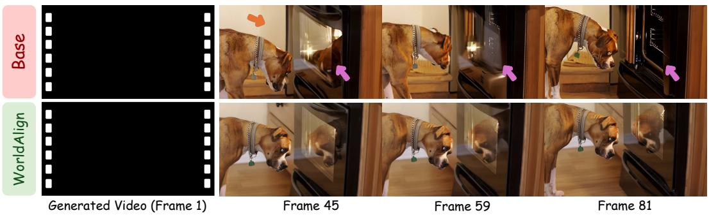
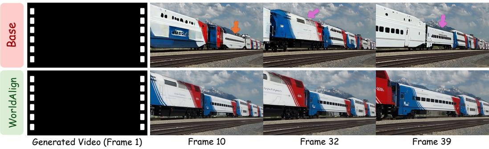
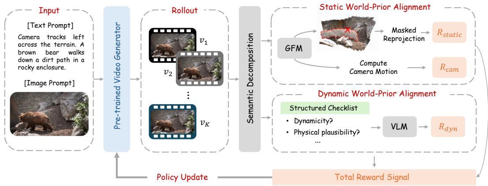
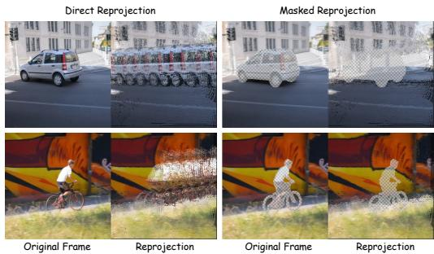
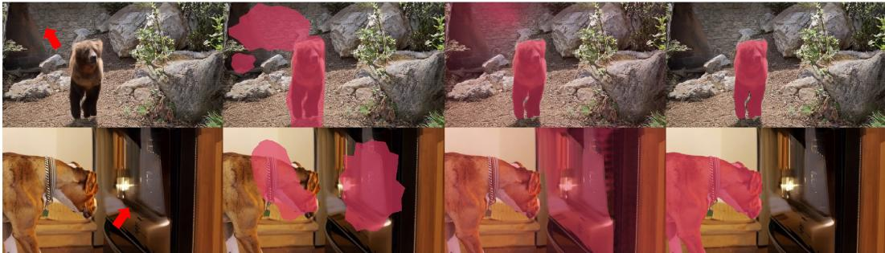

# WORLDALIGN: DECOUPLED 4D REWARD FOR WORLD-CONSISTENT VIDEO GENERATION

Jing He1,3∗, Kaixin Ding3,4, Xingye Tian3, Guibao Shen1, Wenhang Ge1, Xin Tao3, Pengfei Wan3, Ying-Cong Chen1,2,✉

1The Hong Kong University of Science and Technology (Guangzhou) 2The Hong Kong University of Science and Technology 3KlingAI 4The University of Hong Kong

(1) Prompt: Camera pans right. A boxer dog stares into an illuminated oven in a kitchen.

(2) Prompt: Camera pans left. A train travels along the tracks in front of a mountain range.  
  
Figure 1: Comparison between WorldAlign and the base model (Wan2.1-I2V-14B-480P). The first case highlights improvements in static consistency: the base model loses the cabinetry (orange arrows), while the oven handle disappears and its door deforms before vanishing (magenta arrows). The second case highlights improvements in dynamic consistency: the train cars abruptly change color and shape and move opposite to the locomotive’s heading (see the cars marked by samecolored arrows). WorldAlign instead preserves static scene structure and plausible dynamic evolution. If the videos fail to play, we strongly recommend using a multimedia-enabled PDF reader.

## ABSTRACT

Faithful visual world simulation requires generated videos to maintain 4D world consistency, encompassing both static and dynamic consistency. Static consistency requires coherent 3D structure in static environments across viewpoints, while dynamic consistency requires plausible subject motion and consistent appearance over time. Geometry-aware post-training offers a promising way to improve world consistency. However, existing methods often rely on a static-scene assumption. Even those that accommodate dynamic scenes struggle to provide reliable static-consistency feedback, while dynamic consistency is often overlooked or inadequately assessed. To address these limitations, we introduce WorldAlign, a decoupled 4D reward framework that semantically separates static regions and dynamic subjects and provides feedback by aligning each with a world prior suited

to its assumptions. For static regions, WorldAlign aligns static geometry with a geometric world prior through semantically guided masked reprojection, enabling more reliable static-consistency evaluation; an auxiliary camera-motion reward discourages nearly static solutions. For dynamic subjects, WorldAlign uses a strong vision-language model (VLM) as a dynamic world prior and constructs a VLM-as-a-judge reward based on sample-specific checklists that assess dynamicity, physical plausibility, shape, and texture consistency. This decoupled design enables more effective online post-training without requiring human preference annotations. Across two pretrained image-to-video generators, Wan2.1 and Wan2.2, WorldAlign jointly improves static and dynamic consistency over existing methods without suppressing overall or subject motion. These results support decoupled world-prior alignment for more faithful visual world simulation. Project page: https://worldalign.github.io/.

## 1 INTRODUCTION

Faithful visual world simulation requires more than frame-wise realism: the generated world must remain coherent over time. We refer to this property as world consistency, which comprises static and dynamic consistency. Static consistency requires static environments to maintain coherent 3D structure across viewpoints. Dynamic consistency requires subjects to move plausibly while preserving their appearance over time. Such consistency is essential when video generation models serve as world simulators for robotics (Shan et al., 2026; Zhang et al., 2026), autonomous driving (Hu et al., 2023; Wang et al., 2024; Gao et al., 2024), and interactive games (Bruce et al., 2024; Sun et al., 2025; Team et al., 2026). Despite substantial advances in high-fidelity, open-domain video synthesis (Brooks et al., 2024; Seedance et al., 2026; Team et al., 2025; Kong et al., 2024; Wan et al., 2025), large-scale pretrained video generation models remain insufficient for faithful world simulation. A key reason is that their pretraining objectives primarily optimize prediction in RGB or latent space, leaving 3D structure and physical dynamics to be learned only implicitly, without explicit world-consistency constraints. Consequently, static structures may slide, warp, or flicker across viewpoints, while dynamic subjects may exhibit implausible motion and appearance changes, as shown in Fig. 1. Achieving world consistency therefore remains a central challenge for faithful visual world simulation.

Existing efforts toward world-consistent video generation broadly follow two routes. The first modifies the generator architecture to integrate explicit geometric information, including pointconditioned generation (Ren et al., 2025; Yu et al., 2024; Liu et al., 2026a; Zhao et al., 2026) and joint RGB-geometry modeling (Zhang et al., 2025; Bai et al., 2026; Dai et al., 2025; Chen et al., 2025). Although effective, the additional modules and geometric supervision may compromise the broad generalization inherited from large-scale video pretraining. The second preserves the pretrained generator and improves consistency through post-training alignment, allowing expert knowledge or world priors to provide feedback while retaining its broad generative capability. However, real-world scenes often contain both static environments and dynamic subjects, making reliable consistency feedback in such scenes a key challenge for post-training. Epipolar-DPO, VideoGPA, and the geometric rewards of World-R1 rely on static-scene assumptions (Kupyn et al., 2025; Du et al., 2026; Wang et al., 2026). In dynamic scenes, independently moving subjects violate these assumptions, causing legitimate subject motion to be penalized and potentially driving the generator toward frozen subjects. VGGRPO and GeoFlow accommodate dynamic scenes by using motion cues to exclude or downweight dynamic regions during static-consistency evaluation (An et al., 2026; Ackermann et al., 2026). However, alongside legitimate subject motion, these cues also identify unintended sliding or warping of static regions as dynamic, weakening the static-consistency signal (see Fig. 4). Dynamic consistency is also insufficiently addressed: VGGRPO lacks dedicated feedback for dynamic subjects, while GeoFlow focuses on appearance consistency without explicitly assessing whether subjects move as intended or whether their motion is physically plausible. These limitations motivate us to develop more reliable and comprehensive world-consistency rewards.

To this end, we introduce WorldAlign (Fig. 2), a decoupled 4D reward framework that semantically separates static regions and dynamic subjects of each generated video and provides feedback by aligning each with a world prior suited to its assumptions, rather than imposing a static-scene assumption on the entire scene. For static consistency, WorldAlign first semantically segments and tracks dynamic subjects rather than relying on motion cues. This enables geometric evaluation to exclude independently moving subjects while retaining static regions, including those exhibiting unintended sliding or warping. WorldAlign then uses a geometry foundation model (Wang et al., 2025) as a geometric world prior to construct a shared point cloud given the generated video and repro ject it into the input views. Dynamic subjects are masked out during both point-cloud construction and reprojection-error computation, reducing their interference with static-consistency evaluation. When the frames depict a coherent static 3D scene, the shared geometry should reproduce their static regions consistently, whereas inconsistent structures lead to larger reprojection errors. The resulting masked reprojection reward therefore penalizes inconsistent static structures without penalizing le gitimate subject motion. Since reducing camera motion can make geometric consistency easier to satisfy, an auxiliary camera-motion reward discourages nearly static solutions and encourages meaningful viewpoint changes. For dynamic consistency, WorldAlign explicitly evaluates their motion and appearance over time. Because plausible subject evolution depends on the subject’s properties and scene context, we use a strong vision-language model (VLM) as a dynamic world prior. We construct a VLM-as-a-judge reward based on sample-specific checklists that translate this world knowledge into explicit criteria covering dynamicity, physical plausibility, shape consistency, and texture consistency. The fraction of satisfied checklist items provides dynamic-consistency feedback for each video that evaluates not only appearance preservation but also whether subjects move as intended and whether their motion is physically plausible. Together, these rewards enable online post-training to jointly improve static and dynamic consistency without modifying the generator architecture or requiring human preference annotations.

  
Figure 2: Overview of the proposed WorldAlign. Given generated videos, WorldAlign semantically segments and tracks dynamic subjects to decouple each video into static and dynamic regions. Static regions are aligned with a geometric world prior through masked reprojection and camera-motion rewards, while dynamic subjects are aligned with a VLM-based world prior through a structured VLM-as-a-judge reward. The reward signals are normalized within each same-prompt sample group and aggregated for online policy update.

To validate WorldAlign, we compare it with state-of-the-art post-training methods across two pretrained image-to-video generators using both reward-related and reward-independent metrics. Experiments demonstrate that WorldAlign improves static geometry and dynamic consistency over existing methods without suppressing camera or subject motion. These results support decoupled world-prior alignment as an effective approach to more faithful visual world simulation.

## 2 RELATED WORK

## 2.1 PRETRAINED VIDEO GENERATION MODELS

Large-scale pretrained video generation models (Brooks et al., 2024; Seedance et al., 2026; Team et al., 2025; Kong et al., 2024; Wan et al., 2025) have substantially advanced open-domain video synthesis. Their progress is driven by diffusion (Ho et al., 2020) and flow-matching objectives (Lipman et al., 2022; Liu et al., 2022), transformer-based architectures (Dosovitskiy et al., 2020), and large-scale video-text training. However, their pretraining objectives primarily optimize prediction in RGB or latent space, leaving 3D structure and physical dynamics to be learned only implicitly, without explicit world-consistency constraints. Consequently, world consistency remains unreliable across generations. WorldAlign therefore explicitly optimizes the world consistency of these pretrained models through post-training.

## 2.2 WORLD-CONSISTENT VIDEO GENERATION

Existing approaches improve world consistency through two main routes: ① architecture modification for geometry integration, which modifies the generator architecture to incorporate geometric information into the generation process, and ② geometry-aware post-training, which derives geometric feedback from generated videos to refine pretrained generators through post-training.

Architecture Modification for Geometry Integration. Methods in this route introduce additional conditioning inputs derived from reconstructed 3D points and train the generator to use them (Ren et al., 2025; Yu et al., 2024; Liu et al., 2026a; Zhao et al., 2026). Other methods extend the generator to jointly predict RGB appearance and geometric representations such as depth or 3D coordinates (Zhang et al., 2025; Bai et al., 2026; Dai et al., 2025; Chen et al., 2025). These designs require architectural modifications and additional training to accommodate geometric inputs or outputs, which may compromise the broad generalization acquired through large-scale pretraining. WorldAlign instead improves the world consistency through post-training alignment, leaving the generator ar chitecture unchanged.

Geometry-Aware Post-Training. Epipolar-DPO and VideoGPA construct preference pairs from generated videos for post-training, with preferences determined by epipolar error in Epipolar-DPO (Kupyn et al., 2025) and reprojection errors computed from predicted geometry and camera poses in VideoGPA (Du et al., 2026). Both geometric criteria rely on static-scene assumptions; applying them directly to dynamic scenes can penalize legitimate subject motion and encourage the generator to produce stationary subjects. World-R1 (Wang et al., 2026) instead guides post-training with a 3D-aware reward alongside a general visual reward, but this 3D-aware reward still relies on static-scene assumptions. To accommodate dynamic content, it periodically disables the 3D-aware reward and optimizes dynamic scenes using only the general visual reward, which provides no explicit world-consistency constraints. VGGRPO and GeoFlow can provide geometric feedback for dynamic scenes. They use motion cues to identify dynamic regions and reduce interference from them during static-consistency evaluation. Specifically, VGGRPO (An et al., 2026) uses scene flow to filter out dynamic regions, while GeoFlow (Ackermann et al., 2026) uses optical-flow residuals to downweight their contributions. However, these cues can also identify unintended sliding or warping of static regions as dynamic, weakening the static-consistency signal by excluding or downweighting regions whose errors should be penalized. Dynamic consistency also remains insufficiently addressed: VGGRPO provides no dedicated consistency feedback for the filtered subjects, while GeoFlow measures DINO-based appearance consistency across the whole scene after flow alignment. This appearance-based evaluation does not explicitly assess whether subjects move as intended or whether their motion is physically plausible. To improve world consistency in real-world dynamic scenes, WorldAlign uses tracked semantic masks to exclude independently moving subjects from static-consistency evaluation while retaining inconsistent static regions, providing more reliable static-consistency feedback than methods based on motion cues. It also provides dedicated feedback for dynamic subjects through VLM-as-a-judge reward that assesses dynamicity, physical plausibility, shape consistency, and texture consistency.

## 3 METHOD

## 3.1 METHOD OVERVIEW

We consider image-to-video generation1, where a pretrained generator produces an N-frame video $\boldsymbol { v } = \{ I _ { n } \} _ { n = 1 } ^ { N }$ conditioned on an image Ic and a text prompt y. Our goal is to improve the world consistency of generated videos through post-training without modifying the generator architecture.

Real-world scenes contain both static environments and dynamic subjects, which satisfy different consistency assumptions. WorldAlign therefore separates them and provides feedback by aligning each with a suitable world prior, as illustrated in Fig. 2. Given a generated video v, we initialize a segmentation tracker Carion et al. (2025) with the subject mask ${ \check { M } } ^ { c }$ of the conditioning image. The tracker propagates the mask across the video to obtain subject masks $M = \{ M _ { n } \} _ { n = 1 } ^ { N }$ , which define the dynamic regions, while their complements ${ \overline { { M } } } _ { n }$ define the static regions. For static regions, a geometry foundation model is used as the prior for a masked reprojection reward $R _ { \mathrm { s t a t i c } } ,$ , while an auxiliary camera-motion reward $R _ { \mathrm { c a m } }$ discourages nearly static solutions. For dynamic subjects, a vision-language model is used as the prior for a structured VLM-as-a-judge reward $R _ { \mathrm { d y n } }$ . These rewards jointly guide online post-training through GRPO to update the generator.

## 3.2 STATIC WORLD-PRIOR ALIGNMENT

Masked Reprojection Reward. Static regions approximately satisfy rigid multi-view geometry. We therefore use a geometry foundation model (GFM) (Wang et al., 2025) to measure their consistency through cross-view reprojection. Given a generated video v, the GFM predicts a pixelaligned 3D point map $P _ { n }$ , camera intrinsics $K _ { n } ,$ and camera extrinsics $C _ { n }$ for each frame $I _ { n }$

However, directly aggregating the predicted point maps also fuses the dynamic subject at its successive positions into the shared point cloud, forming a 3D trace of its motion. Directly reprojecting this point cloud into each frame produces motion-induced artifacts. Pixels affected by these artifacts yield large reprojection errors regardless of whether the corresponding static regions are geometrically consistent, making direct reprojection unreliable for static-consistency evaluation, as shown in Fig. 3.

  
Figure 3: Motion-induced artifacts of Direct Reprojection. Our masked reprojection can isolate static geometry from subject motion, yielding a more reliable static-consistency reward.

To remove this interference, WorldAlign constructs the shared point cloud using only static regions. Because $P _ { n }$ is pixel-aligned, the tracked mask $M _ { n }$ can be applied directly to exclude 3D points corresponding to the dynamic subject:

$$
\mathcal { P } _ { \mathrm { s t a t i c } } = \left\{ P _ { n } ( x ) \mid x \in \overline { { M } } _ { n } , n = 1 , \ldots , N \right\} .\tag{1}
$$

The resulting point cloud excludes the subject’s motion trajectory and retains only the 3D points assigned to static regions. Because dynamic regions are defined by tracked subject masks rather than motion cues, undesired distortions in static regions still remain during static-consistency evaluation. WorldAlign then projects $\mathcal { P } _ { \mathrm { s t a t i c } }$ into each frame using the predicted camera parameters: $\hat { I } _ { n } ~ =$ Π $( \mathcal { P } _ { \mathrm { s t a t i c } } ; K _ { n } , C _ { n } ^ { \top } )$ , where Π denotes the reprojection operation. Although the reprojected frames $\hat { I } _ { n }$ are rendered from the point cloud containing only the static environments, the original frames $I _ { n }$ still contain dynamic subjects. We therefore apply the same subject mask to each original frame and its reprojected counterpart, excluding the corresponding pixel locations from comparison. We further restrict the comparison with valid reprojections. Thus, the valid comparison set is defined as

$$
\Omega = \left\{ ( n , x ) \mid x \in { \overline { { M } } } _ { n } , \ { \hat { I } } _ { n } ( x ) { \mathrm { i s ~ v a l i d } } \right\} .\tag{2}
$$

Here, n indexes frames and x denotes a pixel location. A pair $( n , x )$ belongs to Ω only if x lies outside the subject mask in frame n and has a valid value in the corresponding reprojected frame. The masked reprojection error and its corresponding static-consistency reward are

$$
E _ { \mathrm { r e p } } = \frac { 1 } { | \Omega | } \sum _ { ( n , x ) \in \Omega } \Big \Vert I _ { n } ( x ) - \hat { I } _ { n } ( x ) \Big \Vert _ { 2 } ^ { 2 } , R _ { \mathrm { s t a t i c } } = - E _ { \mathrm { r e p } } .\tag{3}
$$

Camera-Motion Reward. The masked reprojection reward admits a trivial solution: suppressing viewpoint changes can reduce the reprojection error without requiring consistent 3D structure. To prevent this collapse, WorldAlign reuses the camera extrinsics predicted by the GFM to construct an auxiliary reward that penalizes insufficient camera motion.

Let $C _ { n } = ( R _ { n } , t _ { n } )$ denote the predicted camera extrinsics, with rotation $R _ { \underline { { { n } } } }$ and translation $t _ { n }$ . We define the camera-motion magnitude as $m ( C _ { 1 : N } ) = \bar { d } _ { \mathrm { t r a n s } } + \bar { d } _ { \mathrm { r o t } }$ , where $d _ { \mathrm { t r a n s } }$ and $\bar { d } _ { \mathrm { r o t } }$ denote the mean adjacent-frame translation $\lVert t _ { n + 1 } - t _ { n } \rVert _ { 2 }$ and mean adjacent-frame rotation angle $\theta ( R _ { n + 1 } R _ { n } ^ { \top } )$ respectively. The camera-motion reward applies a hinge penalty when the predicted motion falls below a threshold $\boldsymbol { \tau } ;$

$$
R _ { \mathrm { c a m } } = - \operatorname* { m a x } \left( 0 , \tau - m ( C _ { 1 : N } ) \right) ,\tag{4}
$$

where $\tau$ is the lower-bound camera-motion threshold. This reward penalizes videos with insufficient viewpoint changes, preventing the generator from reducing the reprojection error solely through nearly static viewpoints.

## 3.3 DYNAMIC WORLD-PRIOR ALIGNMENT

WorldAlign uses a strong VLM as a dynamic world prior and translates its world knowledge into the VLM-as-a-judge reward based on subject-specific binary questions.

Before training, we use a VLM to construct a sample-specific checklist $\mathcal { Q } = \{ q _ { j } \} _ { j = 1 } ^ { J }$ from each conditioning pair $( I ^ { c } , y )$ , where J is the number of questions in each checklist. The checklist consists of subject-centric binary questions tailored to the subject and its intended motion, covering four complementary aspects of dynamic consistency:

• Dynamicity: whether the subject exhibits the intended motion rather than remaining static.

• Physical plausibility: whether the motion follows physically plausible dynamics given the subject’s intrinsic properties and the surrounding environment.

• Shape: whether the subject preserves its structure over time while allowing physically plausible articulation.

• Texture: whether the subject preserves its defining visual attributes, such as color, patterns, and surface details.

Here, the shape and texture criteria prevent appearance drift. The sample-specific checklist accounts for subject- and context-dependent dynamics, while its binary format decomposes an open-ended judgment into explicit criteria for more reliable evaluation.

During training, the judging VLM receives the full generated video v and the checklist Q. The full video allows it to consider the surrounding scene, while the evaluation instruction directs it to focus on the dynamic subject and answer each question with YES or NO. Let $a _ { j } ~ \in ~ \{ 0 , 1 \}$ denote the answer to question $q _ { j }$ , with YES mapped to 1. We define the VLM-as-a-judge reward as

$$
R _ { \mathrm { d y n } } = \frac { 1 } { J } \sum _ { j = 1 } ^ { J } a _ { j } .\tag{5}
$$

Thus, $R _ { \mathrm { d y n } }$ measures the fraction of checklist criteria satisfied by the generated video.

## 3.4 ONLINE POLICY UPDATE

We optimize the pretrained generator using online GRPO following Flow-GRPO (Liu et al., 2026b). For each conditioning pair $( I ^ { c } , y )$ , the generator samples a group of $K$ videos $\{ v _ { i } \} _ { i = 1 } ^ { K }$ . For every $v _ { i }$ , WorldAlign computes the three reward components $R _ { \mathrm { s t a t i c } } , \bar { R _ { \mathrm { c a m } } }$ , and $R _ { \mathrm { d y n } }$

To obtain group-relative signals while balancing their different scales, we normalize each reward component separately within the group:

$$
\widehat { R } _ { k } ( v _ { i } ) = \frac { R _ { k } ( v _ { i } ) - \mu _ { k } } { \sigma _ { k } + \epsilon } , \qquad k \in \{ \mathrm { s t a t i c , c a m , d y n } \} ,\tag{6}
$$

where $\mu _ { k }$ and $\sigma _ { k }$ are the group mean and standard deviation of reward k, and ϵ is a small constant for numerical stability. The normalized components are aggregated as the advantage:

$$
A _ { i } = \lambda _ { s } \widehat { R } _ { \mathrm { s t a t i c } } ( \boldsymbol { v } _ { i } ) + \lambda _ { c } \widehat { R } _ { \mathrm { c a m } } ( \boldsymbol { v } _ { i } ) + \lambda _ { d } \widehat { R } _ { \mathrm { d y n } } ( \boldsymbol { v } _ { i } ) ,\tag{7}
$$

where $\lambda _ { s } , \lambda _ { c }$ , and $\lambda _ { d }$ control the contributions of the three reward components. The resulting advantage is used with the standard clipped GRPO objective to update the generator. The tracker, GFM, and VLM remain frozen and are used only for reward computation.

## 4 EXPERIMENTS

## 4.1 EXPERIMENTAL SETUP

Datasets. WorldAlign focuses on real-world dynamic scenes in which static environments and dynamic subjects coexist. Existing datasets, such as DL3DV (Ling et al., 2024), contain only static scenes and therefore cannot support dynamic consistency alignment. We thus construct training and evaluation dataset from DAVIS (Pont-Tuset et al., 2017) and COCO (Lin et al., 2014) for real-world dynamic scenes. Each sample comprises a conditioning image, a subject mask for the conditioning image, an image-to-video prompt, and a sample-specific dynamic-consistency checklist. The resulting dataset contains 1,389 samples, of which 100 are randomly held out for evaluation and the remaining 1,289 are used for training. Further details on data selection, prompt generation, and checklist construction are provided in Appendix A.

Baselines. We compare WorldAlign with the original pretrained base model and four post-training methods: Epipolar-DPO (Kupyn et al., 2025), VideoGPA (Du et al., 2026), World-R1 (Wang et al., 2026), and GeoFlow (Ackermann et al., 2026). These comparisons are conducted separately on two base models, Wan2.2-TI2V-5B and Wan2.1-I2V-14B-480P (Wan et al., 2025). For each base model, all post-training methods use the same training data and training settings for a fair comparison. We reproduce World-R1 for our setting without explicit camera trajectories. Our reproduction retains its reconstruction, meta-view, and general visual rewards, but omits camera-aware noise warping and trajectory-alignment rewards. VGGRPO (An et al., 2026) is excluded because its official implementation is not publicly available.

Evaluation Metrics. We evaluate generated videos along three dimensions: static consistency, dynamic consistency, and general video quality. For static and dynamic consistency, we pair rewardrelated and reward-independent metrics to verify gains beyond the optimized objective. General video quality is assessed using third-party VBench metrics (Huang et al., 2024).

① Static Consistency. We report Masked Epipolar Error (M.Epi.) and Masked Reprojection Error (M.Reproj.). M.Epi. is reward-independent: it measures epipolar violations between staticregion correspondences. M.Reproj. measures the discrepancy between original and reprojected static regions. Both exclude tracked dynamic subjects. Lower values are better. Because suppressing viewpoint changes can trivially reduce both errors, we interpret them jointly with Dynamic Degree.

② Dynamic Consistency. We report Tracked-Subject DINOv3 Similarity (Subject DINO) and the Checklist “Yes” Rate. Tracked-Subject DINOv3 Similarity (Simeoni et al., 2025) is reward-´ independent and computes the mean cosine similarity of DINOv3 features in tracked subject regions across adjacent frames. Checklist “Yes” Rate measures the proportion of dynamic-consistency criteria satisfied by each video. Higher values are better. Because a frozen subject can trivially produce high DINO similarity, we interpret it jointly with Dynamicity “Yes” Rate and Dynamic Degree.

③ General Video Quality. Following VBench (Huang et al., 2024), we report Dynamic Degree, Motion Smoothness, and Aesthetic Quality, with higher values being better. Dynamic Degree measures the overall amount of motion and helps identify motion suppression, while Motion Smoothness and Aesthetic Quality assess motion continuity and frame-wise visual quality, respectively.

Implementation details are provided in Appendix B.

## 4.2 COMPARISON WITH STATE-OF-THE-ART METHODS

We compare WorldAlign with pretrained models and geometry-aware alignment methods on static consistency, dynamic consistency, and motion preservation. Complementary human evaluation is provided in Appendix C to further support the quantitative results in Tab. 1.

As shown in Tab. 1, the pretrained base models retain moderate motion but exhibit high geometric errors and limited dynamic consistency, confirming that world consistency remains an unreliable capability of pretrained video generators. Epipolar-DPO and VideoGPA report deceptively low geo metric errors, accompanied by substantial decreases in both Dynamic Degree and Dynamicity “Yes” Rate. Their apparent geometric gains are therefore largely attributable to the suppression of camera and subject motion rather than real improvements in world consistency. VideoGPA exhibits less severe motion suppression because it filters candidates with insufficient camera motion during preference construction, whereas Epipolar-DPO has no such mechanism. Our World-R1 reproduction provides only marginal improvements in static consistency while still suppressing subject motion, as reflected by its lower Dynamic Degree and Dynamicity “Yes” Rate. Its reconstruction and meta-view terms evaluate the reconstructed scene through perceptual and semantic similarity without isolating dynamic subjects. In dynamic scenes, subject-motion discrepancies can therefore dominate the reward, diluting the static-consistency signal and biasing optimization toward subjectmotion suppression. GeoFlow improves static and dynamic consistency over the base models but remains less effective than WorldAlign. Its motion cues may downweight inconsistent static regions, weakening static-consistency feedback, while its appearance-based reward does not explicitly assess motion plausibility. WorldAlign addresses both limitations and achieves stronger consistency without suppressing overall or subject motion. WorldAlign’s gains in Motion Smoothness and Aesthetic Quality further indicate the resulting dynamics remain coherent and visually plausible.

Table 1: Comparison with base models and state-of-the-art alignment methods on two image-tovideo generators. For the Checklist “Yes” Rate, parentheses report the Dynamicity “Yes” Rate over all test videos. M.Reproj. and Checklist “Yes” Rate are reward-related; M.Epi. and Subject DINO are reward-independent. Bold and underlined entries denote the best and second-best results, respectively. Consistency metrics are interpreted jointly with Dynamic Degree because motion suppression can yield deceptively favorable scores, shown in gray. WorldAlign improves both reward-related and reward-independent consistency metrics while preserving overall and subject motion.
<table><tr><td rowspan="2"></td><td colspan="2">Static Consistency</td><td colspan="2">Dynamic Consistency</td><td colspan="3">VBench</td></tr><tr><td>M.Epi. ↓</td><td>M.Reproj. ↓</td><td>Subject DINO ↑</td><td>Checklist “Yes” Rate ↑</td><td>Dynamic Degree↑</td><td>Motion</td><td>Aesthetic Smooth. ↑ Quality ↑</td></tr><tr><td colspan="8">Wan2.2-TI2V-5B</td></tr><tr><td>Base</td><td>0.463</td><td>0.040</td><td>0.922</td><td>0.697 (0.63)</td><td>0.63</td><td>0.957</td><td>0.479</td></tr><tr><td>Epipolar-DPO</td><td>0.268</td><td>0.022</td><td>0.961</td><td>0.646 (0.43)</td><td>0.31</td><td>0.975</td><td>0.481</td></tr><tr><td>VideoGPA</td><td>0.308</td><td>0.024</td><td>0.948</td><td>0.652 (0.56)</td><td>0.54</td><td>0.971</td><td>0.476</td></tr><tr><td>World-R1</td><td>0.432</td><td>0.038</td><td>0.945</td><td>0.657 (0.61)</td><td>0.56</td><td>0.965</td><td>0.459</td></tr><tr><td>GeoFlow</td><td>0.367</td><td>0.031</td><td>0.934</td><td>0.736 (0.74)</td><td>0.67</td><td>0.971</td><td>0.478</td></tr><tr><td>WorldAlign (Ours)</td><td>0.321</td><td>0.026</td><td>0.938</td><td>0.781 (0.85)</td><td>0.72</td><td>0.979</td><td>0.488</td></tr><tr><td colspan="8">Wan2.1-I2V-14B-480P</td></tr><tr><td>Base</td><td>0.469</td><td>0.037</td><td>0.918</td><td>0.760 (0.81)</td><td>0.62</td><td>0.963</td><td>0.481</td></tr><tr><td>Epipolar-DPO</td><td>0.215</td><td>0.019</td><td>0.967</td><td>0.594 (0.53)</td><td>0.33</td><td>0.976</td><td>0.494</td></tr><tr><td>VideoGPA</td><td>0.243</td><td>0.022</td><td>0.963</td><td>0.608 (0.61)</td><td>0.42</td><td>0.970</td><td>0.489</td></tr><tr><td>World-R1</td><td>0.428</td><td>0.034</td><td>0.951</td><td>0.636 (0.72)</td><td>0.53</td><td>0.962</td><td>0.440</td></tr><tr><td>GeoFlow</td><td>0.336</td><td>0.028</td><td>0.936</td><td>0.807 (0.83)</td><td>0.65</td><td>0.975</td><td>0.485</td></tr><tr><td>WorldAlign (Ours)</td><td>0.264</td><td>0.024</td><td>0.939</td><td>0.856 (0.92)</td><td>0.74</td><td>0.978</td><td>0.491</td></tr></table>

## 4.3 ABLATION STUDY

Tab. 2 evaluates the reward components. Masked reprojection alone reduces geometric errors but suppresses motion; adding the Camera Reward raises Dynamic Degree from 0.42 to 0.70. The Dynamic Reward further improves Subject DINO and Checklist “Yes” Rate while retaining the geometric gains. Direct reprojection instead penalizes legitimate subject motion, creating conflicting objectives and yielding poorer static and dynamic consistency than the full masked design. The complete analysis is provided in Appendix D.

## 4.4 COMPARISON OF DYNAMIC REGION IDENTIFICATION

Fig. 4 compares dynamic region identification using scene flow and optical flow, the motion cues used by VGGRPO (An et al., 2026) and GeoFlow (Ackermann et al., 2026), respectively, with our semantic masking on the same videos. In the first column, red arrows mark static regions that undergo unintended distortions over time. These regions should remain included in static-consistency evaluation, while dynamic subjects, such as the bear and dog, should be excluded to avoid interference. Red overlays in the remaining three columns indicate regions identified as dynamic by each method. Both motion cues also classify the distorted static regions as dynamic. Consequently, filtering out or downweighting these regions weakens the static-consistency signal for the errors that should be corrected. Our semantic masks instead isolate and exclude dynamic subjects while retaining inconsistent static regions for evaluation, providing more reliable static-consistency feedback.

Table 2: Ablation of the proposed WorldAlign on Wan2.2-TI2V-5B. Camera and dynamic rewards are incrementally added to both the direct- and masked-reprojection branches. The results show that masked reprojection avoids imposing a static-scene assumption on the entire video and prevents the suppression of dynamic subject motion. The camera reward alleviates the static collapse observed with masked reprojection alone, while the dynamic reward further improves dynamic consistency.
<table><tr><td rowspan="2"></td><td colspan="2">Static Consistency</td><td colspan="2">Dynamic Consistency</td><td colspan="3">VBench</td></tr><tr><td>M.Epi. ↓</td><td>M.Reproj. ↓</td><td>Subject DINO↑</td><td>Checklist &quot;Yes&quot; Rate ↑</td><td>Dynamic Degree ↑</td><td>Motion Smooth. ↑</td><td>Aesthetic Quality ↑</td></tr><tr><td>Base</td><td>0.463</td><td>0.0396</td><td>0.922</td><td>0.697 (0.63)</td><td>0.63</td><td>0.957</td><td>0.479</td></tr><tr><td>w/ Direct R. Reward</td><td>0.298</td><td>0.0223</td><td>0.968</td><td>0.628 (0.18)</td><td>0.24</td><td>0.992</td><td>0.482</td></tr><tr><td>+ Camera Reward</td><td>0.324</td><td>0.0272</td><td>0.963</td><td>0.632 (0.22)</td><td>0.64</td><td>0.982</td><td>0.479</td></tr><tr><td>+ Dynamic Reward</td><td>0.338</td><td>0.0291</td><td>0.954</td><td>0.670 (0.55)</td><td>0.69</td><td>0.974</td><td>0.477</td></tr><tr><td>w/ Masked R. Reward</td><td>0.289</td><td>0.0215</td><td>0.956</td><td>0.667 (0.55)</td><td>0.42</td><td>0.986</td><td>0.480</td></tr><tr><td>+ Camera Reward</td><td>0.317</td><td>0.0262</td><td>0.927</td><td>0.711 (0.64)</td><td>0.70</td><td>0.968</td><td>0.475</td></tr><tr><td>+ Dynamic Reward</td><td>0.321</td><td>0.0260</td><td>0.938</td><td>0.781 (0.85)</td><td>0.72</td><td>0.979</td><td>0.488</td></tr></table>

Input Frame  
Scene-flow  
Optical-flow  
Semantic Masking (ours)  
  
Figure 4: Qualitative comparison of dynamic region identification. The first column shows only the first frame of each video; red arrows mark static regions that distort over time and should remain during static consistency evaluation. Red overlays indicate regions identified as dynamic. Scene flow and optical flow, the motion cues used by VGGRPO and GeoFlow, respectively, also mark distorted static regions, whereas our semantic masks more cleanly isolate the dynamics.

## 5 CONCLUSION

We introduced WorldAlign, a decoupled 4D reward framework that separates static regions and dynamic subjects and aligns each with a world prior suited to its assumptions. For static regions, a masked reprojection reward leverages a geometry foundation model to assess static consistency without interference from subject motion, while an auxiliary camera-motion reward prevents nearly static solutions. For dynamic subjects, a VLM-as-a-judge reward uses sample-specific checklists to assess physical motion and appearance consistency. These rewards enable online post-training without architectural changes or human preference annotations. Across two pretrained image-to-video generators, WorldAlign jointly improves static and dynamic consistency on both reward-related and reward-independent metrics without suppressing overall or subject motion. These results demonstrate the effectiveness of decoupled world-prior alignment for advancing video generation toward more faithful visual world simulation.

## AI USE STATEMENT

Generative AI tools were used for manuscript language polishing. The authors verified the cited references, reviewed all AI-assisted edits, and take full responsibility for the final manuscript.

## REFERENCES

Jan Ackermann, Shengqu Cai, Boyang Deng, Zhengfei Kuang, Songyou Peng, and Gordon Wetzstein. GeoFlow: Enforcing implicit geometric consistency in video generation. arXiv preprint arXiv:2605.18365, 2026.

Zhaochong An, Orest Kupyn, Theo Uscidda, Andrea Colaco, Karan Ahuja, Serge Belongie, Mar´ Gonzalez-Franco, and Marta Tintore Gazulla. Vggrpo: Towards world-consistent video generation with 4d latent reward. arXiv preprint arXiv:2603.26599, 2026.

Yunpeng Bai, Shaoheng Fang, Chaohui Yu, Fan Wang, and Qixing Huang. Geovideo: Introducing geometric regularization into video generation model. Advances in Neural Information Processing Systems, 38:57602–57622, 2026.

Tim Brooks, Bill Peebles, Connor Holmes, Will DePue, Yufei Guo, Leo Jing, David Schnurr, Joe Taylor, Troy Luhman, Eric Luhman, et al. Video generation models as world simulators. OpenAI Blog, 1(8):1, 2024.

Jake Bruce, Michael D Dennis, Ashley Edwards, Jack Parker-Holder, Yuge Shi, Edward Hughes, Matthew Lai, Aditi Mavalankar, Richie Steigerwald, Chris Apps, et al. Genie: Generative interactive environments. In Forty-first International Conference on Machine Learning, 2024.

Nicolas Carion, Laura Gustafson, Yuan-Ting Hu, Shoubhik Debnath, Ronghang Hu, Didac Suris, Chaitanya Ryali, Kalyan Vasudev Alwala, Haitham Khedr, Andrew Huang, et al. Sam 3: Segment anything with concepts. arXiv preprint arXiv:2511.16719, 2025.

Zhaoxi Chen, Tianqi Liu, Long Zhuo, Jiawei Ren, Zeng Tao, He Zhu, Fangzhou Hong, Liang Pan, and Ziwei Liu. 4dnex: Feed-forward 4d generative modeling made easy. arXiv preprint arXiv:2508.13154, 2025.

Yixiang Dai, Fan Jiang, Chiyu Wang, Mu Xu, and Yonggang Qi. Fantasyworld: Geometryconsistent world modeling via unified video and 3d prediction. arXiv preprint arXiv:2509.21657, 2025.

Alexey Dosovitskiy, Lucas Beyer, Alexander Kolesnikov, Dirk Weissenborn, Xiaohua Zhai, Thomas Unterthiner, Mostafa Dehghani, Matthias Minderer, Georg Heigold, Sylvain Gelly, et al. An image is worth 16x16 words: Transformers for image recognition at scale. arXiv preprint arXiv:2010.11929, 2020.

Hongyang Du, Junjie Ye, Xiaoyan Cong, Runhao Li, Jingcheng Ni, Aman Agarwal, Zeqi Zhou, Zekun Li, Randall Balestriero, and Yue Wang. Videogpa: Distilling geometry priors for 3dconsistent video generation. arXiv preprint arXiv:2601.23286, 2026.

Shenyuan Gao, Jiazhi Yang, Li Chen, Kashyap Chitta, Yihang Qiu, Andreas Geiger, Jun Zhang, and Hongyang Li. Vista: A generalizable driving world model with high fidelity and versatile controllability. Advances in Neural Information Processing Systems, 37:91560–91596, 2024.

Jonathan Ho, Ajay Jain, and Pieter Abbeel. Denoising diffusion probabilistic models. Advances in neural information processing systems, 33:6840–6851, 2020.

Anthony Hu, Lloyd Russell, Hudson Yeo, Zak Murez, George Fedoseev, Alex Kendall, Jamie Shotton, and Gianluca Corrado. Gaia-1: A generative world model for autonomous driving. arXiv preprint arXiv:2309.17080, 2023.

Ziqi Huang, Yinan He, Jiashuo Yu, Fan Zhang, Chenyang Si, Yuming Jiang, Yuanhan Zhang, Tianxing Wu, Qingyang Jin, Nattapol Chanpaisit, Yaohui Wang, Xinyuan Chen, Limin Wang, Dahua Lin, Yu Qiao, and Ziwei Liu. VBench: Comprehensive benchmark suite for video generative models. In Proceedings of the IEEE/CVF Conference on Computer Vision and Pattern Recognition, 2024.

Weijie Kong, Qi Tian, Zijian Zhang, Rox Min, Zuozhuo Dai, Jin Zhou, Jiangfeng Xiong, Xin Li, Bo Wu, Jianwei Zhang, et al. Hunyuanvideo: A systematic framework for large video generative models. arXiv preprint arXiv:2412.03603, 2024.

Orest Kupyn, Fabian Manhardt, Federico Tombari, and Christian Rupprecht. Epipolar geometry improves video generation models. arXiv preprint arXiv:2510.21615, 2025.

Tsung-Yi Lin, Michael Maire, Serge Belongie, James Hays, Pietro Perona, Deva Ramanan, Piotr Dollar, and C Lawrence Zitnick. Microsoft coco: Common objects in context. In´ European conference on computer vision, pp. 740–755. Springer, 2014.

Lu Ling, Yichen Sheng, Zhi Tu, Wentian Zhao, Cheng Xin, Kun Wan, Lantao Yu, Qianyu Guo, Zixun Yu, Yawen Lu, et al. Dl3dv-10k: A large-scale scene dataset for deep learning-based 3d vision. In Proceedings ofthe IEEE/CVF Conference on Computer Vision and Pattern Recognition, pp. 22160–22169, 2024.

Yaron Lipman, Ricky TQ Chen, Heli Ben-Hamu, Maximilian Nickel, and Matt Le. Flow matching for generative modeling. arXiv preprint arXiv:2210.02747, 2022.

Fangfu Liu, Wenqiang Sun, Hanyang Wang, Yikai Wang, Haowen Sun, Junliang Ye, Jun Zhang, and Yueqi Duan. Reconx: Reconstruct any scene from sparse views with video diffusion model. IEEE Transactions on Image Processing, 2026a.

Jie Liu, Gongye Liu, Jiajun Liang, Yangguang Li, Jiaheng Liu, Xintao Wang, Pengfei Wan, Di Zhang, and Wanli Ouyang. Flow-grpo: Training flow matching models via online rl. Advances in neural information processing systems, 38:40783–40818, 2026b.

Xingchao Liu, Chengyue Gong, and Qiang Liu. Flow straight and fast: Learning to generate and transfer data with rectified flow. arXiv preprint arXiv:2209.03003, 2022.

Jordi Pont-Tuset, Federico Perazzi, Sergi Caelles, Pablo Arbelaez, Alex Sorkine-Hornung, and´ Luc Van Gool. The 2017 davis challenge on video object segmentation. arXiv preprint arXiv:1704.00675, 2017.

Xuanchi Ren, Tianchang Shen, Jiahui Huang, Huan Ling, Yifan Lu, Merlin Nimier-David, Thomas Muller, Alexander Keller, Sanja Fidler, and Jun Gao. Gen3c: 3d-informed world-consistent video¨ generation with precise camera control. In Proceedings of the IEEE/CVF Conference on Computer Vision and Pattern Recognition, pp. 6121–6132, 2025.

Team Seedance, De Chen, Liyang Chen, Xin Chen, Ying Chen, Zhuo Chen, Zhuowei Chen, Feng Cheng, Tianheng Cheng, Yufeng Cheng, et al. Seedance 2.0: Advancing video generation for world complexity. arXiv preprint arXiv:2604.14148, 2026.

Ziyu Shan, Zhenyu Wu, Xiaofeng Wang, Zheng Zhu, and Ziwei Wang. Dvg-wm: Disentangled video generation enables efficient embodied world model for robotic manipulation. arXiv preprint arXiv:2606.32028, 2026.

Oriane Simeoni, Huy V Vo, Maximilian Seitzer, Federico Baldassarre, Maxime Oquab, Cijo Jose,´ Vasil Khalidov, Marc Szafraniec, Seungeun Yi, Michael Ramamonjisoa, et al. Dinov3.¨ arXiv preprint arXiv:2508.10104, 2025.

Wenqiang Sun, Haiyu Zhang, Haoyuan Wang, Junta Wu, Zehan Wang, Zhenwei Wang, Yunhong Wang, Jun Zhang, Tengfei Wang, and Chunchao Guo. Worldplay: Towards long-term geometric consistency for real-time interactive world modeling. arXiv preprint arXiv:2512.14614, 2025.

DreamX Team, Yancheng Bai, Rui Chen, Xiangxiang Chu, Rujing Dang, Hao Dou, Bingjie Gao, Qiwen Gu, Siyu Hong, Jiachen Lei, et al. Dreamx-world 1.0: A general-purpose interactive world model. arXiv preprint arXiv:2606.16993, 2026.

Gemini Team, Rohan Anil, Sebastian Borgeaud, Jean-Baptiste Alayrac, Jiahui Yu, Radu Soricut, Johan Schalkwyk, Andrew M Dai, Anja Hauth, Katie Millican, et al. Gemini: a family of highly capable multimodal models. arXiv preprint arXiv:2312.11805, 2023.

Kling Team, Jialu Chen, Yuanzheng Ci, Xiangyu Du, Zipeng Feng, Kun Gai, Sainan Guo, Feng Han, Jingbin He, Kang He, et al. Kling-omni technical report. arXiv preprint arXiv:2512.16776, 2025.

Team Wan, Ang Wang, Baole Ai, Bin Wen, Chaojie Mao, Chen-Wei Xie, Di Chen, Feiwu Yu, Haiming Zhao, Jianxiao Yang, et al. Wan: Open and advanced large-scale video generative models. arXiv preprint arXiv:2503.20314, 2025.

Jianyuan Wang, Minghao Chen, Nikita Karaev, Andrea Vedaldi, Christian Rupprecht, and David Novotny. Vggt: Visual geometry grounded transformer. In Proceedings of the Computer Vision and Pattern Recognition Conference, pp. 5294–5306, 2025.

Weijie Wang, Xiaoxuan He, Youping Gu, Yifan Yang, Zeyu Zhang, Yefei He, Yanbo Ding, Xirui Hu, Donny Y Chen, Zhiyuan He, et al. World-r1: Reinforcing 3d constraints for text-to-video generation. arXiv preprint arXiv:2604.24764, 2026.

Xiaofeng Wang, Zheng Zhu, Guan Huang, Xinze Chen, Jiagang Zhu, and Jiwen Lu. Drivedreamer: Towards real-world-drive world models for autonomous driving. In European conference on computer vision, pp. 55–72. Springer, 2024.

An Yang, Anfeng Li, Baosong Yang, Beichen Zhang, Binyuan Hui, Bo Zheng, Bowen Yu, Chang Gao, Chengen Huang, Chenxu Lv, et al. Qwen3 technical report. arXiv preprint arXiv:2505.09388, 2025.

Wangbo Yu, Jinbo Xing, Li Yuan, Wenbo Hu, Xiaoyu Li, Zhipeng Huang, Xiangjun Gao, Tien-Tsin Wong, Ying Shan, and Yonghong Tian. Viewcrafter: Taming video diffusion models for high-fidelity novel view synthesis. arXiv preprint arXiv:2409.02048, 2024.

Peiwen Zhang, Yufan Deng, Shangkun Sun, Juncheng Ma, Duomin Wang, Jonas Du, Zilin Pan, Ye Huang, Hao Liang, Songyan Huang, et al. Physisforcing: Physics reinforced world simulator for robotic manipulation. arXiv preprint arXiv:2606.28128, 2026.

Qihang Zhang, Shuangfei Zhai, Miguel Angel Bautista Martin, Kevin Miao, Alexander Toshev, Joshua Susskind, and Jiatao Gu. World-consistent video diffusion with explicit 3d modeling. In Proceedings of the Computer Vision and Pattern Recognition Conference, pp. 21685–21695, 2025.

Jinjing Zhao, Fangyun Wei, Zhening Liu, Hongyang Zhang, Chang Xu, and Yan Lu. Spatia: Video generation with updatable spatial memory. In Proceedings ofthe IEEE/CVF Conference on Computer Vision and Pattern Recognition, pp. 4245–4257, 2026.

## APPENDIX

## A DATASET CONSTRUCTION

Our dataset contains 1,389 image-to-video conditions: 1,339 from COCO (Lin et al., 2014) and 50 from DAVIS (Pont-Tuset et al., 2017). We randomly hold out 100 conditions for evaluation (90 COCO and 10 DAVIS) and use the remaining 1,289 for training (1,249 COCO and 40 DAVIS). Each condition contains a conditioning image, a subject mask on that image, an image-to-video prompt, and a sample-specific checklist.

For DAVIS, we use the first frame of each selected video as the conditioning image and its annotated object mask as the subject mask. For COCO, we use the panoptic annotations to obtain subject masks. We retain motion-capable subjects, including people, animals, and vehicles, whose masks occupy 15%–40% of the image, and require an image width of at least 500 pixels. These criteria favor scenes containing both a moving subject and sufficient static context for geometry evaluation.

Gemini-3.1-Pro-Preview (Team et al., 2023) generates a plausible continuation prompt from each conditioning image. The prompt contains one camera-motion sentence followed by one sentence describing the subject action and scene context. Given the image and prompt, Gemini-3.1-Pro-Preview then constructs a sample-specific binary checklist. All generated prompts and checklists are validated for schema compliance before being included in the dataset. Tab. S1 shows an example checklist for one training condition. Questions are tailored to the subject and intended motion rather than reused across samples.

Table S1: Example checklist for the prompt: “Camera tracks left across the terrain. A brown bear walks down a dirt path in a rocky enclosure.”
<table><tr><td>Category</td><td>Binary question</td></tr><tr><td>Dynamicity</td><td>Does the brown bear visibly move its body or limbs throughout the video, excluding apparent motion caused solely by camera panning?</td></tr><tr><td></td><td>Physical plausibility Does the brown bear&#x27;s movement look physically realistic, with a natural walking gait, appropriate momentum, and proper foot contact with the ground?</td></tr><tr><td>Shape</td><td>Does the brown bear maintain an anatomically plausible shape while allowing natural articulation, without stretching, breaking, dissolving, or duplicating body parts?</td></tr><tr><td>Texture</td><td>Does the brown bear&#x27;s fur color and texture remain consistent without unnatural flicker, pattern drift, or sudden color changes?</td></tr></table>

## B IMPLEMENTATION DETAILS

WorldAlign is optimized using online GRPO with LoRA adaptation on two machines with 16 NVIDIA A800 GPUs (80 GB each). The LoRA rank and scaling factor are 32 and 64, respectively. GRPO uses a sample group size of $K = 8$ and a clipping threshold of $\epsilon _ { \mathrm { c l i p } } = 1 \times 1 0 ^ { - 4 }$ . We use AdamW with a learning rate of $1 \times 1 0 ^ { - 4 }$ , weight decay $1 0 ^ { - 4 } , \beta = ( 0 . 9 , 0 . 9 \dot { 9 } 9 ) , \epsilon = 1 0 ^ { - 8 }$ , and gradient-norm clipping at 1.0. Training uses bfloat16, gradient checkpointing, and an EMA decay of 0.9 updated every four optimization steps. Each epoch samples 48 distinct conditions and performs two gradient updates. Each method and ablation is trained once per setting; we report checkpoints at epochs 80 and 30 for the 5B and 14B models, respectively.

Training rollouts contain 81 frames at 480 × 832 resolution, generated with 20 denoising steps using Flow-SDE with noise level 0.9. The guidance scales are 3.5 and 5.0 for Wan2.2-TI2V-5B and Wan2.1-I2V-14B-480P, respectively.

For reward computation, SAM3 (Carion et al., 2025) propagates the initial subject mask through each generated video, and VGGT-1B (Wang et al., 2025) computes the static and camera-motion rewards from 25 uniformly sampled frames. The camera-motion threshold is 0.01. Qwen3.6- Plus (Yang et al., 2025) evaluates the dynamic-consistency checklist by receiving the generated video and one question at a time and returning YES or NO. We use deterministic decoding with temperature 0, a 10-fps video input, and at most five output tokens. The three independently normalized reward components are equally weighted, with $\bar { \lambda _ { s } } = \lambda _ { c } = \lambda _ { d } = 1$

During evaluation, every method generates one video for each of the 100 held-out conditions using matched generation settings and seeds, making all metric comparisons paired by condition. Seed 42 is used for training, VLM decoding, and evaluation.

## C HUMAN EVALUATION

## C.1 PROTOCOL

To complement the metrics in Tab. 1 of the main paper, we conduct a pairwise human evaluation on 20 conditions randomly sampled from the held-out test set. Under the Wan2.1-I2V-14B-480P setting, WorldAlign is compared separately with the pretrained base model, Epipolar-DPO, VideoGPA, World-R1, and GeoFlow, producing 100 unique video pairs. Within each pair, both methods use the same conditioning input, prompt, generation settings, and seed. Each anonymized pair is assigned to three independent raters, yielding 300 judgments in total. Videos are shown side by side with ran domized left–right placement, and method identities are hidden. Participants choose the left video, the right video, or a tie according to three criteria: (1) static consistency, whether the static environ ment remains geometrically coherent throughout the video; (2) dynamic consistency, whether the subject moves plausibly while preserving its appearance over time; and (3) overall preference. We report Win/Tie/Loss percentages from the perspective of WorldAlign.

## C.2 RESULTS

We summarize the evaluation at two levels. Tab. S2 aggregates all 300 judgments to show the overall preference for WorldAlign, whereas Tab. S3 reports results against each comparator to determine whether the trend holds across methods. All values are expressed as Win/Tie/Loss percentages from the perspective of WorldAlign.

As shown in Tab. S2, WorldAlign achieves win rates of 71.3%, 75.0%, and 76.0% for static consistency, dynamic consistency, and overall preference, respectively, while its loss rate remains approximately 11% for all three criteria.

Tab. S3 further shows that this advantage is not driven by a single comparator. WorldAlign obtains majority win rates against every method under all three criteria: 65.0%–80.0% for static consistency, 65.0%–81.7% for dynamic consistency, and 65.0%–85.0% for overall preference. Together, the two tables confirm that the improvements in both static and dynamic consistency are perceptible to human evaluators and align with the quantitative findings in the main paper.

Table S2: Aggregate human evaluation over 300 judgments on Wan2.1-I2V-14B-480P. Values are Win/Tie/Loss percentages from the perspective of WorldAlign.
<table><tr><td>Criterion</td><td>Win</td><td>Tie</td><td>Loss</td></tr><tr><td>Static consistency</td><td>71.3</td><td>17.7</td><td>11.0</td></tr><tr><td>Dynamic consistency</td><td>75.0</td><td>14.0</td><td>11.0</td></tr><tr><td>Overall preference</td><td>76.0</td><td>12.7</td><td>11.3</td></tr></table>

Table S3: Human-evaluation results by comparator on Wan2.1-I2V-14B-480P. Each entry reports WorldAlign Win/Tie/Loss percentages over 60 judgments.
<table><tr><td>Comparator</td><td>Static Win/Tie/Loss</td><td>Dynamic Win/Tie/Loss</td><td>Overall Win/Tie/Loss</td></tr><tr><td>Base</td><td>73.3/11.7/15.0</td><td>80.0/10.0/10.0</td><td>81.7/6.7/11.7</td></tr><tr><td>Epipolar-DPO</td><td>73.3/18.3/8.3</td><td>80.0/8.3/11.7</td><td>80.0/8.3/11.7</td></tr><tr><td>VideoGPA</td><td>65.0/26.7/8.3</td><td>65.0/23.3/11.7</td><td>68.3/23.3/8.3</td></tr><tr><td>World-R1</td><td>80.0/11.7/8.3</td><td>81.7/11.7/6.7</td><td>85.0/8.3/6.7</td></tr><tr><td>GeoFlow</td><td>65.0/20.0/15.0</td><td>68.3/16.7/15.0</td><td>65.0/16.7/18.3</td></tr></table>

## D COMPLETE ABLATION ANALYSIS

As shown in Tab. 2 of the main paper, we ablate the key components of WorldAlign. Starting from the “ w/ Masked Reprojection Reward” in the lower half of the table, we incrementally evaluate each component. Masked reprojection substantially reduces M.Epi. and M.Reproj. compared with the base model, demonstrating improved static consistency. However, Dynamic Degree simultaneously drops from 0.63 to 0.42, revealing that the low geometric errors are partially caused by static collapse. Adding the Camera Reward alleviates this collapse and raises Dynamic Degree to 0.70, while both geometric errors remain substantially below those of the base model. To further improve dynamic consistency, we add the Dynamic Reward. Compared with “+ Camera Reward”, Subject DINO increases from 0.927 to 0.938 and the Checklist “Yes” Rate from 0.711 to 0.781. The two static consistency metrics remain nearly unchanged, while Motion Smoothness and Aesthetic Quality also improve. To further verify the necessity of semantic masking, the upper half replaces masked reprojection with direct reprojection. Motion-induced artifacts then contaminate the reward signals: pixels covered by these artifacts are penalized regardless of whether the underlying static background is geometrically consistent. Consequently, direct reprojection alone favors suppressing both camera and subject motion, producing deceptively low geometric errors and high Subject DINO but a Dynamic Degree of only 0.24. Adding the Camera Reward raises Dynamic Degree to 0.64, yet the subject Dynamicity rate remains only 0.22, suggesting that the recovered motion is dominated by the camera while the subject remains largely frozen. Finally, adding the Dynamic Reward creates competing objectives: legitimate subject motion improves Dynamicity and the Checklist rate, but is simultaneously penalized by direct reprojection, weakening the effective static signal and raising M.Epi. and M.Reproj. to 0.338 and 0.0291. In contrast, the corresponding full design in the masked-reprojection branch achieves both lower geometric errors and substantially stronger dynamic consistency, validating the proposed decoupled alignment.

## E EVALUATION DETAILS

## E.1 MASKED EPIPOLAR ERROR

Masked Epipolar Error is independent of the training reward. We sample every 15th frame at the original resolution and evaluate adjacent sampled pairs. SIFT features are matched with a bruteforce matcher and Lowe’s ratio threshold 0.75. The tracked subject mask is dilated with a $7 \times 7$ kernel, and matches whose endpoints fall inside a dynamic region are removed. We estimate the fundamental matrix with RANSAC, refit it on inliers using the normalized eight-point algorithm, and average the square root of the Sampson distance over inlier matches. Frame pairs with fewer than 20 valid matches are excluded.

## E.2 MASKED REPROJECTION ERROR

Masked Reprojection Error is reward-related and follows the geometry pipeline used by the static reward. SAM3 (Carion et al., 2025) propagates the subject mask, and VGGT-1B (Wang et al., 2025) predicts point maps and cameras from 25 uniformly sampled frames. Dynamic points are removed before constructing the shared point cloud, and dynamic pixels are excluded from the image comparison after reprojection. We average RGB mean squared error over valid static pixels.

## E.3 TRACKED-SUBJECT DINOV3 SIMILARITY

Tracked-Subject DINOv3 Similarity (Simeoni et al., 2025) is independent of the training reward.´ For every frame, we crop the square bounding region of the tracked subject, zero pixels outside its mask, resize the crop to 224 × 224, and extract the DINOv3 CLS feature. The metric is the mean cosine similarity between adjacent valid subject features. Because a frozen subject can obtain a high value, we interpret this metric jointly with Dynamicity “Yes” Rate and VBench Dynamic Degree.