# WORLDFACT-BENCH: BEYOND IMAGE-INTERNAL PLAUSIBILITY TO IMAGE-WORLD CONSISTENCY

Zhuohong Chen1,2,\* Zhengxian Wu1,2,\* Yunyao Yu1,2,\* Hangrui Xu2 Zijian Yu1 Hao Tan1 Zhifang Liu2 Peng Jiao2 Jun Lan1,† Haoqian Wang2,†

1Ant Group 2Tsinghua University

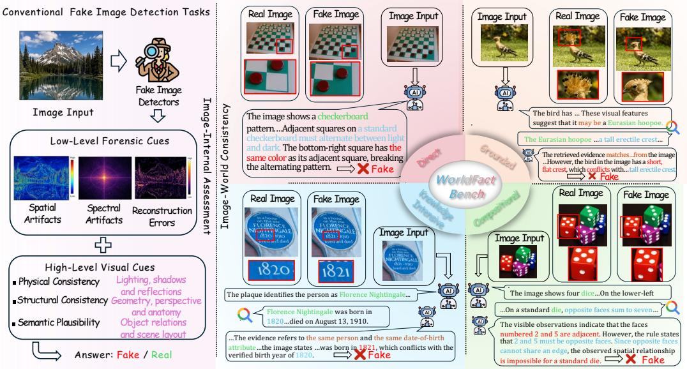  
Figure 1: Comparison between image-internal assessment and image-world consistency verifica-Real Image Fake Image Image Input Image Input Real Imagetion. Left: image forensics examines low-level artifacts and high-level physical, structural, and semantic consistency. Right: examples from the four verification regimes in WorldFact-Bench illustrate how visual observations are checked against real-world facts and rules to identify factual conflicts.

## a	checkerboard	ABSTRACT

same	color	as	its	adjacent	square,	breaking	 rected The	retrieved	evidence	matches…from	tAdvances in image generation have made visual authenticity increasingly diffi--b Fakecult to assess. Although image forensics now examines both generation artifacts Fake ImageReal Image Real Image Fake Iedand higher-level visual inconsistencies, a plausible image can still contradict realowworld facts or rules. We introduce WorldFact-Bench to evaluate image-world con-Image Inputsistency from a single image, without a predefined claim or verification target. The benchmark contains 1,274 source-aligned real–fake pairs across four verification regimes and ten semantic domains. Each pair introduces a specific, evidence-The image	shows	four	dice…On	the	lower-lefsupported factual conflict while seeking to preserve non-target content and visual Florence	Nightingale	was	born	in	 …On	a	standard	die,	opposite	faces	sum	to	sevenplausibility. Images are evaluated independently, and pair accuracy requires both numbered	2	and	5	are	adjacent.	However,	the	rumembers of a pair to be classified correctly. We further propose PERSIST-Agent, Fake cannot	share	an	edge,	the	observed	spatial	relatiwhich organizes iterative verification around a persistent state linking candidate facts, visual observations, evidence, and verification statuses. This state guides subsequent inspection and retrieval while retaining unresolved candidates. With backbone weights fixed, harness self-optimization refines the agent’s prompts and execution rules through validation feedback. Experiments reveal strong label biases in several detectors and uneven gains from retrieval. On the evaluated 8B

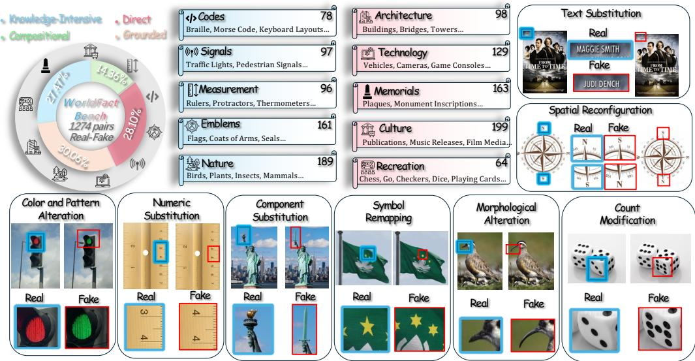  
Figure 2: Overview of WorldFact-Bench. The dataset contains 1,274 real–fake pairs across four verification regimes and ten semantic domains. Left: regime proportions. Middle: domain counts and representative categories. Right and bottom: examples of the eight manipulation types, with blue and red boxes highlighting corresponding factual regions in the real and fake images, respectively.

backbones, PERSIST-Agent improves pair accuracy over both direct judgment and retrieval-augmented baselines, while ablations support the role of persistent verification state. These findings highlight the value of state-guided verification and the remaining gap between visual plausibility and factual correctness.

## 1 INTRODUCTION

Advances in image generation have made synthetic images increasingly realistic in texture, lighting, and structure. This progress makes reliable image forensics more challenging. Existing approaches go beyond low-level generation traces to examine semantic, structural, and physical cues (Yan et al., 2024a). Recent multimodal models also reason about visual anomalies and explain their judgments (Wen et al., 2025; Tan et al., 2025). Yet the absence of obvious anomalies does not establish factual correctness. Verification must also consider whether the depicted content agrees with real-world facts and rules.

For example, a film poster may have a natural layout, clear text, and convincing portraits, yet credit an actor who did not appear in the film. Detecting this error requires checking the film’s cast, not just the appearance of the poster. We study image-world consistency: whether the attributes and relations depicted in an image agree with the relevant facts or rules. Our task asks a model to discover and verify factual conflicts from a single image, without a predefined claim or verification target.

The challenge is not only to obtain knowledge, but also to decide what to check and how that knowledge applies to the image. Factual errors need not produce visible anomalies, so the model must identify facts worth checking among many plausible details. Relevant search results alone are not enough. The model must establish that the evidence concerns the same entity, attribute, and context before comparing it with the visual observation. When several candidates require verification, it must also keep track of what has been checked, what remains uncertain, and which observation or search would resolve that uncertainty. The task therefore requires coordinated visual inspection, evidence assessment, and verification across multiple steps.

To evaluate this ability, we introduce WorldFact-Bench, with 1,274 source-aligned real–fake image pairs across four verification regimes and ten semantic domains. Each pair starts from a source image with a visible fact supported by traceable evidence. We introduce a specific factual conflict while seeking to preserve the remaining content and visual plausibility. This controlled construction reduces variation in subjects and scenes between paired images, helping focus the evaluation on factual changes. At test time, each image is presented independently, without its paired counterpart or a verification target. We report real- and fake-image accuracy, together with pair accuracy, which requires both images in a pair to be classified correctly. This metric exposes failures that can be hidden by a preference for one label.

We also propose PERSIST-Agent, an iterative verification framework built around a persistent verification state. The state records each candidate’s entity and attribute, visual observation, retrieved evidence, and verification status. It separates what is observed in the image from what is supported by evidence, while keeping both linked to the same verification target. The agent uses this state to select candidates for further inspection or retrieval and updates their statuses as new information becomes available. Unresolved or ambiguous candidates can be revisited rather than being treated as settled. This explicit record connects successive actions and provides the basis for the final imagelevel judgment. With backbone weights fixed, PERSIST-Agent performs harness self-optimization, iteratively refining its prompts and execution rules through validation feedback.

Our experiments show strong label biases in several forensic models. Among the models evaluated through direct judgment, the highest pair accuracy is 32.20%, leaving substantial room for improvement. Retrieval improves pair accuracy, but the gains vary across models. PERSIST-Agent improves over direct judgment by 10.40 and 9.41 percentage points on Qwen3-VL-8B and InternVL3.5-8B, respectively, and outperforms the corresponding retrieval-augmented baselines. Ablations further support the role of persistent state: removing it reduces pair accuracy from 18.46% to 11.86% on Qwen3-VL-8B. These results highlight the importance of maintaining verification state alongside access to external evidence. They also show that reliable image-world consistency verification remains an open challenge.

Our main contributions are as follows:

• We introduce WorldFact-Bench to evaluate image-world consistency from a single image without a predefined verification target, using source-aligned pairs with traceable factual evidence.

• We propose PERSIST-Agent, which organizes iterative verification around a persistent state that links candidate facts, visual observations, evidence, and verification statuses.

• We evaluate forensic models and MLLM-based baselines, identify label biases and limited pair-wise discrimination, and show the benefits of state-guided verification through samebackbone comparisons and component ablations.

## 2 RELATED WORK

Image forensics and benchmarks. Image forensic methods use reconstruction errors, learned visual representations, and semantic features to detect generated or manipulated content (Wang et al., 2023; Cazenavette et al., 2024; Yan et al., 2024a; Cheng et al., 2025). MLLM-based approaches further incorporate artifact explanations and pattern-aware reasoning (Wen et al., 2025; Tan et al., 2025). Their scope therefore extends beyond low-level texture cues. Benchmarks such as GenImage and GIM evaluate cross-generator detection and local manipulation detection, respectively (Zhu et al., 2023; Chen et al., 2024). WorldFact-Bench complements these settings by testing whether visually plausible content conflicts with applicable facts or rules. Its source-aligned pairs support evaluation of whether a detector can accept an original image and reject its factually altered counterpart. Table 1 compares representative forensic benchmarks.

Knowledge-grounded visual verification. Multimodal fact-checking uses external evidence to assess image context and image–text claims (Abdelnabi et al., 2021; Wang et al., 2024; Cao et al., 2025). Related benchmarks examine different aspects of visual factuality. T2I-FactualBench evaluates whether text-to-image models depict knowledge-intensive concepts specified by prompts (Huang et al., 2024). Pix2Fact studies fine-grained visual question answering that requires external knowledge (Jiang et al., 2026). Recent work also extracts check-worthy claims from multimodal social media posts (Teo et al., 2026). WorldFact-Bench focuses on discovering and verifying factual conflicts from an image alone. It combines an unspecified verification target 100Couwith controlled factual manipulations and source-aligned pairs, allowing evaluation of both target discovery and real–fake discrimination.

Table 1: Comparison with representative image forensic benchmarks.
<table><tr><td>Benchmark</td><td>Full Gen.</td><td>Local Edit</td><td>Aligned Pair</td><td>External Knowl.</td><td>Factual Edit</td><td>Reasoning</td><td>Loc.</td></tr><tr><td>GenImage Zhu et al. (2023)</td><td>√</td><td></td><td></td><td></td><td></td><td></td><td></td></tr><tr><td>GIM Chen et al. (2024)</td><td>一</td><td>√</td><td>√</td><td></td><td></td><td></td><td>5</td></tr><tr><td>Community Forensics Park &amp; Owens (2024)</td><td>√</td><td>一</td><td></td><td></td><td></td><td></td><td></td></tr><tr><td>AI-GenBench Pellegrini et al. (2025)</td><td>√</td><td>一</td><td></td><td></td><td></td><td></td><td></td></tr><tr><td>ForensicHub Du et al. (2025)</td><td>√</td><td>√</td><td>△</td><td></td><td></td><td></td><td>√</td></tr><tr><td>AEGIS Zhang et al. (2026a)</td><td>△</td><td>△</td><td></td><td></td><td></td><td>√</td><td>√</td></tr><tr><td>WorldFact-Bench</td><td>一</td><td>√</td><td>√</td><td>√</td><td>√</td><td>√</td><td></td></tr></table>

✓: explicit coverage; △: partial coverage; –: not a primary setting.

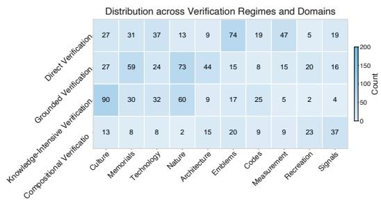

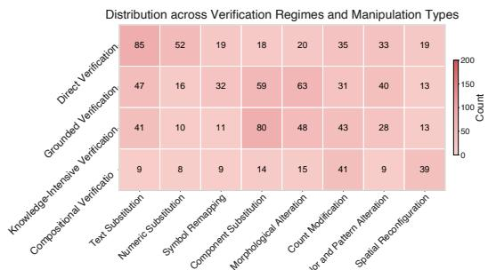  
Figure 3: Distribution of the 1,000 test pairs across verification regimes and semantic domains (left) 200or manipulation types (right). Cell values indicate the number of real–fake pairs.

Verification agents and harness optimization. ReAct interleaves reasoning with external actions (Yao et al., 2022), while FIRE combines evidence retrieval and claim verification in an iterative process (Xie et al., 2024). These approaches establish a foundation for multi-step verification. PERSIST-Agent organizes this process around an explicit, candidate-level state table. The table separates visual observations from evidence-supported values, records unresolved candidates, and guides subsequent inspection and retrieval. Feedback-driven prompt optimization, as studied in GEPA (Agrawal et al., 2025), also provides a basis for improving agent instructions without updating model weights. We use validation-driven harness self-optimization to refine execution within a fixed state schema and action interface. The central mechanism remains the persistent verification state that connects candidate selection, evidence binding, and judgment.

## 3 WORLDFACT-BENCH

## 3.1 TASK DEFINITION

WorldFact-Bench evaluates whether models can identify conflicts between image content and realworld facts or rules. Given a single image, a model predicts Real or Fake. It is not given a predefined verification target, reference evidence, or the paired image. We construct pairs from the same source image. Starting with an original image whose target fact has been verified, we introduce one clear factual conflict through a local edit. The edit aims to preserve the subject, scene, and non-target content. The original and edited images are labeled Real and Fake, respectively, and evaluated independently. This design provides matched images that differ in the target fact, allowing us to test whether a model can both accept the original and detect the manipulation.

## 3.2 VERIFICATION REGIMES

We organize samples into four regimes based on their verification requirements. Direct Verification compares a visual observation with a stable fact or rule when the target attribute and its context are explicit. Grounded Verification first requires identifying the relevant entity or target attribute from visual cues. Knowledge-Intensive Verification relies on detailed entity-specific facts, specialist knowledge, or archival records. Compositional Verification requires combining multiple visual observations and checking their relations or shared constraints. When several requirements apply, we assign one primary label in the following order: Compositional, Knowledge-Intensive, Real: …Grounded, and Direct. These labels describe verification requirements, not prescribed reasoning steps or tools.

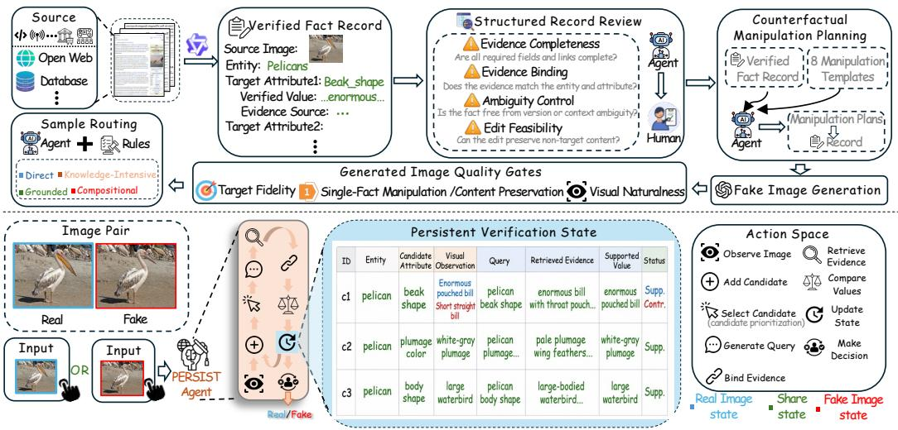  
Figure 4: Overview of WorldFact-Bench construction and PERSIST-Agent. Top: verified fact records guide controlled image manipulation, followed by quality checks and assignment to verification regimes. Bottom: PERSIST-Agent verifies a single image through iterative observation, retrieval, and comparison. A persistent state table links candidate facts to visual observations, evidence, and verification statuses, guiding subsequent actions and retaining unresolved candidates. The paired examples illustrate separate runs, not joint inputs.

## pouch3.3 DATASET CONSTRUCTION AND QUALITY CONTROL

c2 pelican plumage white and pelican plumage white and SupporteFact selection. We select visible, evidence-supported facts from images with traceable sources. wing For each candidate, we verify the relevant entity, attribute, and correct value. Images must provide sufficient visual cues for identification. We exclude candidates with missing context, severe c3 pelican body waterbird body are large- bodied wateocclusion, or unresolved ambiguity between variants.

Controlled manipulation. Each edit targets one fact and specifies both the region to modify and the content to preserve. The edited attribute or relation must contradict the relevant fact or rule, rather than represent another valid version, pose, or state. The edit must also preserve the visual cues needed to identify the entity and verify the fact.

Review and deduplication. Edited images undergo model-assisted checks and human review. We check whether the intended factual conflict is present, whether non-target content is preserved, and whether the edit introduces obvious unintended artifacts. We reject edits that fail to introduce the intended conflict, admit a valid alternative interpretation, or substantially alter non-target content. Before splitting the dataset, we remove duplicates through exact matching, perceptual similarity screening, and semantic review. Samples derived from the same source but targeting different facts may be retained; they are grouped together during splitting.

## 3.4 DATASET COMPOSITION AND EVALUATION PROTOCOL

WorldFact-Bench contains 1,274 original–edited image pairs across four verification regimes, ten semantic domains, and eight manipulation types. Figure 2 presents category counts and representative examples. Figure 3 shows the distributions of verification regimes across semantic domains and manipulation types.

The dataset has no training split. We allocate 274 pairs to validation and 1,000 pairs to testing. Samples from the same source image or confirmed near-duplicate sources form a source group, which is kept within a single split. Subject to this constraint, the split aims to preserve the overall distributions along all three category dimensions while maintaining coverage of their pairwise combinations.

Table 2: Main results on the WorldFact-Bench test set (%). F and R denote fake- and real-image accuracy, respectively; Pair requires both images in a pair to be classified correctly. The highest overall Pair accuracy is shown in bold.
<table><tr><td rowspan="2">Method</td><td colspan="2">Direct</td><td colspan="2">Grounded</td><td colspan="2">K-Int.</td><td colspan="2">Compositional</td><td colspan="3">Overall</td></tr><tr><td>F</td><td>R</td><td>F</td><td>R</td><td></td><td>R</td><td>F</td><td>R</td><td>F</td><td>R</td><td>Pair</td></tr><tr><td colspan="10">Specialized Vision Detectors</td><td></td></tr><tr><td>CO-SPY Cheng et al. (2025)</td><td>22.69</td><td>81.76</td><td>0.00</td><td>100.00</td><td>0.00</td><td>89.47</td><td>0.00</td><td>94.74</td><td>6.38</td><td>91.23</td><td>1.83</td></tr><tr><td>AIDE Yan et al. (2024a)</td><td>0.00</td><td>58.43</td><td>0.00</td><td>100.00</td><td>4.00</td><td>100.00</td><td>10.53</td><td>89.47</td><td>2.61</td><td>86.80</td><td>2.61</td></tr><tr><td>Effort Yan et al. (2024b)</td><td>38.63</td><td>82.03</td><td>0.00</td><td>100.00</td><td>4.00</td><td>100.00</td><td>5.26</td><td>84.21</td><td>12.71</td><td>92.68</td><td>7.14</td></tr><tr><td>PROBE Cao et ai. (2026)</td><td>17.26</td><td>85.30</td><td>26.76</td><td>87.74</td><td>10.14</td><td>87.74</td><td>13.16</td><td>87.74</td><td>17.58</td><td>87.05</td><td>14.24</td></tr><tr><td colspan="10">MLLM-based Detectors</td><td colspan="3"></td></tr><tr><td>FakeVLM Wen et al. (2025)</td><td>0.00</td><td>100.00</td><td>0.00</td><td>100.00</td><td>0.00</td><td>100.00</td><td>0.00</td><td>100.00</td><td>0.00</td><td>100.00</td><td>0.00</td></tr><tr><td>UniGenDet Zhang et al. (2026b)</td><td>100.00</td><td>0.00</td><td>100.00</td><td>0.00</td><td>100.00</td><td>0.00</td><td>100.00</td><td>0.00</td><td>100.00</td><td>0.00</td><td>0.00</td></tr><tr><td>VERITAS Tan et al. (2025)</td><td>0.00</td><td>100.00</td><td>0.00</td><td>97.78</td><td>22.00</td><td>78.95</td><td>5.26</td><td>94.74</td><td>6.79</td><td>92.81</td><td>0.57</td></tr><tr><td colspan="10">MLLMs: Direct Judgment</td><td></td><td></td></tr><tr><td>Qwen3-VL-8B</td><td>22.38</td><td>77.48</td><td>0.00</td><td>100.00</td><td>28.00</td><td>86.84</td><td>31.58</td><td>73.68</td><td>18.51</td><td>86.28</td><td>8.06</td></tr><tr><td>InternVL3.5-8B</td><td>82.24</td><td>21.96</td><td>15.15</td><td>91.11</td><td>90.00</td><td>5.26</td><td>73.68</td><td>15.79</td><td>62.94</td><td>37.31</td><td>8.86</td></tr><tr><td>GLM-4.6V</td><td>0.00</td><td>100.00</td><td>0.00</td><td>100.00</td><td>8.00</td><td>92.11</td><td>15.79</td><td>89.47</td><td>4.47</td><td>96.32</td><td>3.64</td></tr><tr><td>Kimi-K2.6</td><td>22.05</td><td>77.31</td><td>3.03</td><td>100.00</td><td>14.00</td><td>92.11</td><td>42.11</td><td>84.21</td><td>17.01</td><td>89.19</td><td>12.90</td></tr><tr><td>MiniMax-M3</td><td>21.50</td><td>82.77</td><td>0.00</td><td>100.00</td><td>22.00</td><td>97.37</td><td>36.84</td><td>94.74</td><td>17.37</td><td>93.68</td><td>16.76</td></tr><tr><td>Gemini-3.5-Flash</td><td>42.77</td><td>100.00</td><td>16.67</td><td>95.56</td><td>52.00</td><td>94.74</td><td>31.58</td><td>84.21</td><td>35.83</td><td>94.95</td><td>32.20</td></tr><tr><td colspan="10">MLLMs: Retrieval-Augmented Judgment</td><td></td><td></td><td></td></tr><tr><td>InternVL3.5-8B + Retrieval</td><td>81.98</td><td>17.28</td><td>30.30</td><td>64.44</td><td>40.00</td><td>50.00</td><td>68.42</td><td>31.58</td><td>52.97</td><td>42.50</td><td>10.06</td></tr><tr><td>Qwen3-VL-8B + Retrieval Kimi-K2.6 + Retrieval</td><td>38.05</td><td>42.76</td><td>6.06</td><td>97.78</td><td>28.00</td><td>78.95</td><td>31.58</td><td>94.74</td><td>24.74</td><td>76.72</td><td>14.82</td></tr><tr><td></td><td>18.67</td><td>100.00</td><td>6.06</td><td>100.00</td><td>52.00</td><td>100.00</td><td>42.11</td><td>89.47</td><td>27.38</td><td>98.48</td><td>26.89</td></tr><tr><td colspan="10">PERSIST-Agent</td></tr><tr><td>PERSIST-Agent (Qwen3-VL-4B)</td><td>78.46</td><td>22.30</td><td>21.21</td><td>75.56</td><td>70.00</td><td>47.37</td><td>52.63</td><td>84.21</td><td>55.19</td><td>54.12</td><td>17.16</td></tr><tr><td>PERSIST-Agent (InternVL3.5-8B) PERSIST-Agent (Qwen3-VL-8B)</td><td>21.72</td><td>61.79</td><td>22.73</td><td>91.11</td><td>70.00</td><td>39.47</td><td>68.42</td><td>42.11</td><td>41.98</td><td>61.67</td><td>18.27</td></tr><tr><td></td><td>62.86</td><td>62.39</td><td>19.70</td><td>73.33</td><td>70.00</td><td>39.47</td><td>42.11</td><td>78.95</td><td>48.84</td><td>61.79</td><td>18.46</td></tr></table>

We report fake-image accuracy (F), real-image accuracy (R), and pair accuracy (Pair). F and R measure classification accuracy on edited and original images, respectively. Pair is our primary metric: a pair is counted as correct only if both images are classified correctly. A model that always predicts the same label therefore receives a Pair score of zero. All main results use the test split. Overall scores are computed over test samples, rather than as an unweighted average of categorylevel accuracies.

## 4 PERSIST-AGENT

Verifying image–world consistency requires more than retrieving information about an image. First, the verification target is not given: the model must identify which visible details to check. Second, retrieved information must match the entity, attribute, and context under examination before it can support a judgment. Finally, verification may remain incomplete after a single observation or search. The model must retain unresolved candidates and revise earlier judgments as new evidence becomes available. These requirements call for a shared working state that connects candidate selection, evidence gathering, and judgment revision.

We propose PERSIST-Agent, an image verification framework built around a persistent verification state. As shown in Fig. 4, a structured state table links each candidate fact to its visual observation, retrieved evidence, and current status. The agent uses these records to select what to inspect or retrieve next, then updates the relevant entries with the resulting information. This allows verification to proceed across multiple candidates without discarding unresolved questions. Each run takes a single image as input, without access to its paired counterpart, edit annotations, or benchmark reference evidence.

## 4.1 PERSISTENT VERIFICATION STATE

The state table organizes verification around candidate facts. Each row represents an entity attribute or a relation to be checked. For example, the pelican in Fig. 4 may yield candidates concerning its bill shape, plumage color, and body shape.

Each record contains a candidate ID, entity, candidate attribute, visual observation, query, retrieved evidence, evidence value, and verification status. The visual observation describes what is visible in the image. The evidence value describes the corresponding attribute according to an applicable source. These fields are kept separate: the former is obtained through image inspection, whereas the latter is extracted from evidence matched to the entity and its context. For bill shape, for example, the agent compares the observed morphology with the description provided by a relevant source.

Each candidate has one of four statuses: Unverified, when verification is incomplete; Supported, when applicable evidence agrees with the observation; Contradicted, when applicable evidence conflicts with it; and Ambiguous, when the available information leaves multiple valid interpreta tions. Missing evidence alone does not establish a contradiction. Evidence concerning a different entity, version, period, or rule system cannot directly support a judgment.

The table serves as working state rather than only a record of past actions. Unverified candidates remain available for inspection, ambiguous candidates can receive additional observations or evidence, and previous judgments can be revised when relevant new information becomes available. This preserves verification progress across iterations.

## 4.2 STATE-GUIDED ITERATIVE VERIFICATION

Candidate discovery. The agent first inspects the image for verifiable entities, text, numbers, symbols, component properties, and spatial relations. It adds these observations to the state table as candidate facts. A candidate need not appear visually unusual: a plausible detail may still conflict with an external fact. When an observation is unclear, the agent records the uncertainty and may inspect the relevant region again.

Candidate selection and evidence retrieval. At each iteration, the agent selects a candidate based on visual clarity, verifiability, and its potential impact on the final decision. If the observed value remains uncertain, the agent performs further visual inspection. Otherwise, it generates a query using the entity, target attribute, and relevant context, then retrieves supporting material. Previous queries and evidence remain available in the table for reuse and to reduce redundant searches.

Evidence binding and state update. Before using a retrieved source, the agent checks whether it matches the candidate’s entity, attribute, and relevant context. It then extracts the evidence value, compares it with the visual observation, and updates the candidate’s status. For a relation or rule involving multiple observations, the agent first gathers the required visual information and then checks whether it satisfies the shared constraint. If the comparison remains ambiguous, the candidate is retained for further inspection, query refinement, or additional retrieval.

These actions form an iterative process rather than a fixed, single-pass sequence. Each action updates the relevant records while preserving other candidates and their verification progress. New evidence may revise an earlier judgment, and the agent may switch between candidates as their information needs change.

## 4.3 IMAGE-LEVEL DECISION

The final decision is based on the candidates and their bound evidence. The agent predicts Fake when a clearly observed candidate conflicts with reliable, context-matched evidence. Otherwise, it predicts Real once all high-priority candidates have been resolved or the reasoning budget is exhausted. The output includes the image-level label, its rationale, and the relevant evidence, while unresolved candidates remain recorded in the state. Here, Real means that no factual conflict has been established under the available observations, evidence, and budget; it does not imply that every detail in the image has been verified.

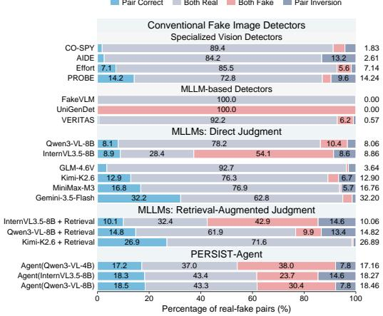

Table 3: Oracle analysis of PERSIST-Agent with Qwen3-VL-8B, measured by Pair accuracy (%). Each partial oracle provides only the named gold information; All Gold provides entity, attribute, and evidence together.
<table><tr><td>Setting</td><td>Direct</td><td>Grounded</td><td>K-Int.</td><td>Comp.</td><td>Overall</td></tr><tr><td>Base</td><td>25.29</td><td>10.41</td><td>15.01</td><td>28.53</td><td>18.46</td></tr><tr><td>+ Entity</td><td>22.64</td><td>25.83</td><td>18.76</td><td>30.47</td><td>23.66</td></tr><tr><td>+ Attribute</td><td>25.91</td><td>38.54</td><td>26.18</td><td>40.72</td><td>31.92</td></tr><tr><td>+ Evidence</td><td>36.48</td><td>52.67</td><td>60.35</td><td>51.26</td><td>50.02</td></tr><tr><td>+ All Gold</td><td>69.24</td><td>74.18</td><td>80.63</td><td>76.47</td><td>74.89</td></tr></table>

Table 4: Component ablation of PERSIST-Agent with Qwen3-VL-8B, measured by Pair accuracy (%).  
Figure 5: Pair-wise prediction outcomes on the WorldFact-Bench test set. Pair Correct denotes two correct predictions; Both Real and Both Fake assign the same label to both images; Pair Inversion reverses both labels. Each bar shows the percentage of pairs in these four outcomes. Numbers on the right indicate Pair accuracy (%).
<table><tr><td>Setting</td><td>Direct</td><td>Grounded</td><td>K-Int.</td><td>Comp.</td><td>Overall</td></tr><tr><td>Full</td><td>25.29</td><td>10.41</td><td>15.01</td><td>28.53</td><td>18.46</td></tr><tr><td>w/o State</td><td>18.92</td><td>5.88</td><td>8.64</td><td>16.73</td><td>11.86</td></tr><tr><td>w/o Prioritization</td><td>19.47</td><td>7.82</td><td>10.96</td><td>21.44</td><td>13.92</td></tr><tr><td>w/o Binding</td><td>18.35</td><td>6.43</td><td>7.28</td><td>23.61</td><td>12.49</td></tr><tr><td>w/o Ambiguity</td><td>19.86</td><td>8.71</td><td>12.35</td><td>25.48</td><td>15.26</td></tr></table>

## 5 EXPERIMENTS

## 5.1 EXPERIMENTAL SETUP

Compared methods. We evaluate five groups of methods: specialized vision detectors, MLLMbased detectors, MLLMs with direct judgment, retrieval-augmented MLLMs, and PERSIST-Agent across backbones. Each method receives a single image without its paired counterpart, a predefined claim, or the target attribute. Real and fake images in each pair are evaluated independently. Oracle experiments additionally provide the reference information for each setting.

Data and metrics. We use 274 real–fake pairs for validation and 1,000 pairs for testing. The test set contains 281 Direct, 301 Grounded, 274 Knowledge-Intensive, and 144 Compositional pairs. Figure 3 shows their distribution across semantic domains and manipulation types. We report fakeimage accuracy (F), real-image accuracy (R), and pair accuracy (Pair). A pair is correct only when both its real and fake images are classified correctly. Pair is our primary metric because it measures whether a method can distinguish both images, rather than favoring one label. All reported results are on the test set. Oracle and ablation experiments use Qwen3-VL-8B. All model results are averaged over three independent runs on the full test set to reduce stochastic variation.

Harness optimization. We automatically optimize the agent harness using validation feedback while keeping the backbone weights fixed. The harness specifies the prompts and execution rules that guide the agent’s verification actions. We retain the persistent state schema, candidate statuses, and action interfaces, and optimize the instructions for candidate selection, query generation, evidence binding, and ambiguity handling. This process changes how the agent uses its available actions, rather than the underlying model parameters.

Optimization proceeds iteratively. At each iteration, the current harness is evaluated on validation images, and its predictions and execution traces are collected. An optimization model uses this feedback to propose revised instructions or execution rules. Candidate configurations are evaluated on the same validation samples under the same per-image inference budget. We select configurations primarily by validation Pair accuracy and also inspect F and R to identify one-sided predictions. The selected harness is fixed before test evaluation. During testing, the agent updates only the verification state of the current image; it does not revise the harness or use test labels as feedback.

## 5.2 MAIN RESULTS

Table 2 reports the main results.

Existing detectors struggle with factual manipulations. Specialized vision detectors achieve Pair scores between 1.83% and 14.24%, with PROBE performing best in this group. Their realimage accuracy is consistently higher than their fake-image accuracy, indicating a tendency to accept manipulated images as real. Among MLLM-based detectors, FakeVLM classifies every image as real, whereas UniGenDet classifies every image as fake. Both therefore obtain zero Pair accuracy despite achieving 100% accuracy on one image class. These results show that strong performance on one label does not imply reliable discrimination between real and fake images.

Retrieval helps, but its gains vary across models. Adding retrieval improves Pair from 8.06% to 14.82% for Qwen3-VL-8B, from 8.86% to 10.06% for InternVL3.5-8B, and from 12.90% to 26.89% for Kimi-K2.6. These gains support the value of external evidence. However, retrieval alone leaves substantial room for improvement. The agent must still identify what to verify, retrieve relevant information, and determine whether that information supports or contradicts the visual observation.

PERSIST-Agent improves performance on the same backbones. With Qwen3-VL-8B, PERSIST-Agent achieves 18.46% Pair, improving over direct judgment and retrieval augmentation by 10.40 and 3.64 percentage points, respectively. With InternVL3.5-8B, it achieves 18.27%, with corresponding gains of 9.41 and 8.21 points. The smaller Qwen3-VL-4B configuration achieves 17.16%. These results support the benefit of maintaining explicit verification state across successive actions. Nevertheless, Gemini-3.5-Flash achieves the highest Pair score among evaluated methods at 32.20%. Image–world consistency remains challenging even for the strongest models.

## 5.3 PAIR-WISE PREDICTION ANALYSIS

Figure 5 groups predictions into four outcomes: Pair Correct, where both images are classified correctly; Both Real and Both Fake, where the same label is assigned to both images; and Pair Inversion, where both predictions are incorrect. This breakdown distinguishes verification from one-sided label bias. Specialized vision detectors predominantly produce Both Real predictions, while UniGenDet exhibits the opposite pattern. PERSIST-Agent reduces the dominant label bias of both 8B backbones. For Qwen3-VL-8B, the proportion of Both Real outcomes decreases from 78.22% under direct judgment to 43.33%. For InternVL3.5-8B, Both Fake decreases from 54.08% to 23.71%. Pair accuracy improves in both cases, although substantial errors remain. Thus, the benefit is not a more balanced prediction distribution: PERSIST-Agent resolves more pairs.

## 5.4 DIAGNOSTIC ANALYSIS

Oracle analysis. Table 3 examines performance when reference entity, attribute, or evidence information is provided. Compared with the base score of 18.46%, the entity, attribute, and evidence settings achieve overall Pair scores of 23.66%, 31.92%, and 50.02%, respectively. Evidence provides the largest gain among these partial-oracle settings. Its effect is particularly pronounced in Knowledge-Intensive Verification, where Pair increases from 15.01% to 60.35%. The benefits are not uniform across regimes. Providing entity information improves Grounded Verification from 10.41% to 25.83%, but reduces Direct Verification from 25.29% to 22.64%. Additional reference information therefore does not guarantee an improvement for every verification regime. Providing all gold information raises overall Pair to 74.89%. The remaining errors show that access to reference information alone is insufficient for reliable final judgments.

Component ablation. Table 4 evaluates the contribution of each component. Removing persistent state causes the largest overall decrease, from 18.46% to 11.86%. The drop is especially large in Compositional Verification, where Pair falls from 28.53% to 16.73%. This supports the role of persistent state in retaining and combining observations across verification steps. Removing evidence binding reduces overall Pair to 12.49%, with the largest regime-level decrease in Knowledge-Intensive Verification, from 15.01% to 7.28%. This highlights the importance of matching retrieved evidence to the relevant entity and attribute. Removing candidate prioritization or ambiguity handling reduces overall Pair to 13.92% or 15.26%, respectively. These results support the use of persistent state, explicit evidence binding, and candidate management within the verification process.

## 6 CONCLUSION

We introduced WorldFact-Bench to evaluate image-world consistency beyond image-internal plausibility. Its source-aligned real–fake pairs test whether models can discover and verify factual conflict from a single image without a predefined target. We also proposed PERSIST-Agent, which uses persistent verification state to connect candidate discovery, visual observations, evidence binding, and subsequent actions. Experiments reveal substantial label biases and show that retrieval alone yields uneven gains. PERSIST-Agent improves over direct and retrieval-augmented judgment on the evaluated 8B backbones, while ablations support the role of persistent state. Our evaluation focuses on controlled factual manipulations; broader real-world coverage and reliable handling of unresolved evidence remain important directions. Together, the benchmark and framework support further study of image verification grounded in both visual content and real-world facts.

## 7 AI USE STATEMENT

In this work, we used generative AI tools solely to polish the writing of the manuscript. We have reviewed all AI-assisted edits and take responsibility for the final content of this work, including all text, claims, and artifacts.

## REFERENCES

Sahar Abdelnabi, Rakibul Hasan, and Mario Fritz. Open-domain, content-based, multi-modal fact-checking of out-of-context images via online resources. 2022 IEEE/CVF Conference on Computer Vision and Pattern Recognition (CVPR), pp. 14920–14929, 2021. URL https: //api.semanticscholar.org/CorpusID:244773560.

Lakshya A. Agrawal, Shangyin Tan, Dilara Soylu, Noah Ziems, Rishi Khare, Krista Opsahl-Ong, Arnav Singhvi, Herumb Shandilya, Michael J Ryan, Meng Jiang, Christopher Potts, Koushik Sen, Alexandros G. Dimakis, Ion Stoica, Dan Klein, Matei A. Zaharia, and O. Khattab. Gepa: Reflective prompt evolution can outperform reinforcement learning. ArXiv, abs/2507.19457, 2025. URL https://api.semanticscholar.org/CorpusID:280046245.

Rui Cao, Zifeng Ding, Zhijiang Guo, M. Schlichtkrull, and Andreas Vlachos. Averimatec: A dataset for automatic verification of image-text claims with evidence from the web. ArXiv, abs/2505.17978, 2025. URL https://api.semanticscholar.org/ CorpusID:278886414.

Zijie Cao, Weijie Tu, Yao Xiao, Weijian Deng, Liang Lin, and Pengxu Wei. Where detectors fail: Probing generative space for generalizable ai-generated image detection. ArXiv, abs/2605.24906, 2026. URL https://api.semanticscholar.org/CorpusID:288671464.

George Cazenavette, Avneesh Sud, Thomas Leung, and Ben Usman. Fakeinversion: Learning to detect images from unseen text-to-image models by inverting stable diffusion. 2024 IEEE/CVF Conference on Computer Vision and Pattern Recognition (CVPR), pp. 10759–10769, 2024. URL https://api.semanticscholar.org/CorpusID:270441010.

Yirui Chen, Xu Huang, Quan Zhang, Wei Li, Mingjian Zhu, Qi Yan, Simiao Li, Hanting Chen, Hailin Hu, Jie Yang, Wei Liu, and Jie Hu. Gim: A million-scale benchmark for generative image manipulation detection and localization. In AAAI Conference on Artificial Intelligence, 2024. URL https://api.semanticscholar.org/CorpusID:270702300.

Siyuan Cheng, Lingjuan Lyu, Zhenting Wang, Xiangyu Zhang, and Vikash Sehwag. Co-spy: Combining semantic and pixel features to detect synthetic images by ai. 2025 IEEE/CVF Conference on Computer Vision and Pattern Recognition (CVPR), pp. 13455–13465, 2025. URL https://api.semanticscholar.org/CorpusID:277271940.

Bo Du, Xuekang Zhu, Xiaochen Ma, Chenfan Qu, Kaiwen Feng, Zhe Yang, Chi man Pun, Jian Liu, and Jizhe Zhou. Forensichub: A unified benchmark & codebase for all-domain fake image detection and localization. ArXiv, abs/2505.11003, 2025. URL https://api. semanticscholar.org/CorpusID:278714583.

Ziwei Huang, Wanggui He, Quanyu Long, Yandi Wang, Haoyuan Li, Zhelun Yu, Fangxun Shu, Long Chan, Hao Jiang, Leilei Gan, and Fei Wu. T2i-factualbench: Benchmarking the factuality of text-to-image models with knowledge-intensive concepts. ArXiv, abs/2412.04300, 2024. URL https://api.semanticscholar.org/CorpusID:274514747.

Yifan Jiang, Cong Zhang, Bofei Zhang, Qiaofeng Zheng, Yifan Yang, Bingzhang Wang, and Yew Soon Ong. Pix2fact: When vision is not enough – benchmarking fine-grained vqa with web verification on high-resolution real-world scenes. 2026. URL https://api. semanticscholar.org/CorpusID:285269379.

Jeongsoo Park and Andrew Owens. Community forensics: Using thousands of generators to train fake image detectors. 2025 IEEE/CVF Conference on Computer Vision and Pattern Recognition (CVPR), pp. 8245–8257, 2024. URL https://api.semanticscholar.org/ CorpusID:273850004.

Lorenzo Pellegrini, Davide Cozzolino, Serafino Pandolfini, Davide Maltoni, Matteo Ferrara, Luisa Verdoliva, Marco Prati, and Marco Ramilli. Ai-genbench: A new ongoing benchmark for aigenerated image detection. 2025 International Joint Conference on Neural Networks (IJCNN), pp. 1–9, 2025. URL https://api.semanticscholar.org/CorpusID:278171455.

Hao Tan, Jun Lan, Zichang Tan, Ajian Liu, Chuanbiao Song, Senyuan Shi, Huijia Zhu, Weiqiang Wang, Jun Wan, and Zhen Lei. Veritas: Generalizable deepfake detection via pattern-aware reasoning. ArXiv, abs/2508.21048, 2025. URL https://api.semanticscholar.org/ CorpusID:280950394.

Joycelyn Teo, Rui Cao, Zhenyun Deng, Zifeng Ding, Michael Sejr Schlichtkrull, and Andreas Vlachos. Multimodal claim extraction for fact-checking. ArXiv, abs/2604.16311, 2026. URL https://api.semanticscholar.org/CorpusID:286855083.

Sheng Wang, Hongzhan Lin, Ziyang Luo, Zhen Ye, Guang Chen, and Jing Ma. Mfc-bench: Benchmarking multimodal fact-checking with large vision-language models. ArXiv, abs/2406.11288, 2024. URL https://api.semanticscholar.org/CorpusID:270560977.

Zhendong Wang, Jianmin Bao, Wen gang Zhou, Weilun Wang, Hezhen Hu, Hong Chen, and Houqiang Li. Dire for diffusion-generated image detection. 2023 IEEE/CVF International Conference on Computer Vision (ICCV), pp. 22388–22398, 2023. URL https://api. semanticscholar.org/CorpusID:257557819.

Siwei Wen, Junyan Ye, Peilin Feng, Hengrui Kang, Zichen Wen, Yize Chen, Jiang Wu, Wenjun Wu, Conghui He, and Weijia Li. Spot the fake: Large multimodal model-based synthetic image detection with artifact explanation. ArXiv, abs/2503.14905, 2025. URL https: //api.semanticscholar.org/CorpusID:277113659.

Zhuohan Xie, Rui Xing, Yuxia Wang, Jiahui Geng, Hasan Iqbal, Dhruv Sahnan, Iryna Gurevych, and Preslav Nakov. Fire: Fact-checking with iterative retrieval and verification. In North American Chapter of the Association for Computational Linguistics, 2024. URL https: //api.semanticscholar.org/CorpusID:273811239.

Shilin Yan, Ouxiang Li, Jiayin Cai, Yanbin Hao, Xiaolong Jiang, Yao Hu, and Weidi Xie. A sanity check for ai-generated image detection. ArXiv, abs/2406.19435, 2024a. URL https://api. semanticscholar.org/CorpusID:270845707.

Zhiyuan Yan, Jiangming Wang, Zhendong Wang, Peng Jin, Ke-Yue Zhang, Shen Chen, Taiping Yao, Shouhong Ding, Baoyuan Wu, and Li Yuan. Effort: Efficient orthogonal modeling for generalizable ai-generated image detection. ArXiv, abs/2411.15633, 2024b. URL https:// api.semanticscholar.org/CorpusID:282910223.

Shunyu Yao, Jeffrey Zhao, Dian Yu, Nan Du, Izhak Shafran, Karthik Narasimhan, and Yuan Cao. React: Synergizing reasoning and acting in language models. ArXiv, abs/2210.03629, 2022. URL https://api.semanticscholar.org/CorpusID:252762395.

Bo Zhang, Tzu-Yen Ma, Zichen Tang, Junpeng Ding, Zirui Wang, Yizhuo Zhao, Pei Gao, Zijie Xi, Zixin Ding, Haiyang Sun, Haocheng Gao, Yuan Liu, Liangjia Wang, Yiling Huang, Yujie Wang, Yuyue Zhang, Ronghui Xi, Yuanze Li, Jiachen Liu, Zhongjun Yang, and E Haihong. Aegis: A holistic benchmark for evaluating forensic analysis of ai-generated academic images. In Annual Meeting of the Association for Computational Linguistics, 2026a. URL https://api.semanticscholar.org/CorpusID:287915931.

Yanran Zhang, Wenzhao Zheng, Yifei Li, Bingyao Yu, Yu Zheng, Lei Chen, Jiwen Lu, and Jie Zhou. Unigendet: A unified generative-discriminative framework for co-evolutionary image generation and generated image detection. ArXiv, abs/2604.21904, 2026b. URL https: //api.semanticscholar.org/CorpusID:287702446.

Mingjian Zhu, Hanting Chen, Qiang Yan, Xu Huang, Guanyu Lin, Wei Li, Zhaopeng Tu, Hailin Hu, Jie Hu, and Yunhe Wang. Genimage: A million-scale benchmark for detecting ai-generated image. ArXiv, abs/2306.08571, 2023. URL https://api.semanticscholar.org/ CorpusID:259164965.

## A DATASET DETAILS

## A.1 COMPOSITION AND SPLIT

WorldFact-Bench contains 1,274 source-aligned real–fake pairs, with 274 pairs for validation and 1,000 for testing. These splits contain 548 and 2,000 images, respectively. There is no training split. Table 5 gives the counts for all four verification regimes, ten semantic domains, and eight manipulation types. All categories in these three dimensions appear in both splits. The three dimensions describe different properties of a sample: the verification requirement, the image content, and the edit operation. Their counts should therefore not be added across dimensions.

The original and edited images of a pair stay in the same split. Images from the same source, including confirmed near-duplicate sources, form a source group that is also kept within one split. This constraint prevents the paired counterpart or a near-duplicate source from appearing in validation when its test image is evaluated. It does not require every entity, semantic category, or public rule to be exclusive to one split.

Table 5: WorldFact-Bench composition by verification regime, semantic domain, and manipulation type. Counts refer to real–fake pairs. Each category dimension covers the same 1,274 pairs.
<table><tr><td>Category</td><td>Validation</td><td>Test</td><td>Total</td></tr><tr><td colspan="4">Verification regime</td></tr><tr><td>Direct</td><td>77</td><td>281</td><td>358</td></tr><tr><td>Grounded</td><td>82</td><td>301</td><td>383</td></tr><tr><td>Knowledge-Intensive</td><td>76</td><td>274</td><td>350</td></tr><tr><td>Compositional</td><td>39</td><td>144</td><td>183</td></tr><tr><td colspan="4">Semantic domain</td></tr><tr><td>Culture</td><td>42</td><td>157</td><td>199</td></tr><tr><td>Memorials</td><td>35</td><td>128</td><td>163</td></tr><tr><td>Technology</td><td>28</td><td>101</td><td>129</td></tr><tr><td>Nature</td><td>41</td><td>148</td><td>189</td></tr><tr><td>Architecture</td><td>21</td><td>77</td><td>98</td></tr><tr><td>Emblems</td><td>35</td><td>126</td><td>161</td></tr><tr><td>Codes</td><td>17</td><td>61</td><td>78</td></tr><tr><td>Measurement</td><td>20</td><td>76</td><td>96</td></tr><tr><td>Recreation</td><td>14</td><td>50</td><td>64</td></tr><tr><td>Signals</td><td>21</td><td>76</td><td>97</td></tr><tr><td colspan="4">Manipulation type</td></tr><tr><td>Text Substitution</td><td>51</td><td>182</td><td>233</td></tr><tr><td>Numeric Substitution</td><td>23</td><td>86</td><td>109</td></tr><tr><td>Symbol Remapping</td><td>19</td><td>71</td><td>90</td></tr><tr><td>Component Substitution</td><td>47</td><td>171</td><td>218</td></tr><tr><td>Morphological Alteration</td><td>41</td><td>146</td><td>187</td></tr><tr><td>Count Modification</td><td>40</td><td>150</td><td>190</td></tr><tr><td>Color and Pattern Alteration</td><td>30</td><td>110</td><td>140</td></tr><tr><td>Spatial Reconfiguration</td><td>23</td><td>84</td><td>107</td></tr><tr><td>All pairs</td><td>274</td><td>1,000</td><td>1,274</td></tr></table>

## A.2 ASSIGNMENT AND QUALITY CHECKS

A sample receives one primary verification regime. When several requirements apply, the assignment order is Compositional, Knowledge-Intensive, Grounded, and Direct. This order resolves overlapping requirements; it is not an ordering of difficulty or a prescribed sequence of model actions. For example, a familiar object can require compositional verification when a conflict can only be established by combining observations. Conversely, a visually detailed image can admit a direct check when the relevant value and rule are explicit.

An edit must introduce a factual conflict, not merely a visible change. A different pose, a valid model variant, or another admissible state is not sufficient to define a fake image. The target must be visible and supported by applicable evidence, and the edit must preserve the cues needed to identify the entity and interpret its context. Review checks target realization, preservation of non-target content, and obvious unintended artifacts. These checks aim to make factual verification informative; they do not establish that every edited image is free of all forensic traces.

## A.3 CONSTRUCTION FILTERING AND EDIT RECIPES

Figure 6 summarizes the construction stages. The initial pool contains 5,600 candidates. Source review retains 3,400, fact verification and counterfactual design retain 2,600, and local editing yields 1,950 image pairs. Visual review retains 1,600 pairs. After the remaining review and deduplication, the released dataset contains 1,274 pairs, or 22.75% of the initial pool. Rejection can occur when the evidence is insufficient, an edit matches a valid alternative, the intended change is not realized, or non-target content is substantially altered.

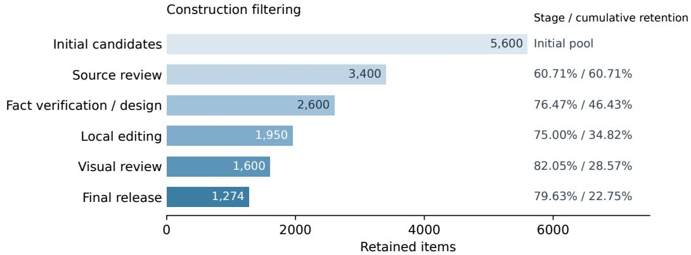  
Figure 6: Construction filtering. Counts refer to source-image candidates before editing and real– fake pairs thereafter. The percentages give retention relative to the preceding stage and the initial pool, respectively. The final release contains 1,274 pairs.

The construction library contains 221 atomic edit recipes. These are reusable operations, not additional samples or target quotas. A recipe specifies the target attribute, applicability conditions, counterfactual change, preservation constraints, rejection conditions, and acceptance checks. Table 6 summarizes the library. The typical regime attached to a recipe is a construction tag; the final regime is assigned to each sample using its actual verification requirements.

Table 6: Coverage of the 221 atomic edit recipes. The two groups classify the same recipe library by different criteria.
<table><tr><td>Manipulation type</td><td>Recipes</td><td>Typical verification regime</td><td>Recipes</td></tr><tr><td>Text Substitution</td><td>27</td><td>Direct</td><td>48</td></tr><tr><td>Numeric Substitution</td><td>22</td><td>Grounded</td><td>41</td></tr><tr><td>Symbol Remapping</td><td>24</td><td>Knowledge-Intensive</td><td>62</td></tr><tr><td>Component Substitution</td><td>20</td><td>Compositional</td><td>70</td></tr><tr><td>Morphological Alteration</td><td>17</td><td></td><td></td></tr><tr><td>Count Modification</td><td>34</td><td></td><td></td></tr><tr><td>Color and Pattern Alteration</td><td>18</td><td></td><td></td></tr><tr><td>Spatial Reconfiguration</td><td>59</td><td></td><td></td></tr><tr><td>Total</td><td>221</td><td>Total</td><td>221</td></tr></table>

## B EVALUATION PROTOCOL AND PAIR-WISE OUTCOMES

## B.1 INPUTS AND EVALUATION TRACKS

Each standard evaluation receives one image at a time. The paired image, reference evidence, and annotated verification target are not supplied. The pair association is used for scoring, not as model input. Table 7 summarizes the evaluated groups. Oracle experiments use Qwen3-VL-8B and provide only the reference information named in each setting; All Gold provides all three items.

Table 7: Evaluation tracks used in the main paper. Standard settings receive a single image without a supplied verification target.
<table><tr><td>Track</td><td>Methods or backbones</td></tr><tr><td>Specialized vision detectors</td><td>CO-SPY, AIDE, Effort, PROBE</td></tr><tr><td>MLLM-based detectors</td><td>FakeVLM, UniGenDet, VERITAS</td></tr><tr><td>Direct judgment</td><td>Qwen3-VL-8B, InternVL3.5-8B, GLM-4.6V, Kimi-K2.6, MiniMax-M3, Gemini-3.5-Flash</td></tr><tr><td>Retrieval-augmented judgment</td><td>Qwen3-VL-8B, InternVL3.5-8B, Kimi-K2.6</td></tr><tr><td>PERSIST-Agent</td><td>Qwen3-VL-4B, InternVL3.5-8B, Qwen3-VL-8B</td></tr></table>

## B.2 INFERENCE CONFIGURATION

Retrieval-Augmented Judgment and PERSIST-Agent use the Serper Google Search API under the shared limits in Table 8. Direct judgment uses no external search. We do not add retrieval or a persistent state to the public forensic methods beyond their original implementations. The shared limits bound available resources; they do not imply that every method makes the same number of calls on each image.

Table 8: Inference settings. Candidate and agent-step limits apply to PERSIST-Agent. Oracle variants retain the same limits and receive only their specified reference information.
<table><tr><td>Setting</td><td>Value</td></tr><tr><td>Search service</td><td>Serper Google Search API</td></tr><tr><td>Results per query</td><td>10</td></tr><tr><td>Maximum search calls per image</td><td>5</td></tr><tr><td>Maximum opened pages</td><td>3 per query</td></tr><tr><td>Maximum evidence spans</td><td>12</td></tr><tr><td>Maximum span length</td><td>256 tokens</td></tr><tr><td>Maximum active candidates</td><td>5</td></tr><tr><td>Maximum agent steps</td><td>12</td></tr><tr><td>Decision temperature</td><td>0</td></tr><tr><td>Image and reverse-image search</td><td>Disabled</td></tr><tr><td>Search-result cache</td><td>Enabled, keyed by normalized query</td></tr><tr><td>Output parsing</td><td>Fixed deterministic parser</td></tr><tr><td>Invalid output</td><td>One retry; unresolved output is incorrect</td></tr></table>

Image and reverse-image search are disabled because retrieving the source image could reveal the original value without discovering the visual target. Standard evaluation does not supply the verification regime label. The parser maps generative outputs to Real or Fake. An invalid output is retried once and counted as incorrect if it remains invalid; it is not silently treated as a correct Real prediction.

## B.3 METRICS AND OUTCOME DECOMPOSITION

For pair i, let $r _ { i }$ indicate a correct prediction on the original image and $f _ { i }$ a correct prediction on the edited image. For N test pairs, the three accuracies are

$$
R = \frac { 1 } { N } \sum _ { i = 1 } ^ { N } r _ { i } , \qquad F = \frac { 1 } { N } \sum _ { i = 1 } ^ { N } f _ { i } , \qquad P = \frac { 1 } { N } \sum _ { i = 1 } ^ { N } r _ { i } f _ { i } ,\tag{1}
$$

where P denotes Pair accuracy. Values in the tables are percentages. Pair accuracy requires both predictions to be correct and is not the mean or product of the two marginal accuracies.

For binary predictions, the four pair outcomes have probabilities

$$
{ \begin{array} { r l } { p _ { \mathrm { c o r r e c t } } = P , } & { \qquad p _ { \mathrm { b o t h ~ r e a l } } = R - P , } \\ { p _ { \mathrm { b o t h ~ f a k e } } = F - P , } & { \qquad p _ { \mathrm { i n v e r s i o n } } = 1 - R - F + P . } \end{array} }\tag{2}
$$

Here the accuracies are written as fractions in [0, 1]. The four probabilities sum to one. Executions that remain invalid after the allowed retry are scored as incorrect rather than omitted from the accuracy denominator. A method that always predicts Real or always predicts Fake has zero Pair accuracy, even though one of its marginal accuracies is one. Table 9 provides the complete outcome decomposition corresponding to the main results.

Table 9: Complete pair-wise outcomes on the 1,000-pair test set (%). The four outcomes are mutually exclusive and sum to 100% for each method, up to rounding.
<table><tr><td>Method</td><td>Pair Correct</td><td>Both Real</td><td>Both Fake</td><td>Pair Inversion</td></tr><tr><td>Specialized Vision Detectors</td><td></td><td></td><td></td><td></td></tr><tr><td>CO-SPY</td><td>1.83</td><td>89.40</td><td>4.55</td><td>4.22</td></tr><tr><td>AIDE</td><td>2.61</td><td>84.19</td><td>0.00</td><td>13.20</td></tr><tr><td>Effort</td><td>7.14</td><td>85.54</td><td>5.57</td><td>1.75</td></tr><tr><td>PROBE</td><td>14.24</td><td>72.81</td><td>3.34</td><td>9.61</td></tr><tr><td>MLLM-based Detectors</td><td></td><td></td><td></td><td></td></tr><tr><td>FakeVLM</td><td>0.00</td><td>100.00</td><td>0.00</td><td>0.00</td></tr><tr><td>UniGenDet</td><td>0.00</td><td>0.00</td><td>100.00</td><td>0.00</td></tr><tr><td>VERITAS</td><td>0.57</td><td>92.24</td><td>6.22</td><td>0.97</td></tr><tr><td>MLLMs: Direct Judgment</td><td></td><td></td><td></td><td></td></tr><tr><td>Qwen3-VL-8B</td><td>8.06</td><td>78.22</td><td>10.45</td><td>3.27</td></tr><tr><td>InternVL3.5-8B</td><td>8.86</td><td>28.45</td><td>54.08</td><td>8.61</td></tr><tr><td>GLM-4.6V</td><td>3.64</td><td>92.68</td><td>0.83</td><td>2.85</td></tr><tr><td>Kimi-K2.6</td><td>12.90</td><td>76.29</td><td>4.11</td><td>6.70</td></tr><tr><td>MiniMax-M3</td><td>16.76</td><td>76.92</td><td>0.61</td><td>5.71</td></tr><tr><td>Gemini-3.5-Flash</td><td>32.20</td><td>62.75</td><td>3.63</td><td>1.42</td></tr><tr><td>MLLMs: Retrieval-Augmented Judgment</td><td></td><td></td><td></td><td></td></tr><tr><td>InternVL3.5-8B + Retrieval</td><td>10.06</td><td>32.44</td><td>42.91</td><td>14.59</td></tr><tr><td>Qwen3-VL-8B + Retrieval</td><td>14.82</td><td>61.90</td><td>9.92</td><td>13.36</td></tr><tr><td>Kimi-K2.6 + Retrieval</td><td>26.89</td><td>71.59</td><td>0.49</td><td>1.03</td></tr><tr><td>PERSIST-Agent</td><td></td><td></td><td></td><td></td></tr><tr><td>Qwen3-VL-4B</td><td>17.16</td><td>36.96</td><td>38.03</td><td>7.85</td></tr><tr><td>InternVL3.5-8B</td><td>18.27</td><td>43.40</td><td>23.71</td><td>14.62</td></tr><tr><td>Qwen3-VL-8B</td><td>18.46</td><td>43.33</td><td>30.38</td><td>7.83</td></tr></table>

Several detectors strongly favor one label. CO-SPY assigns Real to both images for 89.40% of pairs, and AIDE does so for 84.19%. FakeVLM and UniGenDet show complete collapse toward Real and Fake, respectively. These outcomes distinguish one-sided prediction from reliable discrimination between the two members of a pair.

## B.4 COMPARISON ON THE SAME BACKBONES

Table 10 isolates the two 8B backbones evaluated with direct judgment, retrieval augmentation, and PERSIST-Agent. PERSIST-Agent improves Pair over direct judgment by 10.40 points on Qwen3-VL-8B and 9.41 points on InternVL3.5-8B. The gains over their retrieval-augmented variants are 3.64 and 8.21 points, respectively. For Qwen3-VL-8B, the gap between F and R decreases from 67.77 to 12.95 points. For InternVL3.5-8B, however, simple retrieval has a smaller gap than PERSIST-Agent, despite its lower Pair accuracy. Thus, balanced marginal accuracies alone do not establish successful pair-level verification.

Table 10: Same-backbone comparison on the test set. F, R, and Pair are accuracies (%). ∆Pair is the gain over direct judgment in percentage points; Gap is $| F - R |$ . A smaller gap alone does not imply higher pair accuracy.
<table><tr><td>Backbone</td><td>Setting</td><td>F</td><td>R</td><td>Pair</td><td>∆Pair</td><td>Gap</td></tr><tr><td>Qwen3-VL-8B</td><td>Direct</td><td>18.51</td><td>86.28</td><td>8.06</td><td>一</td><td>67.77</td></tr><tr><td></td><td>Retrieval</td><td>24.74</td><td>76.72</td><td>14.82</td><td>+6.76</td><td>51.98</td></tr><tr><td></td><td>PERSIST-Agent</td><td>48.84</td><td>61.79</td><td>18.46</td><td>+10.40</td><td>12.95</td></tr><tr><td>InternVL3.5-8B</td><td>Direct</td><td>62.94</td><td>37.31</td><td>8.86</td><td>一</td><td>25.63</td></tr><tr><td></td><td>Retrieval</td><td>52.97</td><td>42.50</td><td>10.06</td><td>+1.20</td><td>10.47</td></tr><tr><td></td><td>PERSIST-Agent</td><td>41.98</td><td>61.67</td><td>18.27</td><td>+9.41</td><td>19.69</td></tr></table>

## C PERSISTENT STATE AND HARNESS OPTIMIZATION

## C.1 STATE SEMANTICS

PERSIST-Agent separates an observation from the evidence used to assess it. A candidate record contains its ID, entity, candidate attribute, visual observation, query, retrieved evidence, evidence value, and verification status. The visual observation records what the agent reads from the image. The evidence value records what an applicable source supports. A retrieval result should not silently replace an uncertain visual observation with the value the agent expects to see.

Table 11 specifies the meaning of each status. Entity, attribute, and context matching are required before a source can support either agreement or contradiction. A source about a related product family, a different historical period, or another rule system is not sufficient merely because it is semantically relevant. Likewise, failure to retrieve supporting evidence is not itself evidence that the image is false.

Table 11: Interpretation of candidate statuses in the persistent verification state. Statuses can be revised when new observations or evidence become available.
<table><tr><td>Status</td><td>Interpretation</td></tr><tr><td>Unverified</td><td>The observations or evidence needed for a judgment are incomplete.</td></tr><tr><td>Supported</td><td>Applicable evidence agrees with the visual observation.</td></tr><tr><td>Contradicted</td><td>Applicable evidence conflicts with a clearly observed value or relation.</td></tr><tr><td>Ambiguous</td><td>More than one valid interpretation remains, preventing a reliable comparison.</td></tr></table>

Unverified and ambiguous candidates remain available for further work. The agent can inspect the image again, refine a query, retrieve more evidence, or switch to another candidate. Updating one record does not discard the observations and evidence already collected for other candidates. For a relational check, the relevant observations must be considered together before the rule is applied. These properties make the table working state rather than only a transcript of previous actions.

The final label follows the decision rule in the main paper. A reliable factual contradiction supports Fake. If no contradiction is established, the agent predicts Real after resolving the high-priority candidates or exhausting its budget. Unresolved candidates remain in the state. Real therefore means that no conflict was established during that run, not that every visible fact has been verified.

## C.2 WHAT THE HARNESS OPTIMIZATION CHANGES

Harness self-optimization operates on the validation split. The backbone weights, state schema, status definitions, and action interfaces remain fixed. The optimized instructions govern candidate selection, query generation, evidence binding, and ambiguity handling. The optimization model uses validation predictions and execution traces to propose revisions, which are compared on the same validation samples under the same per-image inference budget. Validation Pair accuracy is the primary selection criterion; F and R are also inspected for one-sided predictions.

This process is distinct from the agent’s test-time state updates. The selected harness is frozen before test evaluation. During a test run, the agent updates only the verification state for the current image; it does not optimize its prompts against test labels or use the paired image as feedback. This distinction separates validation-based optimization of the verification procedure from evidencedriven reasoning on a test image.

## D ADDITIONAL DIAGNOSTICS

## D.1 RETRIEVAL PIPELINE

We evaluate retrieval traces from independently processed test images. The Gold Target variant additionally receives the entity or rule context and target attribute, but not gold evidence. It uses the same search and reasoning limits as the standard agent. We distinguish five stages of retrieval and evidence use:

• Query Target Accuracy (QTA): at least one query targets the correct entity or rule context and attribute.

• Gold Source Recall at 10 (GSR@10): the recorded gold source appears among the top ten results of at least one query.

• Equivalent Evidence Recall at 10 (EER@10): a retrieved source supports the decisive fact, including a reliable alternative to the recorded gold source.

• Opened Decisive Evidence Rate (ODER): at least one opened page contains sufficient evidence for verification.

• Evidence Binding Accuracy (EBA): the selected evidence matches the entity, attribute, and relevant version, period, region, or rule context of the image.

Gold-source matching normalizes URLs, removes tracking parameters, and accounts for redirects. The other checks use the structured fact record and a shared rubric. Aliases and equivalent paraphrases are accepted, but a context mismatch is not. An alternative source qualifies only if it supports the same decisive value or rule. If a required trace field is missing, the corresponding check is counted as unsuccessful for that image.

Table 12: Retrieval diagnostics on the test set (%). Gold Target supplies the entity or rule context and target attribute, but not reference evidence. All agent variants use Qwen3-VL-8B. Metric definitions are given in the text.
<table><tr><td>Method / regime</td><td>QTA</td><td>GSR@10</td><td>EER@10</td><td>ODER</td><td>EBA</td></tr><tr><td>Method comparison</td><td></td><td></td><td></td><td></td><td></td></tr><tr><td>Qwen3-VL-8B + Retrieval</td><td>64.35</td><td>38.42</td><td>46.87</td><td>40.16</td><td>26.74</td></tr><tr><td>PERSIST-Agent</td><td>76.74</td><td>45.83</td><td>54.03</td><td>48.90</td><td>34.09</td></tr><tr><td>PERSIST-Agent + Gold Target</td><td>100.00</td><td>63.84</td><td>74.92</td><td>68.47</td><td>53.76</td></tr><tr><td>PERSIST-Agent by verification regime</td><td></td><td></td><td></td><td></td><td></td></tr><tr><td>Direct</td><td>88.60</td><td>56.20</td><td>63.40</td><td>57.10</td><td>44.80</td></tr><tr><td>Grounded</td><td>54.10</td><td>31.20</td><td>37.10</td><td>32.40</td><td>20.30</td></tr><tr><td>Knowledge-Intensive</td><td>84.20</td><td>44.80</td><td>55.90</td><td>50.20</td><td>25.90</td></tr><tr><td>Compositional</td><td>86.70</td><td>58.10</td><td>67.60</td><td>64.90</td><td>57.60</td></tr><tr><td>Overall</td><td>76.74</td><td>45.83</td><td>54.03</td><td>48.90</td><td>34.09</td></tr></table>

Table 12 shows improvements over simple retrieval at each measured stage. PERSIST-Agent reaches 76.74% QTA and 34.09% EBA, compared with 64.35% and 26.74% for Qwen3-VL-8B with retrieval. Its GSR@10, EER@10, and ODER are 45.83%, 54.03%, and 48.90%. Gold Target further raises EER@10 to 74.92% and EBA to 53.76%. Thus, identifying the target helps but does not remove the need to retrieve and bind applicable evidence.

Grounded Verification has the lowest QTA, 54.10%. Knowledge-Intensive Verification has substantially higher QTA, 84.20%, but EBA remains at 25.90%. Compositional Verification has the highest EBA, 57.60%, yet its Pair accuracy is only 28.53%. These patterns distinguish target discovery from evidence acquisition and from the subsequent visual comparison.

## D.2 ORACLE INTERVENTIONS AND COMPONENT ABLATIONS

Figure 7 summarizes the oracle and ablation results reported in the main paper. The partial oracle settings are independent interventions, not a sequence of cumulative additions. Providing the entity, attribute, or evidence raises overall Pair from 18.46% to 23.66%, 31.92%, and 50.02%, respectively. These correspond to gains of 5.20, 13.46, and 31.56 percentage points. All Gold supplies all three items and reaches 74.89%.

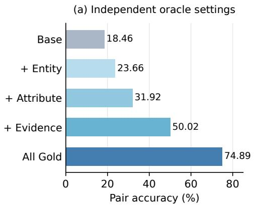

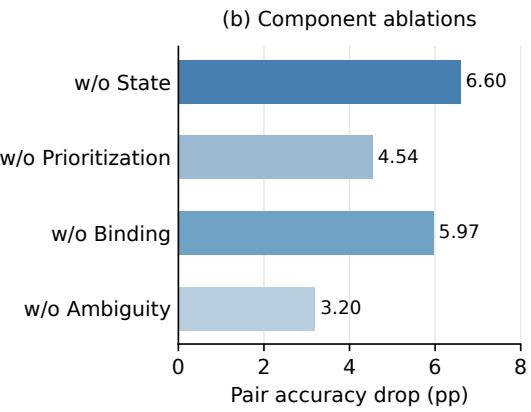  
Figure 7: Oracle and ablation diagnostics for PERSIST-Agent with Qwen3-VL-8B. Left: Pair accuracy when gold information is supplied; each partial oracle provides only the named item, while All Gold provides entity, attribute, and evidence together. Right: Pair accuracy drops relative to the full agent (18.46%) when individual components are removed.

The gains differ across verification regimes. Gold Entity improves Grounded Verification from 10.41% to 25.83%, but reduces Direct Verification from 25.29% to 22.64%. Gold Evidence has its largest regime-level gain on Knowledge-Intensive Verification, from 15.01% to 60.35%. The remaining errors under All Gold show that access to reference information does not, by itself, ensure a correct visual judgment. The oracle scores do not identify the cause of every remaining error.

Removing persistent state produces the largest overall ablation drop, 6.60 points, followed by evidence binding at 5.97 points, candidate prioritization at 4.54 points, and ambiguity handling at 3.20 points. The state ablation reduces Compositional Pair from 28.53% to 16.73%. Removing evidence binding reduces Knowledge-Intensive Pair from 15.01% to 7.28%. These differences support distinct roles for retaining observations across steps and matching evidence to the right verification target.

## D.3 PRIMARY FAILURE CAUSES

We manually analyze 200 failed pairs from PERSIST-Agent with Qwen3-VL-8B, with 50 pairs from each verification regime. Each pair receives one primary failure label. When several errors occur, the earliest identified error in the verification chain determines the label, so a pair is not counted under multiple causes. This is an equal-size sample of failures from each regime, not the full test-set distribution.

In Direct Verification, visual reading and rule or comparison errors each account for 30% of the analyzed failures. In Grounded Verification, entity grounding and target discovery together account for 52%. Retrieval and evidence-binding errors account for 56% in Knowledge-Intensive Verification, while rule or comparison errors account for 40% in Compositional Verification. Across the balanced subset, rule or comparison errors, visual reading errors, and retrieval failures account for 23%, 21%, and 18%, respectively. The analysis identifies recurring bottlenecks without treating these subset percentages as population-wide failure rates.

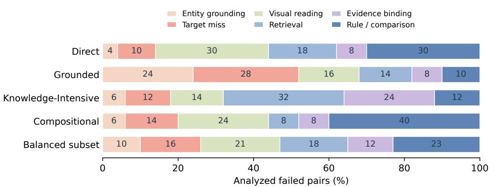  
Figure 8: Primary failure causes in a manual audit of 200 failed pairs, with 50 pairs per verification regime. Each pair receives one label. The last bar summarizes this balanced failure subset, not the regime proportions of the full test set.

## D.4 AGENT BEHAVIOR AND RESOURCE USE

Table 13 summarizes the agent’s behavior by regime. Direct Verification has the shortest average process, with 1.30 search calls and 3.80 agent steps per image. Knowledge-Intensive Verification uses the most search calls and opened evidence pages, 3.70 and 7.20 on average. Compositional Verification uses the most candidates and focused inspections, 4.30 and 4.10, and has the largest mean step count, 7.80. Overall, the agent uses 2.49 search calls and 6.05 steps per image. These are operation counts, not measurements of latency or monetary cost.

Table 13: Agent behavior for PERSIST-Agent with Qwen3-VL-8B. The first five columns report per-image means. Ambig. is the percentage of images with an unresolved high-priority candidate at termination; Budget End is the percentage that reaches the reasoning limit.
<table><tr><td>Regime</td><td>Candidates</td><td>Focused inspections</td><td>Search calls</td><td>Evidence pages</td><td>Agent steps</td><td>Ambig.</td><td>Budget End</td></tr><tr><td>Direct</td><td>2.20</td><td>1.40</td><td>1.30</td><td>2.40</td><td>3.80</td><td>8.60</td><td>4.30</td></tr><tr><td>Grounded</td><td>3.50</td><td>2.80</td><td>2.60</td><td>4.70</td><td>6.10</td><td>18.90</td><td>12.80</td></tr><tr><td>Knowledge-Intensive</td><td>3.20</td><td>2.00</td><td>3.70</td><td>7.20</td><td>7.40</td><td>22.60</td><td>18.50</td></tr><tr><td>Compositional</td><td>4.30</td><td>4.10</td><td>2.30</td><td>4.30</td><td>7.80</td><td>20.10</td><td>16.20</td></tr><tr><td>Overall</td><td>3.17</td><td>2.37</td><td>2.49</td><td>4.68</td><td>6.05</td><td>17.19</td><td>12.46</td></tr></table>

The proportion reaching the reasoning limit is 12.46% overall, and 17.19% retain an unresolved high-priority candidate at termination. These observations complement final-label accuracy by describing how much verification work remains incomplete.

## E QUALITATIVE VERIFICATION EXAMPLES

The following diagrams summarize verification traces rather than reproduce verbatim execution logs. Paired images are shown together only for explanation; each is processed independently. The cases illustrate verification stages, not error frequencies.

A localized, checkable observation. In Figure 9, the observed keyboard sequences are Q-W-E-R and Q-W-F-R. Matching this local observation to the QWERTY layout rule allows the trace to accept the original and reject the altered image.

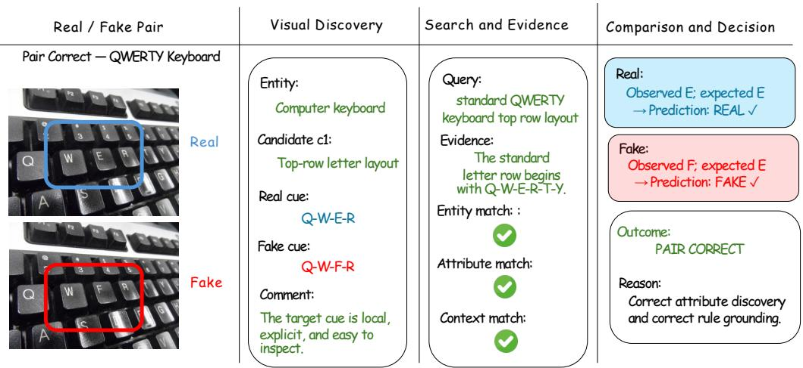  
Figure 9: A successful verification example on a QWERTY keyboard. The trace compares theEntity match: : observed top-row letters with the applicable layout rule and reaches a Pair Correct outcome. BlueOutcome: and red boxes identify the corresponding regions in the original and edited images.

Entity: Query:A relevant target with an overlooked visual change. Figure 10 illustrates a Both Real outcome.Correct attribute discovery →Prediction: REAL ✓The original dial shows 3000, while the edited image shows 3500 at the same location. The trace identifies the dial’s numeric progression as relevant but overlooks the altered mark and accepts bothinspect. The standard Fake:images. This case shows that relevant evidence cannot compensate for an incorrect local visual observation.

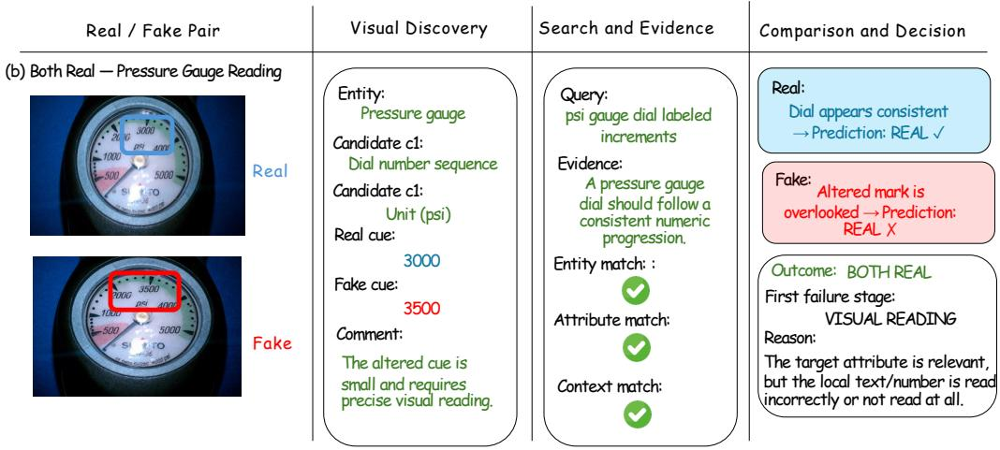  
letter row begins →PFigure 10: A visual-reading failure on a pressure gauge. The target marking changes from 3000 in Real cue: the original image to 3500 in the edited image. The trace overlooks this change and predicts Real for both, resulting in a Both Real outcome.

Q-W-F-R(d) Pair Inversion — Domino Matching RuleRelevant evidence with the wrong scope. Figure 11 illustrates a Both Fake outcome. Evidence Comment: CorrDomino layout domino rule adjacent The wrabout the Kodak Brownie family or nearby variants is applied to an exact model designation, incor-The target cue is local, Context match: and cCandidate c1: ends ust match Prerectly rejecting the original image. The case distinguishes retrieval relevance from valid evidence binding.

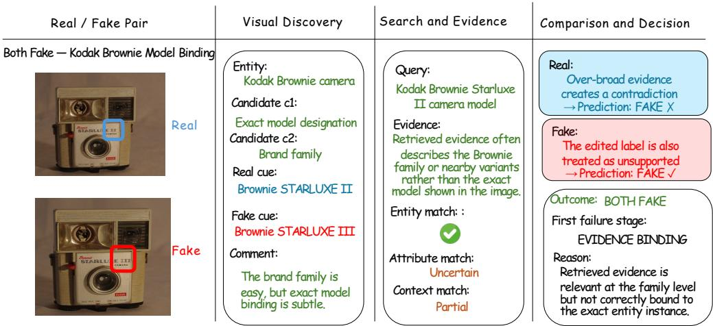  
Figure 11: An evidence-binding failure illustrated with a Kodak Brownie camera. Broad familyAttribute match: VISUAL READING level evidence is applied to an exact model designation, resulting in a Both Fake outcome. SemanticFake Reason: relevance alone does not establish that a source applies to the depicted variant.but the local text/number is read

The correct rule applied to the wrong observation. In Figure 12, the trace retrieves the relevant matching rule but checks the wrong connection or miscompares its values. It rejects the original and accepts the edited image. This Pair Inversion illustrates the need to connect a rule to the correct local observations.

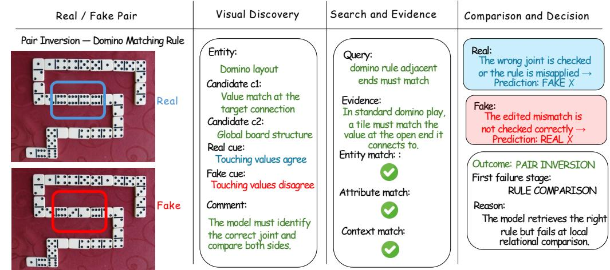  
Figure 12: A rule-comparison failure illustrated with a domino layout. The trace has the relevant matching rule but applies it to the wrong connection or miscompares the local values, leading to Pair Inversion.

## F SCOPE AND LIMITATIONS

Controlled, source-aligned edits do not cover all generated or misleading imagery, especially cases that depend on missing event context or an external textual claim. Nor do the construction checks establish that every sample is free of forensic traces. A Real prediction can still leave candidates unresolved, so it is not a guarantee of complete factual correctness. Finally, the oracle and ablation results measure prediction changes, not a complete causal attribution of errors; the manual failure analysis describes only its balanced subset.