# iCATS: Fast Video Generation via Interaction-Aware Sparse Attention and Timestep-Adaptive Sparsity

Chengfeng Han1,2∗ Baole Ai3 Xianlu Bian1,2∗ Jie Yao2 Zilong Huang2 Ang Wang3 Dandan Ding1†

1Hangzhou Normal University 2T-Head Semiconductor Co., Ltd. 3Alibaba Group

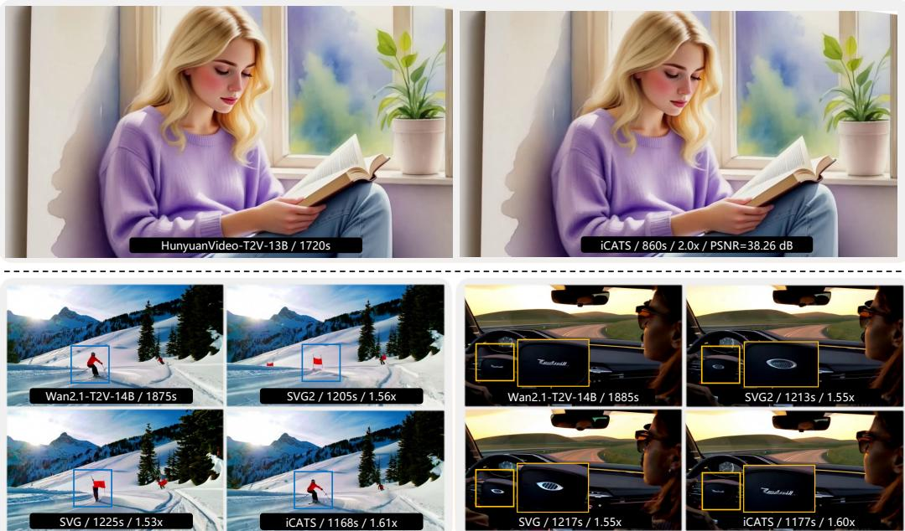  
Figure 1: Visualizations on HunyuanVideo-T2V-13B and Wan2.1-T2V-14B show that iCATS better preserves visual details while achieving higher speedup than other training-free methods, producing results closer to native videos. On average, it achieves 2.03× acceleration with 31.017 dB PSNR on HunyuanVideo-T2V-13B, and 1.55× acceleration with 29.301 dB PSNR on Wan2.1-T2V-14B.

## Abstract

Training-free sparse attention offers a practical acceleration solution to Diffusion Transformers (DiTs) via reducing computations without fine-tuning. It typically involves estimating the importance of query-key regions and deriving sparse masks to compute only the important candidates, which inevitably introduces approximation errors that may degrade generation quality. To better balance the efficiency-quality trade-off, we propose iCATS, integrating improved importance estimation and sparse mask construction with an efficient hardware execution strategy. Specifi cally, for importance estimation, unlike previous works that perform independent clustering over query and key tokens based on feature similarity to estimate attention scores, iCATS demonstrates that clustering based on query-key dot-product interactions is more accurate and further reformulates this objective as a simple quadratic form for low-cost computation. For sparse mask construction, instead of

using a fixed top-p rule, we observe that tolerance to sparse approximation errors varies across denoising timesteps and therefore introduce an SNR-guided sparsity schedule to adjust sparsity dynamically, leading to higher accuracy. Finally, for hardware execution, we devise a tail-merging strategy to reduce padding overhead caused by irregular cluster sizes, improving GPU kernel utilization. Extensive experiments show that iCATS achieves 2.03× acceleration with 31.017 dB PSNR on HunyuanVideo-T2V-13B and 1.55× acceleration with 29.301 dB PSNR on Wan2.1-T2V-14B, delivering a state-of-the-art efficiency-quality trade-off.

## 1 Introduction

Diffusion Transformers (DiTs) [1] have driven remarkable progress in video generation [2–12], emerging as the dominant backbone architecture. However, as the demand for generating longer and higher-resolution videos continues to grow, the length of token sequences increases substantially, causing the quadratic computational cost of attention mechanisms to rise sharply [13]. This quadratic scaling has become a critical bottleneck during inference for DiT-based video generation models, motivating efficient attention acceleration while preserving generated video quality.

Sparse attention [14–23] is an effective way to accelerate DiT inference by computing only a subset of attention interactions. Existing works fall into two categories: training-based and trainingfree methods. Training-based methods [24–27] fine-tune models with predefined sparse patterns, achieving high sparsity (e.g., ∼90% [25]) but requiring retraining when sparsity changes. In contrast, training-free methods [28–33] introduce sparsity without modifying model parameters. With lower sparsity (e.g., ∼70% [17]), they provide greater flexibility and plug-and-play usability across various pretrained DiT models, which is more practical for real applications. Therefore, this work focuses on training-free sparse attention for DiT acceleration.

The core idea of training-free sparse attention is retaining the most important attention computations only during inference. This is typically achieved by first estimating the importance of query-key regions in the attention map and then deriving sparse masks through rules such as top-p selection. A common strategy is to partition query and key tokens independently and use group mean features to form a smaller query-key matrix for this importance estimation [29, 21, 17]. Based on this matrix, sparse masks are constructed by selecting the most important blocks or clusters. Among these methods, SVG2 [17] groups tokens by feature similarity via k-means clustering and employs cluster centroids to estimate attention scores for cluster selection, achieving state-of-the-art performance.

While this clustering strategy is efficient, its optimization objective is not fully aligned with minimizing the importance estimation error (see Section 3.1 for details). A more principled approach is to cluster tokens based on their query-key dot-product interactions. However, explicitly clustering tokens by their full query-key dot-product interactions is prohibitively expensive for long video sequences: constructing the full query-key dot-product matrix already incurs quadratic complexity in sequence length, not to mention that each interaction vector itself also has sequence-length dimensionality. To tackle this issue, we reformulate the clustering objective derived from query-key interactions as a quadratic form in the original query/key space, avoiding explicit construction of the full matrix. This yields a more efficient clustering scheme for more accurate importance estimation.

Upon the estimated importance, sparse masks are determined by pre-defined rules. The fixed top-p rule [34, 35] is widely used by selecting the highest-scoring query-key regions until the cumulative importance reaches p. While simple and effective, this rule yields a similar sparsity across the denoising process, overlooking the fact that tolerance to sparse approximation errors varies across timesteps. Since signal-to-noise ratio (SNR) characterizes the denoising state [36–38] by reflecting the relative strength of noise and signal at different timesteps, it provides a natural basis for adaptive sparsity control. Based on this, we propose an SNR-guided sparsity schedule, in which the top-p value is computed offline from a smooth function of the logarithmic SNR, effectively driving sparse masks to match various denoising timesteps.

When deploying these optimization methods on hardware, execution efficiency is critical. In existing cluster-based sparse attention, mapping clusters to block-based GPU kernels often produces underfilled tail blocks due to irregular cluster sizes [39–42], increasing computational overhead and reducing hardware utilization. This problem is particularly severe on the query side, where the same padding overhead may be incurred repeatedly across multiple selected key clusters. To alleviate this, we introduce a tail-merging strategy that reduces padding overhead and improves utilization during sparse attention execution.

Building on these designs, we propose iCATS (Fast Video Generation via Interaction-Aware Sparse Attention and Timestep-Adaptive Sparsity), a training-free framework that performs optimization throughout the sparse attention pipeline. The main contributions of this work are as follows:

• We propose a training-free method, called iCATS, for DiT acceleration. iCATS clusters tokens according to query-key interactions via a quadratic-form objective defined in the original query/key space, avoiding complicated full query-key dot-product computation while improving the accuracy of importance estimation.

• For sparse mask construction, iCATS introduces an SNR-guided sparsity schedule that dynamically adjusts the top-p value across denoising timesteps, thereby allocating the computation budget to the selected informative query-key interactions.

• Moreover, when deployed on hardware, iCATS develops a tail-merging strategy that reduces padding overhead from irregular query cluster sizes, improving GPU kernel utilization during sparse attention execution.

• Extensive experiments on representative DiT-based video generation models show that iCATS achieves state-of-the-art performance among training-free sparse attention methods, delivering an advanced trade-off between generation quality and inference efficiency.

## 2 Related Work

## 2.1 Training-based Sparse Attention

Training-based sparse attention methods accelerate DiT-based video generation by learning modeladaptive sparse computation patterns. DSV [43] trains separate low-rank predictors to identify critical key-value pairs and achieves acceleration using specialized kernels and sparsity-aware parallelism. However, the decoupled predictor design limits end-to-end optimization. VSA [20] addresses this issue by introducing an end-to-end trainable sparse attention design: it first performs coarse cubelevel attention on pooled representations to locate important regions, and then computes token-level attention within the selected cube blocks, enabling joint optimization of selection and computation. VMoBA [44] likewise adopts block-level selection, but with a different motivation: it exploits the spatio-temporal locality of videos through recurrent 1D-2D-3D block partitioning, global block selection, and threshold-based selection.

The above methods all directly discard unselected tokens, whereas SLA [24] revisits this design and instead partitions blocks into three computational levels: sparse attention for critical blocks, linear attention for marginal blocks, and direct skipping for negligible ones. Building on this idea, SLA2 [25] replaces heuristic splitting with a learnable router and further introduces ratio-based branch fusion and quantization-aware low-bit sparse attention.

Despite their different designs, these methods all rely on additional model-specific training or finetuning, which limits their flexibility when the target model changes.

## 2.2 Training-free Sparse Attention

Training-free sparse attention improves inference efficiency without modifying model parameters, which is more flexible for deployment. One line of work uses predefined sparse patterns derived from spatio-temporal priors. SVG [31] profiles per-head spatial and temporal patterns online and applies the resulting masks through FlexAttention [45]. RainFusion [15] and Sparse-vDiT [18] extend this line with richer predefined patterns, while STA [14] replaces full attention with sliding tile attention over local 3D neighborhoods. Although these methods are fast, their fixed or hand-designed sparse patterns limit adaptivity to diverse video content.

Another line of work dynamically constructs sparse masks based on token features. SpargeAttn [46] identifies important blocks through a two-stage online filtering scheme. XAttention [47] estimates block importance using strided antidiagonal sums followed by cumulative thresholding. SVG2 [17] further improves dynamic sparse attention by first applying k-means clustering to group tokens with similar features, then using cluster centroids to estimate attention importance for group selection, and finally reordering the selected groups into contiguous layouts for more efficient sparse attention execution. Compared with predefined-pattern methods, these dynamic approaches are more contentadaptive. However, their token grouping operates independently in the query and key feature spaces; while simple, it sacrifices accuracy.

Following importance estimation, most existing methods [31, 17] apply a fixed sparsity level across denoising timesteps to construct sparse masks. This produces similar sparsity patterns across steps, even though different denoising timesteps exhibit distinct characteristics during the generation process. These observations motivate a more accurate and efficient sparse attention framework that optimizes the entire pipeline.

## 3 Motivation

## 3.1 Independent Clustering Mismatches Q-K Interaction Objectives

As aforementioned, existing sparse attention methods [17] typically adopt a clustering-based approach for importance estimation: clustering centroids are used to construct a smaller query-key matrix that replaces the original full matrix. Therefore, the clustering objective is to minimize the error between the original and the smaller query-key matrices.

To further explain, we fix the query matrix $Q$ and analyze key clustering as an illustrative example. Let $G = \{ B _ { t } \} _ { t = 1 } ^ { P }$ denote a partition of key tokens, where each key token $k _ { j } \in \mathbb { R } ^ { 1 \times d }$ is a row vector and $\mu _ { t } \in \mathbb { R } ^ { 1 \times d }$ is the centroid of cluster $B _ { t }$ . If each key token is replaced by its cluster centroid when forming the smaller query-key matrix, the optimization objective is then to minimize the resulting error in the query-key dot-product interactions, $\mathrm { i . e . }$ , minimizing $\begin{array} { r } { E ( G ) = \sum _ { t = 1 } ^ { P } \sum _ { j \in B _ { t } } \| Q ( k _ { j } ^ { \top } - \mu _ { t } ^ { \top } ) \| _ { 2 } ^ { 2 } } \end{array}$ By contrast, previous key-space clustering methods like k-means assume that $Q ^ { \top } Q \propto I , { \mathrm { i . e . } }$ , the query matrix treats all directions in the key space isotropically, and simplify $E ( G )$ to ${ \hat { E } } ( G ) =$ $\begin{array} { r } { \sum _ { t = 1 } ^ { P } \sum _ { j \in B _ { t } } \| k _ { j } - \mu _ { t } \| _ { 2 } ^ { 2 } } \end{array}$ . Apparently, this ${ \hat { E } } ( G )$ optimization is not aligned with the true objective $E ( G )$ of minimizing the query-key interaction error, thereby reducing estimation accuracy.

Instead, this paper proposes to directly optimize $E ( G )$ . However, this is computationally expensive for long video sequences, as it requires constructing the full query-key dot-product matrix and representing each token with a sequence-length interaction vector, which increases inference time. Therefore, we develop an efficient method, termed Interaction-aware Clustering, which minimizes $E ( G )$ using a low-complexity scheme without explicitly constructing the full matrix.

## 3.2 Fixed Sparsity Overlooks Denoising Dynamics

In flow-based video generation [38], samples are synthesized through an iterative denoising process. Let a latent representation $\boldsymbol { x } _ { 0 } \in \mathrm { \bar { \mathbb { R } } } ^ { T \times H \times W \times C }$ be mapped from a clean video $X$ , where $T , H , W$ , and C denote the numbers of frames, height, width, and channels. At denoising timestep $t \in \{ 0 , \ldots , N \}$ the latent is $x _ { t } = a _ { t } x _ { 0 } + b _ { t } \epsilon$ , where $\epsilon \sim \mathcal { N } ( 0 , I )$ , N is the total number of solver steps, and $a _ { t }$ and $b _ { t }$ are determined by the timestep schedule. As t increases, $x _ { t }$ transitions from signal-dominated to noise-dominated, while sampling follows the reverse denoising process back to $x _ { 0 }$

Existing methods typically use a fixed top-p rule to construct sparse masks across denoising timesteps. Although the exact number of selected blocks or clusters may vary slightly due to score estimation, the overall sparsity remains broadly similar throughout the denoising trajectory (see our analysis in appendix A). While simple, this implicitly assumes that approximation errors between dense and sparse computations contribute uniformly across timesteps. However, denoising is a recursive process in which the state at each timestep depends on the previous update. Consequently, errors introduced at one timestep accumulate and propagate along the denoising trajectory. As a result, errors at different timesteps have varying impacts on the final output.

Therefore, under a fixed computational budget, the key challenge is not only how much attention computation can be reduced but also how to allocate this budget appropriately across timesteps to best preserve quality. This motivates our SNR-guided Sparsity that adjusts sparse mask construction according to the characteristics of each denoising timestep. As the SNR directly reflects denoising progress and signal dominance, it serves as an ideal indicator for such adaptation.

## 3.3 Varying Cluster Sizes Incur Tail Overhead

Unlike block-based sparse attention, which naturally matches fixed-size block kernels (Figure 2a), cluster-based sparse attention selects computation at the cluster level (Figure 2b). This easily produces irregular cluster sizes that do not align with the fixed execution granularity of sparse kernels.

More specifically, in cluster-based sparse attention with block-based kernels, tokens from selected key clusters are gathered into a contiguous sequence for each query cluster, and attention is computed block by block. The last block is often partially filled, yet the kernel still executes full-block computation, introducing overhead on padded positions. This inefficiency is especially severe on the query side, where padding in the last query block repeats across all key/value blocks, causing overhead to scale with the selected key length. Therefore, reducing tail execution overhead is crucial for improving hardware efficiency, motivating our Tail-merging Strategy.

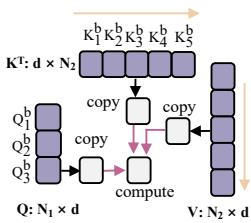  
(a) block-based

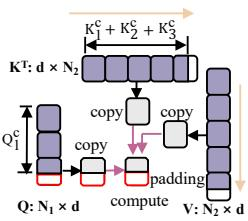  
(b) cluster-based  
Figure 2: Visualization of (a) block-based and (b) cluster-based sparse attention.

## 4 Method

This section details our proposed iCATS. As shown in Figure 3, iCATS consists of three components: interaction-aware clustering for accurate importance estimation (Section 4.1), SNR-guided sparsity for sparse mask construction (Section 4.2), and tail merging for sparse attention execution (Section 4.3).

## 4.1 Interaction-Aware Clustering

Recalling Section 3.1, iCATS performs interaction-aware clustering by grouping tokens using their query-key dot-product interactions. We represent all token features as row vectors. Let $Q =$ $\lbrack \widehat { q } _ { 1 } ^ { \intercal } , \widehat { q } _ { 2 } ^ { \intercal } , \widehat { \ldots } , q _ { n } ^ { \intercal } ] ^ { \intercal } \in \mathbb { R } ^ { n \times d } \left( d \ll n \right)$ ) denote the query matrix, where $q _ { i } \in \mathbb { R } ^ { 1 \times d }$ is the i-th query token. Here, n is the sequence length and d is the token dimension, $\mathrm { e . g . , } n = 7 5$ , 600 and $d = 1 2 8$ in Wan2.1- T2V-14B. Let $\bar { B _ { t } }$ denote the t-th key cluster and $\mu _ { t } \in \mathbb { R } ^ { 1 \times d }$ its centroid, where $t \in \{ 1 , \ldots , P \}$ with P being the total number of key clusters. We define the key clustering objective as:

$$
\begin{array} { l } { \displaystyle \mathcal { L } = \sum _ { t = 1 } ^ { P } \sum _ { j \in B _ { t } } \left\| Q k _ { j } ^ { \top } - Q \mu _ { t } ^ { \top } \right\| _ { 2 } ^ { 2 } = \displaystyle \sum _ { t = 1 } ^ { P } \sum _ { j \in B _ { t } } \sum _ { i = 1 } ^ { n } \left( q _ { i } k _ { j } ^ { \top } - q _ { i } \mu _ { t } ^ { \top } \right) ^ { 2 } } \\ { \displaystyle = \sum _ { t = 1 } ^ { P } \sum _ { j \in B _ { t } } \left( k _ { j } - \mu _ { t } \right) \left( \sum _ { i = 1 } ^ { n } q _ { i } ^ { \top } q _ { i } \right) \left( k _ { j } ^ { \top } - \mu _ { t } ^ { \top } \right) = \sum _ { t = 1 } ^ { P } \sum _ { j \in B _ { t } } \left( k _ { j } - \mu _ { t } \right) Q ^ { \top } Q \left( k _ { j } ^ { \top } - \mu _ { t } ^ { \top } \right) . } \end{array}\tag{1}
$$

As seen, clustering using query-key interactions requires computing, for each key, its dot products with all queries to form an n-dimensional interaction vector, followed by clustering in this space. Equation (1) finally reformulates this objective as a quadratic form in the original key feature space of dimension $d ,$ where $d \ll n$ , avoiding explicit construction of the full query-key dot-product matrix. Query clustering is defined symmetrically, yielding a corresponding quadratic form induced by $K ^ { \top } \dot { K }$ . Although $Q ^ { \top } Q$ and $\bar { K ^ { \top } } K$ are only of size $d \times d ,$ computing them still requires aggregating statistics over all tokens. To reduce this overhead, we approximate them using cluster centroids and sizes. Specifically, for query clusters $\{ A _ { r } \} _ { r = 1 } ^ { O } ,$ where O is the number of query clusters, with centroid $\mu _ { r }$ and size $\left\lceil A _ { r } \right\rceil$ , and key clusters $\{ \stackrel {  } { B _ { t } } \} _ { t = 1 } ^ { P }$ defined similarly with size $\left| B _ { t } \right|$ , we define $\begin{array} { r } { M _ { Q } = \sum _ { r = 1 } ^ { O } \left| A _ { r } \right| \mu _ { r } ^ { \top } \mu _ { \prime } } \end{array}$ and $\begin{array} { r } { M _ { K } = \sum _ { t = 1 } ^ { P } \left| B _ { t } \right| \mu _ { t } ^ { \top } \mu _ { t } } \end{array}$ . Approximating $Q ^ { \top } Q$ with $M _ { Q }$ and $K ^ { \top } K$ with $M _ { K } .$ , and noting that $M _ { Q }$ and $M _ { K }$ are symmetric matrices, the quadratic-form distances for clustering become:

$$
\begin{array} { r } { ( k _ { j } - \mu _ { t } ) M _ { Q } ( k _ { j } ^ { \top } - { \mu } _ { t } ^ { \top } ) = k _ { j } M _ { Q } k _ { j } ^ { \top } + \mu _ { t } M _ { Q } { \mu } _ { t } ^ { \top } - 2 k _ { j } M _ { Q } { \mu } _ { t } ^ { \top } , } \\ { ( q _ { i } - \mu _ { r } ) M _ { K } ( q _ { i } ^ { \top } - { \mu } _ { r } ^ { \top } ) = q _ { i } M _ { K } q _ { i } ^ { \top } + \mu _ { r } M _ { K } { \mu } _ { r } ^ { \top } - 2 q _ { i } M _ { K } { \mu } _ { r } ^ { \top } . } \end{array}\tag{2}
$$

Built on Flash-Kmeans [48], we precompute the token-side terms $( \mathbf { e . g . } , k _ { j } M _ { Q } , k _ { j } M _ { Q } k _ { j } ^ { \top } , q _ { i } M _ { K }$ and $q _ { i } M _ { K } q _ { i } ^ { \top } .$ ) only once before the clustering iterations begin, as token features remain fixed. The centroid-side terms are recomputed from the current centroids at each iteration.

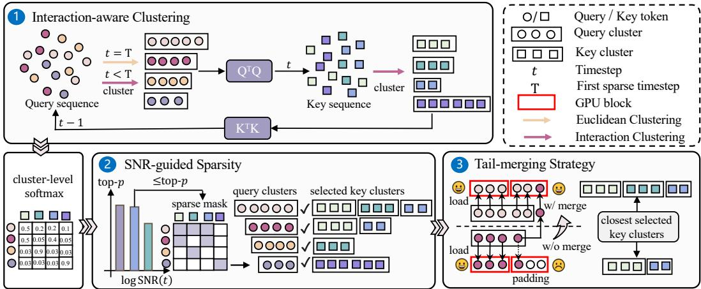  
Figure 3: Overview of iCATS pipeline. For each attention layer, query and key tokens are first grouped by ① Interaction-aware Clustering. Then, the corresponding query-key cluster centroids are used to approximate softmax scores at the cluster level. Based on these approximated scores, ② SNR-guided Sparsity determines the top-p value at each denoising timestep and selects the corresponding attention computation region. Finally, ③ Tail-merging Strategy is applied before sparse attention kernel computation by reassigning tail tokens of non-block-aligned query clusters, thereby reducing padding overhead caused by irregular cluster sizes. In this figure, interaction clustering denotes interaction-aware query-key clustering, while Euclidean clustering is used to initialize query clusters solely at the first sparse timestep.

Based on this design, we perform interaction-aware clustering alternately. At the first sparse timestep, query tokens are clustered in the original feature space, and the resulting query centroids and cluster sizes are used to construct $M _ { Q }$ . Key tokens are then clustered using the quadratic form induced by $M _ { Q } ,$ , and the resulting key centroids and cluster sizes are used to construct $M _ { K }$ . At later timesteps, we use the previous $M _ { K }$ to guide query clustering, leveraging the similarity of quadratic structures between adjacent timesteps. The updated query clusters define the current $M _ { Q }$ , which in turn induces the quadratic form for key clustering. The resulting key clusters form a new $\dot { M _ { K } }$ for the next timestep.

## 4.2 SNR-Guided Sparsity

Motivated by the observation in Section 3.2, iCATS devises the SNR-guided sparsity schedule, which dynamically adjusts the sparsity of sparse masks across timesteps. Specifically, we employ the timestep-wise SNR to characterize the denoising state: a low SNR typically corresponds to noise-dominated latents at earlier denoising stages, where approximation errors may affect more subsequent updates, while a high SNR indicates the emergence of cleaner signal components and more stable semantic structures. This makes SNR a practical indicator for adapting top-p across timesteps. Formally, the timestep-wise SNR is defined as $\mathrm { S N R } ( t ) = \left( a _ { t } / b _ { t } \right) ^ { 2 }$

Figure 4a shows that the raw SNR spans a wide range across timesteps, making early- and latestage differences hard to distinguish. We therefore operate in the logarithmic domain and define $\ell _ { t } \dot { = } \log \mathrm { S N R } ( t )$ (see Figure 4b). This converts ratio changes in SNR into additive differences, making variations across timesteps easier to model and analyze.

As analyzed in Figure 4b, the logSNR(t) curve exhibits a clear stage-wise pattern: the early and late stages change more sharply, while the middle stage is comparatively smooth. Based on this observation, we use an inverted sigmoid function to generate timestep-adaptive top-p values for sparse mask construction. The inverted sigmoid provides a simple schedule shape that aligns well with the stage-wise pattern of the logSNR(t) curve: its two saturated ends help maintain relatively stable computation in the early and late stages, while its transition region allows top-p to decrease gradually in the smoother middle stage. Overall, we keep dense attention before the first sparse timestep $t _ { \mathrm { s p a r s e } } ,$ and apply sparse attention for $t \leq t _ { \mathrm { s p a r s e } }$ with

$$
\mathrm { t o p } { - p _ { t } = p _ { \mathrm { m i n } } + \left( 1 - p _ { \mathrm { m i n } } \right) \left( 1 - \frac { 1 } { 1 + \exp ( - k x _ { t } ) } \right) , \qquad t \leq t _ { \mathrm { s p a r s e } } } ,\tag{3}
$$

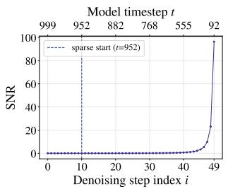  
(a) SNR

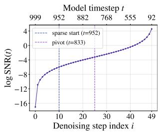  
(b) logSNR(t)

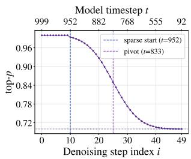  
(c) Top-p from logSNR(t)  
Figure 4: Visualization of proposed SNR-guided sparsity schedule on Wan2.1-T2V-14B. (a) Raw SNR over denoising timesteps. (b) logSNR(t), where the pivot marks the center of the flattest region. (c) The resulting top-p schedule generated by an inverted sigmoid.

where $p _ { \mathrm { m i n } }$ denotes the minimum top-p value, and $x _ { t } = \ell _ { t } - \ell _ { t _ { \mathrm { p i v o t } } }$ is defined by the logSNR(t) difference between timestep t and a pivot timestep $t _ { \mathrm { p i v o t } }$ . The pivot is chosen automatically as the timestep immediately following the minimum difference between consecutive logSNR(t) values, which typically lies near the smoothest denoising stage.

We choose $\tau \in ( 0 , 1 )$ to be very close to 1 in practice (e.g., 0.99 or 0.999), which controls how close the inverted sigmoid is to its upper bound at the first sparse timestep and thus determines the sigmoid slope as $\begin{array} { r } { k = \frac { \log { \frac { \tau } { 1 - \tau } } } { \left| \ell _ { t _ { \mathrm { s p a r s e } } } - \ell _ { t _ { \mathrm { p i v o t } } } \right| } } \end{array}$ . Finally, rather than introducing an additional parameter, we set the minimum retained ratio of key clusters by linearly scaling top-p as min $\begin{array} { r } { - p _ { t } = 0 . 1 \cdot \frac { \mathrm { t o p } - p _ { t } } { \mathrm { t o p } - p _ { t _ { \mathrm { p i v o t } } } } } \end{array}$

As illustrated in Figure 4c, the final top-p schedule resulting from logSNR(t) keeps the sparse masking budget more stable in the early and late stages while reducing top-p more smoothly in the middle stage, which better aligns with the stage-wise characteristics of denoising. Since the SNR sequence is fully determined by the predefined noise schedule, the top-p values can be computed offline before video generation, largely saving runtime overhead during inference. To further illustrate this behavior, we visualize the computational density of iCATS across timesteps in Appendix A (Figure 1), where density denotes the proportion of retained computations.

## 4.3 Tail-Merging Strategy

Motivated by the tail execution issue analyzed in Section 3.3, iCATS develops a tail-merging strategy before the kernel computation of sparse attention to reduce the extra overhead caused by irregular cluster sizes. The core idea is to restructure query clusters in a hardware-friendly manner while preserving the original sparse attention pattern as much as possible, thereby reducing both scheduling and padding overhead. To this end, we first exploit merging opportunities that do not alter the original sparse pattern, and then further reduce the remaining tail waste.

Specifically, we merge query clusters within the same attention head that attend to the same set of key clusters. Because these clusters share the same attended key-cluster set, this operation preserves the original sparse attention pattern without introducing additional error, while reducing the number of query clusters and subsequent scheduling overhead.

We then handle query clusters whose sizes are not divisible by the block execution size, since their final execution blocks are only partially occupied while still fully computed, leading to tail overhead. Our goal is to reassign only tokens in these tail blocks to improve execution-block utilization while minimizing perturbation to the sparse attention pattern. To this end, we need to find suitable target clusters for these tail tokens. Specifically, we measure the compatibility between query clusters based on the similarity of their key-cluster masks. Each mask is represented as a packed binary vector, from which pairwise Hamming distances between clusters are computed. A smaller Hamming distance indicates that the key-cluster masks of two query clusters are more similar; when the merged mask is updated by union, this usually leads to fewer newly introduced key clusters, making them better candidates for merging. Under size and alignment constraints, we iteratively identify compatible cluster pairs and reassign the tail-block tokens of the source cluster to the target cluster. After merging, empty clusters are removed, and the remaining clusters are compactly reindexed. In implementation, we perform two rounds of tail merging. Detailed pseudocode is presented in Appendix E.1.

## 5 Experiments and Analysis

## 5.1 Setup

Experimental setup. We evaluate iCATS on three mainstream video generation DiT models, including HunyuanVideo-T2V-13B, Wan2.1-T2V-14B, and Wan2.1-I2V-14B, for 5-second 720p generation. Following prior works [31, 17], we use the Penguin Benchmark with VBench [49, 50] prompt optimization for text-to-video evaluation. For image-to-video evaluation, we use VBench prompt-image pairs and resize the input images to 16:9 to match the 720p setting. Ablations are conducted on Wan2.1-T2V-14B using 138 randomly sampled text prompts. More setting details can be found in Appendix B.

Evaluation metrics. We measure the similarity between videos generated by the accelerated DiT models and the original DiT models using PSNR, SSIM [51], and LPIPS [52] and evaluate video quality with VBench [49]. The main paper reports the average VBench score, while the detailed breakdown over subject consistency, background consistency, motion smoothness, aesthetic quality, and imaging quality is reported in Appendix C. To assess practical efficiency, we report the speedup over the original dense attention. We also report sparsity, defined as the theoretical computation reduction ratio of sparse attention methods relative to dense attention.

Comparison setup. We compare iCATS against two state-of-the-art sparse attention methods, SVG [31] and SVG2 [17], using their official open-source implementations and settings for fair comparisons. Moreover, we evaluate two iCATS variants, Base and Turbo, whose hyperparameters are chosen to match the speed or sparsity of prior methods. Unless otherwise stated, experiments are conducted on eight NVIDIA H100 GPUs.

## 5.2 Quality & Efficiency Evaluation

Table 1 shows that iCATS-Base and iCATS-Turbo consistently achieve a better quality-efficiency tradeoff than SVG and SVG2 on both HunyuanVideo-T2V-13B and Wan2.1-T2V-14B. At comparable speedup, iCATS-Base achieves better PSNR, SSIM, LPIPS, and VBench than SVG2, indicating stronger quality preservation. Meanwhile, iCATS-Turbo provides higher acceleration at similar sparsity while maintaining better reconstruction quality and competitive VBench scores. The same trend also holds on Wan2.1-I2V-14B, where iCATS-Base improves all reconstruction metrics and VBench over SVG2 at comparable speed, while iCATS-Turbo achieves the fastest inference among sparse methods and still maintains better reconstruction quality with matched VBench. Detailed VBench results can be found in Appendix C. Visualization comparisons are shown in Figure 1 and Appendix G. Results of cross-model and cross-task hyperparameter transfer without retuning are provided in Appendix F.

Table 1: Comparison with existing works on various benchmark models
<table><tr><td>Method</td><td>PSNR↑</td><td>SSIM↑</td><td>LPIPS↓</td><td>VBench↑</td><td>Time (s)↓</td><td>Sparsity</td></tr><tr><td>HunyuanVideo-T2V-13B (Dense)</td><td></td><td></td><td></td><td>0.844</td><td>1730</td><td></td></tr><tr><td>SVG</td><td>20.362</td><td>0.725</td><td>0.235</td><td>0.843</td><td>874 (1.98×)</td><td>75.8%</td></tr><tr><td>SVG2</td><td>26.247</td><td>0.869</td><td>0.097</td><td>0.842</td><td>853 (2.03×)</td><td>71.5%</td></tr><tr><td>iCATS-Base</td><td>31.017</td><td>0.926</td><td>0.050</td><td>0.844</td><td>854 (2.03×)</td><td>66.1%</td></tr><tr><td>iCATS-Turbo</td><td>30.466</td><td>0.922</td><td>0.054</td><td>0.844</td><td>827 (2.10×)</td><td>70.3%</td></tr><tr><td>Wan2.1-T2V-14B (Dense)</td><td></td><td></td><td></td><td>0.839</td><td>1889</td><td></td></tr><tr><td>SVG</td><td>21.497</td><td>0.741</td><td>0.197</td><td>0.836</td><td>1220 (1.55×)</td><td>65.7%</td></tr><tr><td>SVG2</td><td>25.606</td><td>0.853</td><td>0.098</td><td>0.837</td><td>1226 (1.54×)</td><td>68.6%</td></tr><tr><td>iCATS-Base</td><td>29.301</td><td>0.908</td><td>0.058</td><td>0.838</td><td>1222 (1.55×)</td><td>61.7%</td></tr><tr><td>iCATS-Turbo</td><td>28.172</td><td>0.895</td><td>0.068</td><td>0.837</td><td>1176 (1.61×)</td><td>69.0%</td></tr><tr><td>Wan2.1-I2V-14B (Dense)</td><td></td><td></td><td></td><td>0.847</td><td>1519</td><td></td></tr><tr><td>SVG</td><td>26.533</td><td>0.847</td><td>0.101</td><td>0.844</td><td>1088 (1.40×)</td><td>65.7%</td></tr><tr><td>SVG2</td><td>29.082</td><td>0.890</td><td>0.067</td><td>0.845</td><td>1081 (1.41×)</td><td>69.9%</td></tr><tr><td>iCATS-Base</td><td>30.606</td><td>0.911</td><td>0.056</td><td>0.846</td><td>1084 (1.41×)</td><td>63.2%</td></tr><tr><td>iCATS-Turbo</td><td>30.097</td><td>0.905</td><td>0.060</td><td>0.846</td><td>1057 (1.44×)</td><td>68.9%</td></tr></table>

To understand the quality gains from interaction-aware clustering, we compare both clustering schemes with exact dense attention using two metrics. (i) Token-level top-p selection overlap: for each query token q, we compute its exact dense attention weights (full softmax over all keys) and apply top-p $( p = 0 . 9 )$ to obtain the keys selected for $q ;$ the method computes keys in the key clusters selected for the query cluster containing $q ;$ overlap is the fraction of dense-selected keys covered by the method, averaged over all query tokens. (ii) Attention output MSE between dense and masked attention outputs (attention weights multiplied by V ), with masked weights zeroed and the remaining weights renormalized. The diagnostics are conducted on Wan2.1-T2V-14B with 20 randomly sampled prompts, covering 5 timesteps (t = 952, 882, 768, 555, 92), 5 layers (1, 10, 20, 30, 39), and 4 heads (0, 10, 20, 30) per layer. Both schemes share the same top-p (0.9), min-p (0.1), cluster configuration (400 query / 1000 key clusters), clustering iterations (50 at the first sparse timestep, then 2), warmup, and kernel implementation; only the clustering scheme differs. As shown in Table 2, interactionaware clustering achieves higher selection overlap (+1.7 points) and a 36% lower output MSE, with consistent gains at every sampled timestep, layer, and head (Appendix D). These results indicate that interaction-aware clustering better matches dense attention in both region selection and attention outputs. On Wan2.1-T2V-14B over 20 randomly sampled prompts, replacing $M _ { Q } / M _ { K }$ with exact $Q ^ { \top } Q / K ^ { \top } K$ under the same SNR-guided sparsity schedule yields the same reported token-level overlap (0.912 for both), while increasing denoising time from 1219 s to 1257 s.

Table 2: Attention fidelity of different clustering schemes on Wan2.1-T2V-14B.
<table><tr><td>Method</td><td>Top-p overlap↑</td><td>Output MSE  $( \times 1 0 ^ { - 4 } ) \downarrow$ </td></tr><tr><td>Independent Euclidean clustering</td><td>0.896</td><td>8.99</td></tr><tr><td>Interaction-aware clustering (ours)</td><td>0.913</td><td>5.75</td></tr></table>

To quantify the effect of tail merging, we measure the reduction in execution blocks before and after merging at each sparse attention timestep, where execution blocks are defined following FlashInfer [53]. Figure 5 shows the average reduction ratio of iCATS, with the shaded region indicating the min-max range across layers. The reduction is largest at early timesteps and gradually decreases during denoising. The merging procedure is efficiently implemented in Triton [54]. On Wan2.1-T2V-14B running on an NVIDIA H100 GPU, each invocation of the merging function takes ∼3 ms, while merging itself takes ∼10 s per generation, which is negligible relative to the total inference time of 1222 s. More details are provided in Appendix E.2.

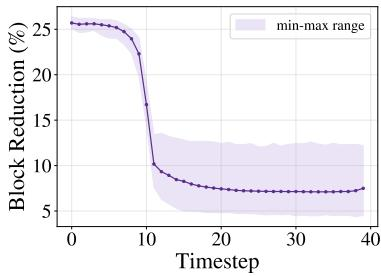  
Figure 5: Reduction ratio of execution blocks on Wan2.1-T2V-14B.

## 5.3 Cross-Hardware Validation

To evaluate the hardware generalization of iCATS, we further deploy iCATS-Turbo on Wan2.1- T2V-14B on the T-Head Zhenwu M890P3, an AI accelerator developed by Alibaba T-Head, with sparse kernel operators adapted to this platform. As shown in Table 3, iCATS achieves performance comparable to that on H100 GPUs, demonstrating strong adaptability and generalization across hardware platforms.

Table 3: Comparison of different methods on Wan2.1-T2V-14B using the Zhenwu M890P.
<table><tr><td>Method</td><td>PSNR↑</td><td>SSIM↑ LPIPS↓</td><td></td><td></td><td>Time (s)↓ Speedup↑ Sparsity</td><td></td></tr><tr><td>Wan2.1-T2V-14B (Dense)</td><td>一</td><td></td><td></td><td>2828</td><td></td><td>一</td></tr><tr><td>SVG</td><td>21.847</td><td>0.774</td><td>0.186</td><td>2208</td><td>1.28×</td><td>65.7%</td></tr><tr><td>SVG2</td><td>26.321</td><td>0.870</td><td>0.088</td><td>2214</td><td>1.28×</td><td>68.9%</td></tr><tr><td>iCATS-Turbo</td><td>28.849</td><td>0.903</td><td>0.061</td><td>2073</td><td>1.36×</td><td>68.9%</td></tr></table>

## 5.4 Human Evaluation

We conduct a blind human evaluation comparing iCATS-Base with SVG2 on Wan2.1-T2V-14B. We select 20 prompts from the Penguin Benchmark with VBench prompt optimization, covering complex scenes, highly dynamic human actions, and simple static scenes. Video pairs are anonymized as A/B with shuffled order. Eleven participants, all video-domain professionals with normal vision, compare the videos side by side on 2K screens. For each prompt, they select the video with better perceptual quality or choose “Similar Quality,” yielding 220 votes in total.

As shown in Table 4, iCATS-Base receives 54.1% of the votes, compared with 18.6% for SVG2, while 27.3% indicate similar quality. These results show a preference for iCATS-Base in the evaluated samples, providing human evidence of its perceptual advantage beyond the automatic metrics.

Table 4: Human preference on Wan2.1-T2V-14B.
<table><tr><td>Preference</td><td>Votes</td><td>Percentage</td></tr><tr><td>SVG2</td><td>41</td><td>18.6%</td></tr><tr><td>iCATS-Base</td><td>119</td><td>54.1%</td></tr><tr><td>Similar Quality</td><td>60</td><td>27.3%</td></tr></table>

## 5.5 Ablation Study

We conduct ablation studies on the turbo variant on Wan2.1-T2V-14B to evaluate the contribution of interaction-aware clustering (IC), SNR-guided sparsity (SG), and tail-merging strategy (TM). Here, “Anchor” denotes the starting configuration built upon SVG2 settings.

As reported in Table 5, both IC and SG improve quality over Anchor, and their combination brings further gains, indicating that they are complementary. In particular, SG controls how the sparsity budget is allocated across timesteps, whereas IC improves how this budget is used for sparse region selection. Adding TM yields the best overall trade-off, improving speedup from 1.56× to 1.61× while achieving the best quality metrics. Although TM slightly reduces sparsity, it improves speed by reducing padding overhead. Overall, all three components contribute positively to final performance.

Table 5: Ablation study on Wan2.1-T2V-14B
<table><tr><td>Method</td><td>PSNR↑</td><td>SSIM↑</td><td>LPIPS↓</td><td>Time↓</td><td>Sparsity</td></tr><tr><td>Wan2.1-T2V-14B</td><td></td><td></td><td></td><td>1890s</td><td></td></tr><tr><td>Anchor</td><td>25.894</td><td>0.868</td><td>0.101</td><td>1227s (1.54×)</td><td>68.7%</td></tr><tr><td>w/IC</td><td>26.435</td><td>0.878</td><td>0.093</td><td>1224s (1.54×)</td><td>69.9%</td></tr><tr><td>w/SG</td><td>27.309</td><td>0.890</td><td>0.085</td><td>1219s (1.55×)</td><td>69.5%</td></tr><tr><td>w/TM</td><td>26.085</td><td>0.872</td><td>0.098</td><td>1223s (1.55×)</td><td>67.9%</td></tr><tr><td>w/ IC &amp; SG</td><td>28.283</td><td>0.903</td><td>0.074</td><td>1213s (1.56×)</td><td>70.0%</td></tr><tr><td>w/ IC &amp; SG &amp; TM</td><td>28.372</td><td>0.905</td><td>0.072</td><td>1171s (1.61×)</td><td>69.0%</td></tr></table>

## 6 Conclusion & Limitation

We propose iCATS, a training-free sparse attention framework for accelerating DiT-based video generation. iCATS optimizes importance estimation, sparse mask construction, and hardware execution throughout the sparse attention pipeline. It reformulates the importance estimation from independent clustering to Query-Key interaction clustering and simplifies the resulting optimization as a low-cost computation. Moreover, iCATS proposes SNR-guided sparsity scheduling across denoising timesteps for dynamic sparsity allocation and hardware-friendly tail merging to reduce execution overhead in implementation. In this way, iCATS delivers state-of-the-art performance on various DiT models.

Currently, the clustering procedure in iCATS is not optimized for multi-GPU parallel execution and is left for future work. The token-level sparse masking kernel also remains to be further optimized.

## References

[1] Peebles, W., S. Xie. Scalable diffusion models with transformers. arXiv preprint arXiv:2212.09748, 2022.

[2] Team Wan, A. Wang, B. Ai, et al. Wan: Open and advanced large-scale video generative models. arXiv preprint arXiv:2503.20314, 2025.

[3] Kong, W., Q. Tian, Z. Zhang, et al. HunyuanVideo: A systematic framework for large video generative models. arXiv preprint arXiv:2412.03603, 2024.

[4] Yang, Z., J. Teng, W. Zheng, et al. CogVideoX: Text-to-video diffusion models with an expert transformer. arXiv preprint arXiv:2408.06072, 2024.

[5] Gao, Y., H. Guo, T. Hoang, et al. Seedance 1.0: Exploring the boundaries of video generation models. arXiv preprint arXiv:2506.09113, 2025.

[6] Team Seedance, D. Chen, L. Chen, et al. Seedance 2.0: Advancing video generation for world complexity, 2026.

[7] Kling Team, J. Chen, Y. Ci, et al. Kling-Omni technical report, 2025.

[8] Wu, B., C. Zou, C. Li, et al. HunyuanVideo 1.5 technical report, 2025.

[9] Liu, Y., K. Zhang, Y. Li, et al. Sora: A review on background, technology, limitations, and opportunities of large vision models, 2024.

[10] Feng, W., C. Yang, H. Qin, et al. QuantSparse: Comprehensively compressing video diffusion transformer with model quantization and attention sparsification. In The Fourteenth International Conference on Learning Representations. 2026.

[11] Li, S., R. Lu, Q. Chen, et al. DSA: Efficient inference for video generation models via distributed sparse attention. In The Fourteenth International Conference on Learning Representations. 2026.

[12] Zhou, X., Q. Mang, S. Yang, et al. SVG-EAR: Parameter-free linear compensation for sparse video generation via error-aware routing, 2026.

[13] Vaswani, A., N. Shazeer, N. Parmar, et al. Attention is all you need. In Advances in Neural Information Processing Systems, vol. 30. 2017.

[14] Zhang, P., Y. Chen, R. Su, et al. Fast video generation with sliding tile attention. In Forty-second International Conference on Machine Learning. 2025.

[15] Chen, A., B. Dong, J. Li, et al. Rainfusion: Adaptive video generation acceleration via multi-dimensional visual redundancy. arXiv preprint arXiv:2505.21036, 2025.

[16] Chen, A., Y. Liu, J. Huang, et al. RainFusion2.0: Temporal-spatial awareness and hardwareefficient block-wise sparse attention. arXiv preprint arXiv:2512.24086, 2025.

[17] Yang, S., H. Xi, Y. Zhao, et al. Sparse VideoGen2: Accelerate video generation with sparse attention via semantic-aware permutation. In The Thirty-ninth Annual Conference on Neural Information Processing Systems. 2025.

[18] Chen, P., X. Zeng, M. Zhao, et al. Sparse-vDiT: Unleashing the power of sparse attention to accelerate video diffusion transformers. arXiv preprint arXiv:2506.03065, 2025.

[19] Li\*, X., M. Li\*, T. Cai, et al. Radial Attention: O(n log n) sparse attention with energy decay for long video generation. arXiv preprint arXiv:2506.19852, 2025.

[20] Zhang, P., Y. Chen, H. Huang, et al. Faster video diffusion with trainable sparse attention. In D. Belgrave, C. Zhang, H. Lin, R. Pascanu, P. Koniusz, M. Ghassemi, N. Chen, eds., Advances in Neural Information Processing Systems, vol. 38, pages 152509–152534. Curran Associates, Inc., 2025.

[21] Liu, X., Z. Li, J. Zhang, et al. Rectified SpaAttn: Revisiting attention sparsity for efficient video generation. arXiv preprint arXiv:2511.19835, 2025.

[22] Agarwal, K., Z. Chen, C. Luo, et al. MonarchRT: Efficient attention for real-time video generation, 2026.

[23] Luo, J., J. Chen, J. Wang, et al. Training-free sparse attention for fast video generation via offline layer-wise sparsity profiling and online bidirectional co-clustering, 2026.

[24] Zhang, J., H. Wang, K. Jiang, et al. SLA: Beyond sparsity in diffusion transformers via fine-tunable sparse–linear attention. In The Fourteenth International Conference on Learning Representations. 2026.

[25] —. SLA2: Sparse-linear attention with learnable routing and qat. arXiv preprint arXiv:2602.12675, 2026.

[26] Chen, J., Y. Zhao, J. Yu, et al. SANA-Video: Efficient video generation with block linear diffusion transformer. In The Fourteenth International Conference on Learning Representations. 2026.

[27] Fang, T., H. Zhang, R. Xie, et al. SALAD: Achieve high-sparsity attention via efficient linear attention tuning for video diffusion transformer, 2026.

[28] Shmilovich, D., T. Wu, A. Dahan, et al. LiteAttention: A temporal sparse attention for diffusion transformers, 2025.

[29] Zhang, Y., J. Xing, B. Xia, et al. Training-free efficient video generation via dynamic token carving. In D. Belgrave, C. Zhang, H. Lin, R. Pascanu, P. Koniusz, M. Ghassemi, N. Chen, eds., Advances in Neural Information Processing Systems, vol. 38, pages 81913–81946. Curran Associates, Inc., 2025.

[30] Li, X., Y. Gu, X. Lin, et al. PSA: Pyramid sparse attention for efficient video understanding and generation, 2025.

[31] Xi, H., S. Yang, Y. Zhao, et al. Sparse Video-Gen: Accelerating video diffusion transformers with spatial-temporal sparsity. In Forty-second International Conference on Machine Learning. 2025.

[32] Liang, C., H. Chen, L. Hou, et al. VMonarch: Efficient video diffusion transformers with structured attention, 2026.

[33] Xia, Y., S. Ling, F. Fu, et al. Training-free and adaptive sparse attention for efficient long video generation. In Proceedings of the IEEE/CVF International Conference on Computer Vision (ICCV), pages 15982–15993. 2025.

[34] Zhu, K., T. Tang, Q. Xu, et al. Tactic: Adaptive sparse attention with clustering and distribution fitting for long-context LLMs. In The Fourteenth International Conference on Learning Representations. 2026.

[35] Lin, C., J. Tang, S. Yang, et al. Twilight: Adaptive attention sparsity with hierarchical top-p pruning. In D. Belgrave, C. Zhang, H. Lin, R. Pascanu, P. Koniusz, M. Ghassemi, N. Chen, eds., Advances in Neural Information Processing Systems, vol. 38, pages 119406–119432. Curran Associates, Inc., 2025.

[36] Ho, J., A. Jain, P. Abbeel. Denoising diffusion probabilistic models. Advances in neural information processing systems, 33:6840–6851, 2020.

[37] Song, Y., J. Sohl-Dickstein, D. P. Kingma, et al. Score-based generative modeling through stochastic differential equations. In International Conference on Learning Representations. 2021.

[38] Lipman, Y., R. T. Chen, H. Ben-Hamu, et al. Flow matching for generative modeling. arXiv preprint arXiv:2210.02747, 2022.

[39] Dao, T., D. Fu, S. Ermon, et al. Flashattention: Fast and memory-efficient exact attention with io-awareness. Advances in neural information processing systems, 35:16344–16359, 2022.

[40] Dao, T. Flashattention-2: Faster attention with better parallelism and work partitioning. arXiv preprint arXiv:2307.08691, 2023.

[41] Shah, J., G. Bikshandi, Y. Zhang, et al. Flashattention-3: Fast and accurate attention with asynchrony and low-precision. Advances in Neural Information Processing Systems, 37:68658– 68685, 2024.

[42] Zadouri, T., M. Hoehnerbach, J. Shah, et al. Flashattention-4: Algorithm and kernel pipelining co-design for asymmetric hardware scaling, 2026.

[43] Tan, X., Y. Chen, Y. Jiang, et al. Dsv: Exploiting dynamic sparsity to accelerate large-scale video dit training. arXiv preprint arXiv:2502.07590, 2025.

[44] Wu, J., L. Hou, H. Yang, et al. VMoBA: Mixture-of-block attention for video diffusion models. In The Fourteenth International Conference on Learning Representations. 2026.

[45] Dong, J., B. Feng, D. Guessous, et al. Flex Attention: A programming model for generating optimized attention kernels, 2024.

[46] Zhang, J., C. Xiang, H. Huang, et al. SpargeAttention: Accurate and training-free sparse attention accelerating any model inference. In Forty-second International Conference on Machine Learning. 2025.

[47] Xu, R., G. Xiao, H. Huang, et al. XAttention: Block sparse attention with antidiagonal scoring. In Forty-second International Conference on Machine Learning. 2025.

[48] Yang, S., H. Xi, Y. Zhao, et al. Flash-kmeans: Fast and memory-efficient exact k-means, 2026.

[49] Huang, Z., Y. He, J. Yu, et al. VBench: Comprehensive benchmark suite for video generative models. In Proceedings of the IEEE/CVF Conference on Computer Vision and Pattern Recognition. 2024.

[50] Zheng, D., Z. Huang, H. Liu, et al. VBench-2.0: Advancing video generation benchmark suite for intrinsic faithfulness. arXiv preprint arXiv:2503.21755, 2025.

[51] Wang, Z., A. C. Bovik, H. R. Sheikh, et al. Image quality assessment: from error visibility to structural similarity. IEEE transactions on image processing, 13(4):600–612, 2004.

[52] Zhang, R., P. Isola, A. A. Efros, et al. The unreasonable effectiveness of deep features as a perceptual metric. In Proceedings of the IEEE conference on computer vision and pattern recognition, pages 586–595. 2018.

[53] Ye, Z., L. Chen, R. Lai, et al. Flashinfer: Efficient and customizable attention engine for LLM inference serving. In Eighth Conference on Machine Learning and Systems. 2025.

[54] Tillet, P., H.-T. Kung, D. Cox. Triton: an intermediate language and compiler for tiled neural network computations. In Proceedings ofthe 3rd ACM SIGPLAN International Workshop on Machine Learning and Programming Languages, pages 10–19. 2019.

## Appendix

## A SNR-Guided Sparsity

Figure 1 illustrates the efficacy of our proposed SNR-guided sparsity in iCATS. Specifically, we present the density changes across timesteps on Wan2.1-T2V-14B. As shown, iCATS allocates computation dynamically along the denoising trajectory: it keeps full computation during warmup, gradually reduces density in the middle stage, and stabilizes in the late stage. Compared with the fixeddensity baseline SVG2 (the light blue dotted line in Figure 1), iCATS preserves more computation early on while using much lower density later, with iCATS-Turbo being more aggressive.

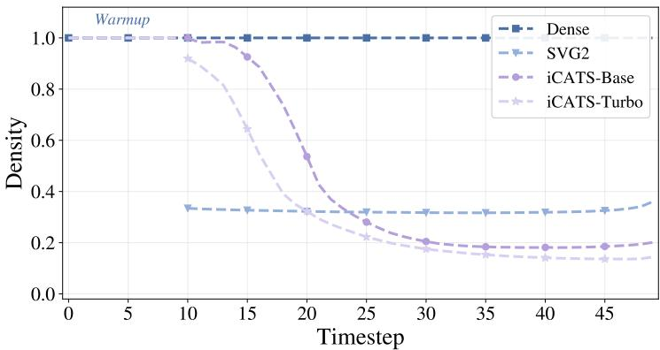  
Figure 1: Density of the original full attention, SVG2, and our iCATS across timesteps on Wan2.1- T2V-14B.

## B Detailed Experimental Settings

This appendix provides the detailed settings for all compared methods.

Compared methods. We compare iCATS with two state-of-the-art sparse attention baselines, SVG and SVG2. On HunyuanVideo-T2V-13B, Wan2.1-T2V-14B and Wan2.1-I2V-14B, all baseline methods follow their official open-source implementations and default settings, including warmup timesteps, warmup layers, and the number of clustering iterations.

iCATS variants. We evaluate two variants of iCATS, Base and Turbo, designed to match the speed or sparsity of prior methods under different models. For fair comparison, the warmup timesteps, warmup layers, and clustering iterations of iCATS follow the baseline configuration of each model, as summarized in Table 1.

Table 1: Warmup and clustering configurations for each model.
<table><tr><td>Model</td><td>Warmup timesteps</td><td>Warmup layers</td><td>Cluster iters (first/later)</td></tr><tr><td>HunyuanVideo-T2V-13B</td><td>5/50</td><td>1/60</td><td>50/2</td></tr><tr><td>Wan2.1-T2V-14B</td><td>10/50</td><td>1/40</td><td>50/2</td></tr><tr><td>Wan2.1-I2V-14B</td><td>14/40</td><td>1/40</td><td>50/2</td></tr></table>

For HunyuanVideo-T2V-13B, both iCATS variants use 500 query clusters and 1000 key clusters. The Base variant uses $p _ { \mathrm { m i n } } = 0 . 7$ and $\tau = 0 . 9 8$ , while the Turbo variant uses $p _ { \mathrm { m i n } } = 0 . 6 5$ and $\tau = 0 . 9 7$

For Wan2.1-T2V-14B, both iCATS variants use 400 query clusters and 1000 key clusters. The Base variant uses $p _ { \mathrm { m i n } } = 0 . 7$ and $\tau = 0 . 9 9 9$ , while the Turbo variant uses $p _ { \mathrm { m i n } } = 0 . 6 5$ and $\tau = 0 . 9 7$

For Wan2.1-I2V-14B, both iCATS variants use 400 query clusters and 1000 key clusters. The Base variant uses $p _ { \mathrm { m i n } } = 0 . 8$ and $\tau = 0 . 9 9 9$ , while the Turbo variant uses $p _ { \mathrm { m i n } } = 0 . 7 5$ and $\tau = 0 . 9 8$

These settings are chosen to provide comparable speed or sparsity to prior sparse attention methods.

## C Additional VBench Results

Table 2 reports detailed VBench results for all compared methods across all models. Specifically, we report subject consistency, background consistency, motion smoothness, aesthetic quality, imaging quality, and the averaged VBench score. These fine-grained results complement the average scores reported in the main paper and provide a clearer view of quality preservation under sparse attention.

Overall, iCATS remains highly competitive with dense attention and strong sparse baselines across all models. On HunyuanVideo-T2V-13B, both iCATS-Base and iCATS-Turbo achieve an average VBench score of 0.844, exactly matching dense attention. More specifically, both variants match dense attention in subject consistency, background consistency, motion smoothness, and imaging quality. Compared with existing sparse baselines, iCATS further achieves the strongest subject consistency while remaining tied for the best background consistency and motion smoothness. These results indicate that the proposed sparse attention design preserves identity consistency, scene coherence, temporal stability, and visual fidelity without measurable degradation on this model.

On Wan2.1-T2V-14B, iCATS-Base achieves an average VBench score of 0.838, outperforming SVG (0.836) and slightly surpassing SVG2 (0.837), while iCATS-Turbo matches SVG2 at 0.837. In addition, iCATS remains competitive in subject consistency and background consistency, preserves motion smoothness close to other sparse methods, and achieves the strongest imaging quality among the sparse variants. These results suggest that the proposed sparse attention design preserves both structural coherence and visual fidelity well, while still enabling substantial efficiency gains.

On Wan2.1-I2V-14B, iCATS likewise remains highly competitive with dense attention. Both iCATS-Base and iCATS-Turbo achieve an average VBench score of 0.846, exceeding SVG (0.844) and SVG2 (0.845) while staying very close to dense attention (0.847). Looking at the detailed dimensions, iCATS-Base matches dense attention in imaging quality, iCATS-Turbo matches dense attention in background consistency, and both variants preserve the same motion smoothness as dense attention. Meanwhile, subject consistency and aesthetic quality also remain competitive with the strongest sparse baselines, showing that iCATS generalizes well beyond text-to-video generation and can maintain strong appearance consistency, scene coherence, motion quality, and perceptual fidelity in the image-to-video setting.

Table 2: Detailed VBench comparison with existing methods on benchmark models
<table><tr><td>Method</td><td>Sub.Cons.↑</td><td>Back.Cons.↑</td><td>Mot.Smooth↑</td><td>Aes.Qual.↑</td><td>Img.Qual.↑</td><td>VBench (Avg.)↑</td></tr><tr><td>HunyuanVideo-T2V-13B (Dense)</td><td>0.940</td><td>0.959</td><td>0.994</td><td>0.628</td><td>0.698</td><td>0.844</td></tr><tr><td>SVG</td><td>0.938</td><td>0.959</td><td>0.994</td><td>0.632</td><td>0.693</td><td>0.843</td></tr><tr><td>SVG2</td><td>0.939</td><td>0.959</td><td>0.993</td><td>0.627</td><td>0.695</td><td>0.842</td></tr><tr><td>iCATS-Base</td><td>0.940</td><td>0.959</td><td>0.994</td><td>0.627</td><td>0.698</td><td>0.844</td></tr><tr><td>iCATS-Turbo</td><td>0.940</td><td>0.959</td><td>0.994</td><td>0.627</td><td>0.698</td><td>0.844</td></tr><tr><td>Wan2.1-T2V-14B (Dense)</td><td>0.934</td><td>0.955</td><td>0.987</td><td>0.630</td><td>0.689</td><td>0.839</td></tr><tr><td>SVG</td><td>0.929</td><td>0.953</td><td>0.987</td><td>0.629</td><td>0.686</td><td>0.836</td></tr><tr><td>SVG2</td><td>0.931</td><td>0.954</td><td>0.986</td><td>0.630</td><td>0.684</td><td>0.837</td></tr><tr><td>iCATS-Base</td><td>0.932</td><td>0.954</td><td>0.986</td><td>0.629</td><td>0.687</td><td>0.838</td></tr><tr><td>iCATS-Turbo</td><td>0.931</td><td>0.953</td><td>0.986</td><td>0.629</td><td>0.687</td><td>0.837</td></tr><tr><td>Wan2.1-I2V-14B (Dense)</td><td>0.958</td><td>0.958</td><td>0.986</td><td>0.618</td><td>0.716</td><td>0.847</td></tr><tr><td>SVG</td><td>0.953</td><td>0.954</td><td>0.986</td><td>0.612</td><td>0.715</td><td>0.844</td></tr><tr><td>SVG2</td><td>0.956</td><td>0.955</td><td>0.986</td><td>0.614</td><td>0.715</td><td>0.845</td></tr><tr><td>iCATS-Base</td><td>0.956</td><td>0.957</td><td>0.986</td><td>0.615</td><td>0.716</td><td>0.846</td></tr><tr><td>iCATS-Turbo</td><td>0.955</td><td>0.958</td><td>0.986</td><td>0.616</td><td>0.715</td><td>0.846</td></tr></table>

## D Attention Fidelity Breakdown

Table 3 breaks down the attention fidelity diagnostics in Table 2 of the main paper by timestep, layer, and head. Interaction-aware clustering consistently outperforms independent Euclidean clustering on both metrics across all sampled points.

Table 3: Breakdown of attention fidelity on Wan2.1-T2V-14B by timestep, layer, and head. Each entry is reported as “interaction-aware (ours) / Euclidean”; MSE values are in units of $1 0 ^ { - 4 } .$
<table><tr><td>Timestep t</td><td>952</td><td>882</td><td>768</td><td>555</td><td>92</td></tr><tr><td>Top-p overlap↑</td><td>0.902 / 0.891</td><td>0.914 / 0.896</td><td>0.915 / 0.896</td><td>0.916 / 0.897</td><td>0.917 / 0.901</td></tr><tr><td>Output MSE↓</td><td>8.91 / 11.75</td><td>6.33 / 9.52</td><td>5.41 / 8.27</td><td>4.71 / 7.48</td><td>3.40 / 7.91</td></tr><tr><td>Layer</td><td>1</td><td>10</td><td>20</td><td>30</td><td>39</td></tr><tr><td>Top-p overlap↑ Output MSE↓</td><td>0.947 / 0.941 1.36 / 4.19</td><td>0.879 / 0.863 18.42 / 20.22</td><td>0.881 / 0.863 4.76 / 5.59</td><td>0.904 / 0.880 2.68 / 10.74</td><td>0.952 / 0.935 1.55 / 4.19</td></tr><tr><td>Head</td><td></td><td></td><td>20</td><td></td><td></td></tr><tr><td></td><td>0</td><td>10</td><td></td><td>30</td><td>一</td></tr><tr><td>Top-p overlap↑</td><td>0.933 / 0.919</td><td>0.920 / 0.910</td><td>0.903 / 0.892</td><td>0.894 / 0.866</td><td>一</td></tr><tr><td>Output MSE↓</td><td>5.25 / 8.54</td><td>4.81 / 5.04</td><td>7.04 / 7.28</td><td>5.91 / 15.08</td><td>一</td></tr></table>

## E Tail-Merging Strategy

## E.1 Algorithm Overview

Algorithm 1 Proposed Tail-merging Strategy   
Input:   
$\mathbf { L } \in \mathbb { Z } ^ { B H \times N } ;$ query-cluster labels; $\mathbf { s } \in \mathbb { Z } ^ { B H \times C } ;$ cluster sizes; $C { : }$ number of query-clusters   
$\mathbf { P } \in \{ 0 , 1 \} ^ { B H \times C \times \mathbf { \check { W } } }$ : key-cluster mask per cluster; W: number of key-clusters; b: block stride   
Output:   
$\mathbf { \bar { L } ^ { \prime } } \in \mathbb { Z } ^ { B H \times N } ;$ : updated labels; $\mathbf { s } ^ { \prime } \in \mathbb { Z } ^ { B H \times C ^ { \prime } }$ : merged sizes $( C ^ { \prime } \le C ) ; \mathbf { M } ^ { \prime } \in \{ 0 , 1 \} ^ { B H \times C ^ { \prime } \times W } ;$ : merged   
masks   
1: Ppack ← PackToInt64(P); (P∗, π) ← Unique([head\_id, $\mathbf { P } _ { \mathrm { p a c k } } ] )$ ▷ merge clusters with identical   
key-cluster masks within each head   
2: if duplicate masks exist then   
3: s∗ ← IndexAdd(π, s); L∗ ← Remap(L, π) ▷ accumulate sizes of merged clusters; rewrite token   
labels via π   
4: else   
5: $\mathbf { L } ^ { * } , \mathbf { s } ^ { * } , \mathbf { P } ^ { * }  \mathbf { L } , \mathbf { s } , \mathbf { P } _ { \mathrm { p a c k } }$   
6: end if   
7: $\boldsymbol { \tau }  \mathbf { s } ^ { * }$ mod $\begin{array} { r l } { b ; \ \mathbf { T }  \mathrm { C o m p u t e I s T a i l } ( \mathbf { L } ^ { * } , \mathbf { s } ^ { * } , b ) } & { { } \triangleright \pmb \tau _ { i } : } \end{array}$ tail length of cluster i; $\mathbf { T } \in \{ 0 , 1 \} ^ { B H \times N }$ flags   
tail tokens   
8: $\mathbf { i f } \exists \pmb { \tau } _ { i } > 0$ then   
9: D ← HammingDis $( \mathbf { P } ^ { * } , \mathbf { P } ^ { * } ) ; \mathbf { D } _ { i i }  \infty$   
10: $\mathbf { D } _ { i j }  \infty \mathrm { ~ i f ~ } \pmb { \tau } _ { i } = 0 \lor \pmb { \tau } _ { j } = 0 \lor \pmb { \tau } _ { i } + \pmb { \tau } _ { j } > b$ ▷ forbid self-merge, clusters without tails, and tail   
overflow   
11: for $r = 1 , 2$ do   
12: $\begin{array} { r } { j ^ { * } ( i )  \arg \operatorname* { m i n } _ { j } \ \mathbf { D } _ { i j } ; \ \mathcal { E } \gets \{ ( i , j ) : j ^ { * } ( i ) = j , \ : j ^ { * } ( j ) = i , \ : i < j \} } \end{array}$ ▷ nearest neighbor by mask   
similarity; mutually selected pairs only   
13: if ${ \mathcal { E } } = \emptyset$ then break   
14: end if   
15: for $( i , j ) \in \mathcal { E }$ do   
16: $\mathbf { \widetilde { P } } _ { i } ^ { * } \gets \mathbf { P } _ { i } ^ { * } \cup \mathbf { P } _ { j } ^ { * } ; ~ \mathbf { s } _ { i } ^ { * } \mathrel { + } = \pmb { \tau } _ { j } ; ~ \mathbf { s } _ { j } ^ { * } \mathrel { - } = \pmb { \tau } _ { j }$ ▷ merge masks via bitwise OR; transfer $\tau _ { j }$ tail tokens   
from j to i   
17: $\mathbf { L } _ { n } ^ { * }  { } i \ \forall n : \ \mathbf { L } _ { n } ^ { * } { = } j \land \mathbf { T } _ { n } { = } 1 ; \ \mathbf { D } _ { j , \cdot } = \mathbf { D } . , j$ ← ∞ ▷ reassign tail tokens of j to i; invalidate j   
in this round   
18: end for   
19: i $\mathrm { f } r < 2$ then   
20: $\boldsymbol { \tau }  \mathbf { s } ^ { * }$ mod b; T ← ComputeIsTail(L∗, s∗, b); recompute D and reapply constraints to D   
21: end if   
22: end for   
23: end if   
24: $\mathbf { L } ^ { \prime } $ Remap(L∗, s∗ > 0); s′ ← s∗[s∗ > 0]; M′ ← Unpack $( \mathbf { P } ^ { * } [ \mathbf { s } ^ { * } > 0 ] )$ ▷ remove empty clusters   
and compact indices   
25: return L′, s′, M′

Algorithm 1 summarizes the complete tail merging procedure in iCATS. Given per-token cluster assignments, cluster sizes, and binary key-cluster masks, we first pack each mask into a compact integer and, within each head, merge clusters with identical masks exactly by summing their sizes and remapping token labels. We then selectively reassign tail tokens from non-block-aligned clusters: a pair $( i , j )$ with $i < j$ is merged only if the two clusters are mutually closest in Hamming distance and their tails fit into one block, moving the tail tokens of j into i and merging their masks by union, which improves block utilization while largely preserving the original sparsity structure. After two rounds, empty clusters are removed and the rest are compactly reindexed within each head for subsequent sparse attention computation.

## E.2 Implementation Details

In line with the previous cluster-based method [17], in our implementation, we employ FlashInfer [53] to execute sparse attention. To evaluate the effectiveness of the tail-merging strategy, we measure the relative reduction in the number of executed blocks under the iCATS-Base setting, with SNR-guided sparsity configured by $\tau = 0 . 9 9 9$ and $p _ { \mathrm { m i n } } = 0 . 7$ . FlashInfer organizes sparse attention computation into execution blocks, $\mathrm { e . g . }$ ., with a query-side block size of 128 and a key/value-side block size of 96. As shown in Figure 2, the average reduction across layers is about 25% at early denoising timesteps where the sparsity level remains low. As denoising progresses and the sparsity increases according to the SNR-guided sparsity schedule (see Figure 1), the key/value sequence length also decreases, and thus this average reduction gradually decreases to around 7%. The min-max range in Figure 2 further shows the variation in block reduction ratio across sparse attention layers at each denoising timestep.

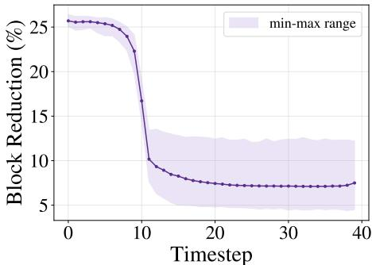  
Figure 2: Relative reduction in the number of executed FlashInfer blocks on Wan2.1-T2V-14B under the iCATS-Base setting.

## F Hyperparameter Sensitivity and Transferability

In the main experiments, model-specific hyperparameters are chosen to match the runtime or sparsity of the corresponding baselines. To examine whether these settings can be reused across models and tasks, we directly transfer the query/key cluster counts and SNR-guided sparsity hyperparameters of HunyuanVideo-Base to Wan2.1-T2V-14B and Wan2.1-I2V-14B without retuning. Warmup timesteps, warmup layers, and clustering iterations follow each target model’s baseline settings, while tail merging uses two rounds throughout. We evaluate the transferred configuration using 100 randomly sampled prompts.

Table 4 shows that the transferred configuration achieves better PSNR, SSIM, and LPIPS than SVG2 on both tasks at comparable speedup. On Wan2.1-T2V-14B, it achieves 28.656 dB PSNR, compared with 25.411 dB for SVG2, while differing from the Wan-tuned iCATS-Base configuration by only 0.404 dB. On Wan2.1-I2V-14B, it improves PSNR from 29.068 to 29.810 dB with slightly higher speedup. These results support the reuse of a shared clustering and sparsity-schedule configuration across the evaluated models and tasks.

We further examine hyperparameter sensitivity on Wan2.1-T2V-14B using the same prompt set. Starting from the Base setting $( \tau = 0 . 9 9 9 , p _ { \mathrm { m i n } } = 0 . 7 )$ , we independently decrease τ to 0.99, 0.98, and 0.97, or decrease $p _ { \mathrm { m i n } }$ to 0.6, while keeping all other settings fixed. Unlike the configurationtransfer experiment, these runs retain the Wan-specific query/key cluster counts to isolate the effects of the two sparsity-schedule hyperparameters.

Table 4: Hyperparameter transfer from HunyuanVideo-Base to Wan2.1 without retuning.
<table><tr><td>Method PSNR↑ SSIM↑ LPIPS↓ Speedup↑ Sparsity</td></tr><tr><td>Wan2.1-T2V-14B</td></tr><tr><td>SVG2 25.411 0.845 0.101 1.54× 68.7%</td></tr><tr><td>iCATS-Base (Wan-tuned) 29.060 0.904 0.060</td></tr><tr><td>1.54× 60.5% iCATS (transferred) 28.656 0.899 0.065 1.55× 66.2%</td></tr><tr><td>Wan2.1-I2V-14B</td></tr><tr><td>SVG2 29.068 0.890 0.067 1.42× 70.1%</td></tr><tr><td>iCATS (transferred) 29.810 0.901 0.063 1.44× 71.5%</td></tr></table>

As shown in Table 5, decreasing either parameter increases sparsity and speedup, with a gradual reduction in reconstruction quality. Across the tested τ values, sparsity increases from 60.5% to 66.4%, while speedup increases from 1.54× to 1.58×. All tested settings retain better PSNR, SSIM, and LPIPS than SVG2, indicating that the quality advantage is maintained across the evaluated parameter range rather than depending on a single setting.

Table 5: Hyperparameter sensitivity on Wan2.1-T2V-14B. Each variant changes only the indicated parameter from iCATS-Base.
<table><tr><td>Setting</td><td>PSNR↑ SSIM↑</td><td>LPIPS↓</td><td></td><td>Speedup↑ Sparsity</td><td></td></tr><tr><td>SVG2</td><td>25.411</td><td>0.845</td><td>0.101</td><td>1.54×</td><td>68.7%</td></tr><tr><td>iCATS-Base</td><td>29.060</td><td>0.904</td><td>0.060</td><td>1.54×</td><td>60.5%</td></tr><tr><td> $\tau = 0 . 9 9$ </td><td>28.716</td><td>0.900</td><td>0.063</td><td>1.55×</td><td>63.4%</td></tr><tr><td> $\tau = 0 . 9 8$ </td><td>28.537</td><td>0.897</td><td>0.065</td><td>1.56×</td><td>65.2%</td></tr><tr><td> $\tau = 0 . 9 7$ </td><td>28.392</td><td>0.895</td><td>0.067</td><td>1.58×</td><td>66.4%</td></tr><tr><td> $p _ { \mathrm { m i n } } = 0 . 6$ </td><td>28.576</td><td>0.896</td><td>0.066</td><td>1.57×</td><td>63.8%</td></tr></table>

## G Additional Visualizations

We provide additional visualization comparisons between iCATS and dense attention on Wan2.1-T2V-14B. These examples demonstrate that iCATS preserves high visual fidelity and maintains generation quality that is visually close to the original dense attention across diverse scenes and motion patterns.

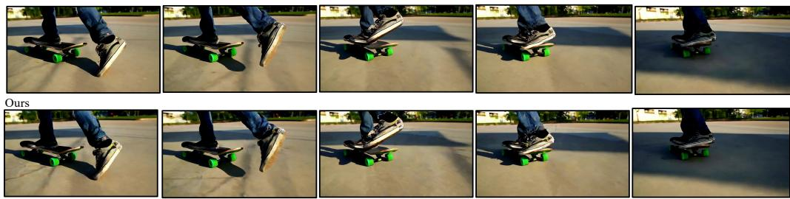  
A sleek skateboard with a vibrant, graffiti-inspired design on its deck rests on a sunlit, urban street. The camera zooms in to reveal the intricate artwork, featuring bold colors and dynamic patterns. The scene transitions to a close-up of the skateboard's wheels, which are a striking neon green, spinning smoothly as the board glides effortlessly over the pavement. The background blurs slightly, emphasizing the skateboard's motion. Finally, the skateboarder, wearing a pair of worn-out sneakers and ripped jeans, performs a series of impressive tricks, including an ollie and a kickflip, showcasing the skateboard's agility and the rider's skill against the backdrop of a bustling cityscape  
Figure 3: Visualization comparison between iCATS and dense attention on Wan2.1-T2V-14B.

Dense  

Ours  
  
A vibrant blue jay perches gracefully on a slender branch, its feathers shimmering in the soft morning light. The bird's keen eyes scan the surroundings, capturing the essence of the tranquil forest. It flutters its wings briefly, showcasing the intricate patterns of blue, white, and black on its plumage. The background reveals a lush canopy of green leaves, with rays of sunlight filtering through, creating a dappled effect on the forest floor. The blue jay then tilts its head, emitting a melodious call that echoes through the serene woodland, adding a touch of magic to the peaceful scene

Dense  
  
Ours

  
A sleek, modern bicycle with a matte black frame and aerodynamic design begins its journey on a smooth, sunlit road. The rider, clad in a fitted, neon green cycling suit and helmet, leans forward, gripping the handlebars tightly. The camera captures the initial slow pedal strokes, the wheels spinning with increasing speed. As the bicycle accelerates, the background blurs, emphasizing the rapid motion. The rider's muscles tense and flex, showcasing the effort and determination. The sunlight glints off the bike's frame and the rider's helmet, creating a dynamic interplay of light and shadow. The sound of the wind rushing past and the rhythmic clicking of the gears enhance the sensation of speed and exhilaration.

Dense  

Ours  
  
A focused individual grips the steering wheel of a sleek, modern car, the dashboard illuminated by soft, ambient lighting. The camera captures the driver's profile, revealing a calm expression and a pair of stylish sunglasses. Outside the window, a picturesque landscape of rolling hills and a setting sun unfolds, casting a golden glow over the scene. The interior of the car is luxurious, with leather seats and a state-of-the-art infotainment system. As the car glides smoothly along the winding road, the driver occasionally glances at the rearview mirror, reflecting a serene, empty highway behind. The journey exudes a sense of freedom and tranquility, with the gentle hum of the engine providing a soothing soundtrack.

Ours  
  
A dimly lit music studio, filled with an array of high-end equipment, sets the scene. The room is adorned with soundproofing foam panels, creating an intimate and professional atmosphere. A sleek black grand piano sits in one corner, its polished surface reflecting the soft glow of ambient lighting. Nearby, a vintage microphone on a stand awaits the next vocal performance. The mixing console, with its myriad of buttons and sliders, is the heart of the studio, surrounded by monitors displaying intricate waveforms. Shelves lined with vinyl records and musical instruments, including guitars and a drum set, add to the creative vibe. The air is thick with the promise of musical magic, as the studio stands ready to capture the next hit

Dense  
  
Ours

  
A vibrant orange ceramic bowl sits on a rustic wooden table, bathed in the soft glow of morning sunlight streaming through a nearby window. The bowl's glossy surface reflects the light, highlighting its smooth curves and rich color. Inside, a collection of fresh, colorful fruits—red apples, green grapes, and yellow bananas—create a striking contrast against the bowl's vivid hue. The scene is serene and inviting, with the background featuring a blurred view of a cozy kitchen, complete with potted plants and vintage decor, enhancing the warm, homely atmosphere

Figure 3: Figure 3 continued.